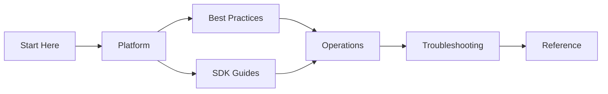

---
content_sources:
  diagrams:
    - id: guide-sections-overview
      type: Mermaid
      source: self-generated
---

# About

The Azure Communication Services Practical Guide is an open, practitioner-focused documentation project for developers, SREs, and support engineers.

## Project Vision

Azure Communication Services (ACS) provides an immense range of capabilities, from SMS to high-quality Video Calling. However, moving from a basic demo to a production-grade application requires navigating complex concepts like Identity isolation, Access Token lifetimes, and regional availability.

This guide is designed to provide clear, actionable advice that complements the official Microsoft documentation, with a focus on real-world implementation and systematic troubleshooting.

## Guide Sections

<!-- diagram-id: guide-sections-overview -->

## Project Goals

- **Bridge the Gap**: Provide the missing context between tutorial code and production-ready architecture.
- **Operational Excellence**: Focus on monitoring, alerting, and quotas from the start.
- **Rapid Recovery**: Supply structured playbooks and KQL queries to reduce time-to-resolution during incidents.

## Acknowledgment

This guide is built upon the collective experience of developers and engineers working with Azure Communication Services. Special thanks to the community for sharing their insights and troubleshooting tips.

## Verified Test Reports

The following tests were performed with real Azure resources to validate the guidance in this project:

- [Email Communication Service Test Report](email-test-report.md) — End-to-end email sending, delivery confirmation, and monitoring with Python SDK (April 2026)

## See Also

- [Start Here](start-here/overview.md)
- [Learning Paths](start-here/learning-paths.md)

## Sources

- [Azure Communication Services Overview](https://learn.microsoft.com/azure/communication-services/overview)
- [ACS Documentation Hub](https://learn.microsoft.com/azure/communication-services/)
