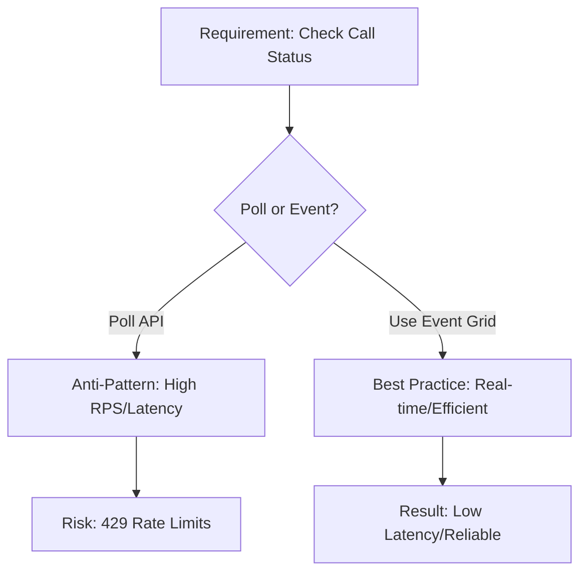

---
content_sources:
  - source: mslearn-adapted
    mslearn_url: https://learn.microsoft.com/azure/communication-services/concepts/best-practices
content_validation:
  status: pending_review
  last_reviewed: null
  reviewer: agent
  core_claims: []
---

# Common Anti-Patterns

Anti-patterns are common mistakes that can lead to security vulnerabilities, performance issues, and increased costs in Azure Communication Services (ACS). This document identifies these anti-patterns and provides guidance on how to avoid them.

## Storing Connection Strings in Code

One of the most common and dangerous anti-patterns is hardcoding ACS connection strings directly into your application's source code.

*   **Risk**: If your code is leaked or committed to a public repository, anyone with access can control your ACS resource.
*   **Fix**: Use **Azure Key Vault** to store your connection string and access it using a **Managed Identity** for your backend service.

## Not Implementing Token Refresh

Failing to implement token refresh logic in your client applications can lead to service interruptions for your users.

*   **Risk**: Once an access token expires (default 24 hours), the client application will lose connection to ACS.
*   **Fix**: Monitor the token expiration time and proactively request a new token from your backend before the current one expires.

## Ignoring SMS Opt-Out Requirements

Sending SMS messages to users who have opted out is not only poor practice but also a violation of regulations in many countries.

*   **Risk**: Your phone number may be blocked by carriers, and your business could face legal penalties.
*   **Fix**: Always implement and respect opt-out logic (e.g., "Reply STOP to unsubscribe") and maintain a suppression list of users who have opted out.

## Not Verifying Email Domains Properly

Sending emails from unverified or improperly configured domains can lead to low deliverability.

*   **Risk**: Your emails are more likely to be flagged as spam by mailbox providers.
*   **Fix**: Verify your custom domain via DNS and configure **SPF** and **DKIM** to ensure high deliverability and sender authenticity.

## Polling Instead of Using Event Grid

Polling the ACS API to check for new messages or status changes is inefficient and can lead to rate limiting.

*   **Risk**: Increased latency, higher resource usage, and potential 429 (Too Many Requests) errors.
*   **Fix**: Use **Azure Event Grid** to receive real-time notifications of events (e.g., incoming SMS, call status changes) directly at your webhook endpoint.

<!-- diagram-id: anti-pattern-decision -->

## Not Handling Rate Limits Gracefully

Many developers fail to implement proper retry logic and backoff strategies for ACS API calls.

*   **Risk**: Transient errors and rate limits can cause your application to fail.
*   **Fix**: Use **exponential backoff** and respect the `Retry-After` header when you receive a 429 error from the ACS API.

## Hardcoding Phone Numbers

Hardcoding phone numbers in your application code or configuration files can make it difficult to manage and scale your communication services.

*   **Risk**: Changing a phone number requires a code deployment, and managing multiple numbers for different campaigns becomes cumbersome.
*   **Fix**: Store and manage phone numbers in a database or external configuration service, allowing your application to dynamically retrieve the correct number based on the use case.

## Sources

*   [ACS Service Limits](https://learn.microsoft.com/azure/communication-services/concepts/service-limits)
*   [ACS Authentication Concepts](https://learn.microsoft.com/azure/communication-services/concepts/authentication)
*   [Azure Well-Architected Framework: Anti-Patterns](https://learn.microsoft.com/azure/architecture/antipatterns/)
