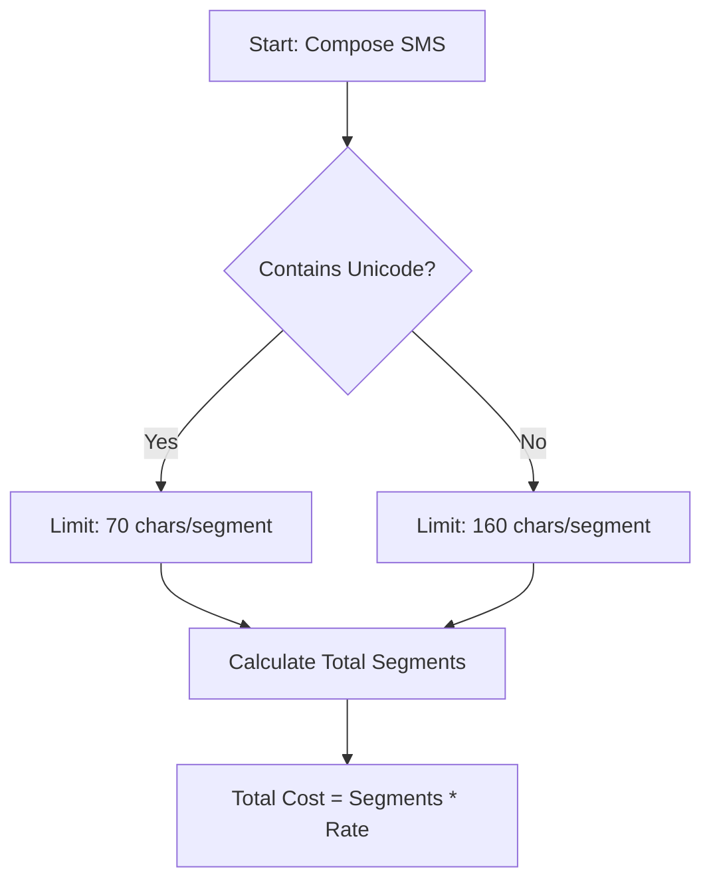

---
content_sources:
  diagrams:
    - id: cost-sms-optimization
      type: flowchart
      source: mslearn-adapted
      mslearn_url: https://learn.microsoft.com/azure/communication-services/concepts/pricing
---

# Cost Optimization

Azure Communication Services (ACS) uses a consumption-based pricing model, meaning you only pay for what you use. This document outlines the best practices for managing and optimizing your ACS costs.

## ACS Pricing Model Overview

Costs are calculated differently for each communication channel:

| Channel | Pricing Metric | Example |
| --- | --- | --- |
| **SMS** | Per-message segment sent or received | Sending a 200-character message (2 segments) |
| **Calling** | Per-minute per-participant | A 10-minute call with 3 people = 30 minutes |
| **Chat** | Per-message sent | Sending a message to a thread with 10 participants |
| **Email** | Per-email recipient sent | Sending an email to 5 recipients = 5 emails |
| **Phone Numbers** | Monthly recurring charge per number | Renting a US Toll-Free number |

## Phone Number Cost Management

Phone numbers carry a fixed monthly cost, regardless of usage.

*   **Cleanup Unused Numbers**: Regularly audit your phone numbers in the Azure Portal and release those that are no longer needed.
*   **Consolidate Traffic**: Use a single number for multiple campaigns or departments where possible, especially for toll-free numbers.

## Optimizing SMS Costs

SMS costs are based on the number of message segments sent.

*   **Message Segmentation**: Standard SMS messages are limited to 160 characters (GSM-7) or 70 characters (Unicode). Be aware that long messages are split into multiple segments, increasing the cost.
*   **Avoid Unicode**: Whenever possible, use only GSM-7 characters to maximize the characters per segment and reduce costs.
*   **Opt-out Handling**: Implement opt-out logic (e.g., "Reply STOP to unsubscribe") to avoid sending messages to users who do not want them, which reduces waste and ensures regulatory compliance.

<!-- diagram-id: cost-sms-optimization -->

## Email Tier Selection

ACS offers multiple email sending tiers based on volume. Choose the tier that best fits your expected monthly sending volume.

## Video and Voice Cost Optimization

Calling costs are based on the number of participant-minutes.

*   **Resolution and Bandwidth**: While you don't pay more for high resolution, using it consumes more bandwidth, which can increase data egress costs for your Azure environment.
*   **Disconnect Idle Participants**: Implement logic to automatically disconnect participants from a call or chat thread after a period of inactivity to prevent accidental overcharging.

## Cost Monitoring with Azure Cost Management

Use Azure Cost Management to track and analyze your ACS spending.

*   **Budgets**: Set up budgets for your ACS resource group and configure alerts to notify you when spending reaches a certain threshold.
*   **Tags**: Apply tags (e.g., `Environment`, `Department`, `Project`) to your ACS resources to breakdown costs by business unit or environment.
*   **Cost Analysis**: Use the Azure Portal's cost analysis tools to identify which channels (e.g., SMS vs. Calling) are driving the most spend.

## Sources

*   [ACS Pricing Details](https://azure.microsoft.com/en-us/pricing/details/communication-services/)
*   [Azure Cost Management](https://learn.microsoft.com/azure/cost-management-billing/cost-management-billing-overview)
*   [SMS Message Segmentation](https://learn.microsoft.com/azure/communication-services/concepts/telephony/sms-concepts#message-segmentation)
