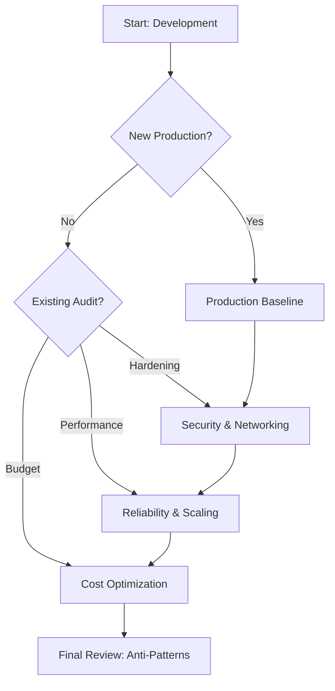

---
hide:
  - toc
content_sources:
  - source: mslearn-adapted
    mslearn_url: https://learn.microsoft.com/azure/communication-services/concepts/best-practices
---

# Best Practices Overview

Azure Communication Services (ACS) provides a powerful set of APIs and SDKs for building communication experiences. This section serves as the design judgment layer between the low level platform capabilities and high level SDK implementations. It provides curated guidance for moving from initial proof of concept to a hardened, production ready deployment.

## Documentation Map

| Document | Focus Area |
| --- | --- |
| [Production Baseline](production-baseline.md) | Minimum controls, resource setup, and initial identity strategy. |
| [Security Best Practices](security.md) | Token management, data privacy, and resource protection. |
| [Networking Best Practices](networking.md) | Firewall rules, proxy configuration, and bandwidth planning. |
| [Reliability Best Practices](reliability.md) | SDK retries, circuit breakers, and connection resilience. |
| [Scaling Best Practices](scaling.md) | Throughput limits, participant caps, and rate limit handling. |
| [Cost Optimization](cost-optimization.md) | Pricing model overview and strategies for reducing spend. |
| [Common Anti-Patterns](common-anti-patterns.md) | Frequent mistakes and how to avoid them. |

## Learning Flow

<!-- diagram-id: best-practices-flow -->

## Recommended Reading Paths

Depending on your current project phase, we recommend focusing on specific areas first:

*   **New Production Rollout**: Start with [Production Baseline](production-baseline.md) and [Security Best Practices](security.md).
*   **Existing App Hardening**: Focus on [Networking Best Practices](networking.md) and [Reliability Best Practices](reliability.md).
*   **Cost Tuning**: Review [Cost Optimization](cost-optimization.md) and [Scaling Best Practices](scaling.md).

## Decision Areas Covered

This guide addresses critical technical decisions including:

1.  How to securely manage user access tokens without exposing connection strings.
2.  How to configure network environments for high quality audio and video.
3.  How to handle transient errors and service interruptions gracefully.
4.  How to scale SMS and Email workloads while staying within platform limits.

## Who Should Read This

*   **Solution Architects**: To design resilient and secure communication architectures.
*   **Developers**: To implement SDKs following established patterns.
*   **DevOps Engineers**: To configure Azure resources and monitor service health.
*   **Security Professionals**: To verify data privacy and identity controls.

## Quality Gate Checklist

Before deploying your ACS solution to production, verify the following:

*   [ ] Connection strings are stored in Azure Key Vault or managed via Managed Identity.
*   [ ] Access tokens are generated on the backend and have appropriate TTLs.
*   [ ] Firewall rules are configured for TURN/STUN traffic.
*   [ ] Retry logic is implemented for all asynchronous operations.
*   [ ] Email domains are verified and SMS opt out logic is in place.

## See Also

*   [ACS Conceptual Documentation](https://learn.microsoft.com/azure/communication-services/concepts/best-practices)
*   [Azure Well-Architected Framework](https://learn.microsoft.com/azure/architecture/framework/)

## Sources

*   Azure Communication Services Best Practices (Microsoft Learn)
*   Practical experience from large scale Azure Communication Services implementations.
