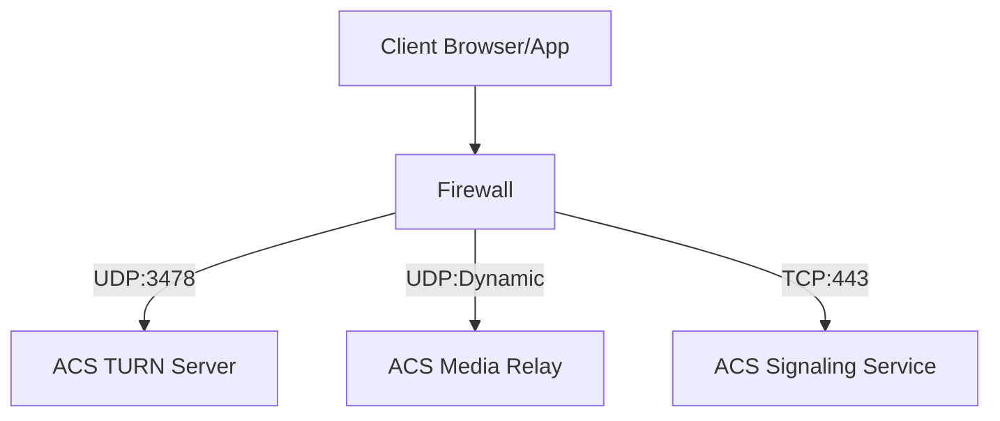

---
content_sources:
  - source: mslearn-adapted
    mslearn_url: https://learn.microsoft.com/azure/communication-services/concepts/best-practices
content_validation:
  status: pending_review
  last_reviewed: null
  reviewer: agent
  core_claims: []
---

# Networking Best Practices

Azure Communication Services (ACS) provides real-time calling and chat capabilities that require careful network configuration to ensure high-quality communication experiences. This document outlines the networking best practices for ACS.

## Firewall Rules for Calling SDK

The ACS Calling SDK uses standard protocols for media transmission, including STUN (Session Traversal Utilities for NAT) and TURN (Traversal Using Relays around NAT).

### Required Ports and Protocols

To ensure media flows correctly, the following firewall rules must be implemented on the client's network:

| Direction | Port Range | Protocol | Description |
| --- | --- | --- | --- |
| Outbound | 443 | TCP | Signaling and API calls (HTTPS/WSS) |
| Outbound | 3478-3481 | UDP | STUN and TURN media traffic |
| Outbound | 49152-65535 | UDP | Media traffic (RTP/RTCP) |

!!! warning "Do Not Block UDP"
    Blocking UDP traffic will force media to fall back to TCP, significantly increasing latency and degrading audio/video quality. Always allow UDP for the best communication experience.

<!-- diagram-id: networking-media-flow -->

## Proxy Configuration for WebRTC

If your network uses an HTTP proxy, the ACS Calling SDK will attempt to use it for signaling. However, proxies often do not support the UDP traffic required for media.

*   **Proxy Bypass**: Configure your proxy to bypass traffic for ACS endpoints where possible.
*   **PAC Files**: Use Proxy Auto-Config (PAC) files to direct ACS traffic around the proxy.

## Bandwidth Planning

Voice and video quality are directly proportional to available bandwidth.

| Feature | Recommended Bandwidth (Minimum) |
| --- | --- |
| **High Quality Video (720p)** | 1.5 Mbps |
| **Standard Quality Video (360p)** | 500 Kbps |
| **High Fidelity Voice** | 100 Kbps |
| **Low Fidelity Voice** | 30 Kbps |

!!! tip "Adaptive Bitrate"
    The ACS Calling SDK automatically adjusts the bitrate based on current network conditions. However, you should still plan for the minimum bandwidth requirements for your users.

## CDN Considerations for UI Library

If you are using the ACS UI Library, consider serving it from a Content Delivery Network (CDN) to reduce latency and improve load times for your users.

## Private Connectivity Options

For backend services communicating with ACS, you can use **Azure Private Link** to ensure that data remains on the Azure backbone network and is not exposed to the public internet.

*   **Endpoint Support**: ACS supports Private Link for data-plane operations (e.g., sending SMS or Email).
*   **Virtual Network (VNet) Integration**: Connect your ACS resource to your VNet to secure your backend communication.

## Sources

*   [ACS Networking Requirements](https://learn.microsoft.com/azure/communication-services/concepts/voice-video-calling/network-requirements)
*   [ACS Private Link Support](https://learn.microsoft.com/azure/communication-services/concepts/private-link)
*   [WebRTC Protocol Overview](https://webrtc.org/)
