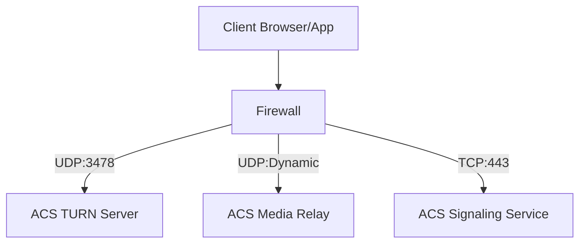

---
content_sources:
  diagrams:
    - id: networking-media-flow
      type: flowchart
      source: mslearn-adapted
      mslearn_url: https://learn.microsoft.com/azure/communication-services/concepts/best-practices
content_validation:
  status: verified
  last_reviewed: 2026-07-25
  reviewer: agent
  core_claims:
    - claim: "Voice and video scenarios require clients to reach the documented Azure Communication Services network endpoints and ports for signaling and media"
      source: https://learn.microsoft.com/en-us/azure/communication-services/concepts/voice-video-calling/network-requirements
      verified: true
    - claim: "ACS calling guidance documents the firewall, proxy, port, and endpoint requirements that client networks must allow for real-time media workloads"
      source: https://learn.microsoft.com/en-us/azure/communication-services/concepts/voice-video-calling/network-requirements
      verified: true
---

# Networking Best Practices

Azure Communication Services (ACS) provides real-time calling and chat capabilities that require careful network configuration to ensure high-quality communication experiences. This document outlines the networking best practices for ACS.

## Firewall Rules for Calling SDK

The ACS Calling SDK uses standard protocols for media transmission, including STUN (Session Traversal Utilities for NAT) and TURN (Traversal Using Relays around NAT).

### Required Ports and Protocols

To ensure media flows correctly, the following firewall rules must be implemented on the client's network:

| Direction | Port Range | Protocol | Description |
| --- | --- | --- | --- |
| Outbound | 443 | TCP | Signaling and API calls (HTTPS/WSS) |
| Outbound | 3478-3481 | UDP | STUN and TURN media traffic |
| Outbound | 49152-65535 | UDP | Media traffic (RTP/RTCP) |

!!! warning "Do Not Block UDP"
    Blocking UDP traffic will force media to fall back to TCP, significantly increasing latency and degrading audio/video quality. Always allow UDP for the best communication experience.

<!-- diagram-id: networking-media-flow -->

```mermaid
graph TD
    Client[Client Browser/App] --> FW[Firewall]
    FW -- UDP:3478 --> TURN[ACS TURN Server]
    FW -- UDP:Dynamic --> MediaRelay[ACS Media Relay]
    FW -- TCP:443 --> Signaling[ACS Signaling Service]
```

## Proxy Configuration for WebRTC

If your network uses an HTTP proxy, the ACS Calling SDK will attempt to use it for signaling. However, proxies often do not support the UDP traffic required for media.

*   **Proxy Bypass**: Configure your proxy to bypass traffic for ACS endpoints where possible.
*   **PAC Files**: Use Proxy Auto-Config (PAC) files to direct ACS traffic around the proxy.

## Bandwidth Planning

Voice and video quality are directly proportional to available bandwidth.

| Feature | Recommended Bandwidth (Minimum) |
| --- | --- |
| **High Quality Video (720p)** | 1.5 Mbps |
| **Standard Quality Video (360p)** | 500 Kbps |
| **High Fidelity Voice** | 100 Kbps |
| **Low Fidelity Voice** | 30 Kbps |

!!! tip "Adaptive Bitrate"
    The ACS Calling SDK automatically adjusts the bitrate based on current network conditions. However, you should still plan for the minimum bandwidth requirements for your users.

## CDN Considerations for UI Library

If you are using the ACS UI Library, consider serving it from a Content Delivery Network (CDN) to reduce latency and improve load times for your users.

## Private Connectivity Options

For backend services communicating with ACS, you can use **Azure Private Link** to ensure that data remains on the Azure backbone network and is not exposed to the public internet.

*   **Endpoint Support**: ACS supports Private Link for data-plane operations (e.g., sending SMS or Email).
*   **Virtual Network (VNet) Integration**: Connect your ACS resource to your VNet to secure your backend communication.

## Why This Matters

Real-time voice and video quality depends almost entirely on the client network. Blocking UDP, forcing media through a proxy, or under-provisioning bandwidth degrades calls in ways that are hard to diagnose after the fact. Getting the network baseline right prevents the majority of "the call sounds bad" support cases.

## Recommended Practices

- Allow the documented outbound ports: TCP 443 for signaling, and UDP 3478-3481 and 49152-65535 for media.
- Never block UDP — TCP fallback significantly increases latency and degrades media quality.
- Configure proxy bypass or PAC files so ACS media traffic avoids proxies that cannot carry UDP.
- Plan bandwidth against the minimums per feature (for example, 1.5 Mbps for 720p video).
- Use **Azure Private Link** and VNet integration to keep backend data-plane traffic on the Azure backbone.

## Common Mistakes / Anti-Patterns

- Blocking or rate-limiting UDP, forcing all media over TCP.
- Routing media through an HTTP proxy that only supports signaling.
- Provisioning bandwidth for average load while ignoring peak concurrent calls.
- Exposing backend ACS calls to the public internet when Private Link is available.

## Validation Checklist

- [ ] Required TCP 443 and UDP media port ranges are allowed outbound.
- [ ] UDP is not blocked anywhere on the client path.
- [ ] Proxy bypass or PAC rules exist for ACS endpoints.
- [ ] Bandwidth plan meets the minimum for the highest-quality feature in use.
- [ ] Private Link / VNet integration is used for backend connectivity where required.

## See Also

- [Reliability Best Practices](reliability.md)
- [Production Baseline](production-baseline.md)

## Sources

*   [ACS Networking Requirements](https://learn.microsoft.com/azure/communication-services/concepts/voice-video-calling/network-requirements)
*   [ACS Private Link Support](https://learn.microsoft.com/azure/communication-services/concepts/private-link)
*   [WebRTC Protocol Overview](https://webrtc.org/)
