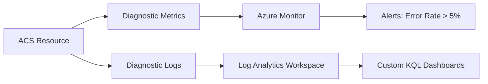

---
hide:
  - toc
content_sources:
  - source: mslearn-adapted
    mslearn_url: https://learn.microsoft.com/azure/communication-services/concepts/best-practices
---

# Production Baseline

Moving from a development or proof-of-concept environment to a production deployment of Azure Communication Services (ACS) requires a set of foundational controls. This document defines the minimum production baseline for ACS resources, covering configuration, identity, and monitoring.

## Resource Configuration

For production resources, focus on stability and redundancy:

*   **Redundancy**: Choose regions with Availability Zone support where possible. Although ACS is a global service, certain data residency options and specific resource types (like Email Communication Services) may have regional considerations.
*   **Data Residency**: Define your data residency requirements during resource creation. This cannot be changed later.
*   **Environment Segregation**: Use separate ACS resources for development, staging, and production. Never share a single connection string across multiple environments.

## Identity Strategy

The security of your ACS resource depends entirely on how you manage access.

### Managed Identity vs. Connection Strings

| Feature | Connection String | Managed Identity (Recommended) |
| --- | --- | --- |
| **Storage** | Requires secure vault (Key Vault) | Integrated with Azure AD / Entra ID |
| **Rotation** | Manual or scripted rotation needed | Automated by Azure |
| **Exposure** | High risk if leaked | Low risk (bound to resource) |
| **Auditability** | Difficult to track usage | Integrated with Azure activity logs |

!!! tip "Use Managed Identity"
    Always use System-Assigned or User-Assigned Managed Identity for backend services (Azure Functions, Web Apps) to authenticate with ACS. This eliminates the need to handle secrets in your application code.

## Monitoring Baseline

A production resource must have a monitoring baseline to ensure visibility into failures.

<!-- diagram-id: monitoring-baseline-flow -->

### Telemetry Targets

1.  **Azure Monitor Metrics**: Monitor overall health, including call drops, SMS delivery failures, and email bounce rates.
2.  **Log Analytics**: Enable Diagnostic Settings to capture detailed logs for chat, calling, SMS, and email. This is essential for post-incident analysis.
3.  **Event Grid**: Use Event Grid for real-time notification of events (e.g., incoming SMS, call status changes) instead of polling APIs.

## Phone Number Management

For SMS and PSTN calling, manage your phone numbers carefully:

*   **Acquisition**: Plan for number acquisition lead times, especially for toll-free or international numbers.
*   **Verification**: Ensure all required business verification documents are submitted to avoid service interruptions.
*   **Cleanup**: Regularly audit unused numbers to reduce monthly recurring costs.

## Email Domain Verification

Before sending production emails:

1.  **Domain Ownership**: Verify ownership of your custom domain via DNS records.
2.  **Sender Authentication**: Configure SPF and DKIM to ensure high deliverability and avoid being flagged as spam.
3.  **Volume Warm-up**: If sending large volumes of email, start with a lower volume and gradually increase to warm up your IP reputation.

## Sources

*   [ACS Authentication Concepts](https://learn.microsoft.com/azure/communication-services/concepts/authentication)
*   [ACS Logging and Diagnostics](https://learn.microsoft.com/azure/communication-services/concepts/logging-and-diagnostics)
*   Azure Communication Services Production Readiness Guide (Internal/Microsoft Learn)
