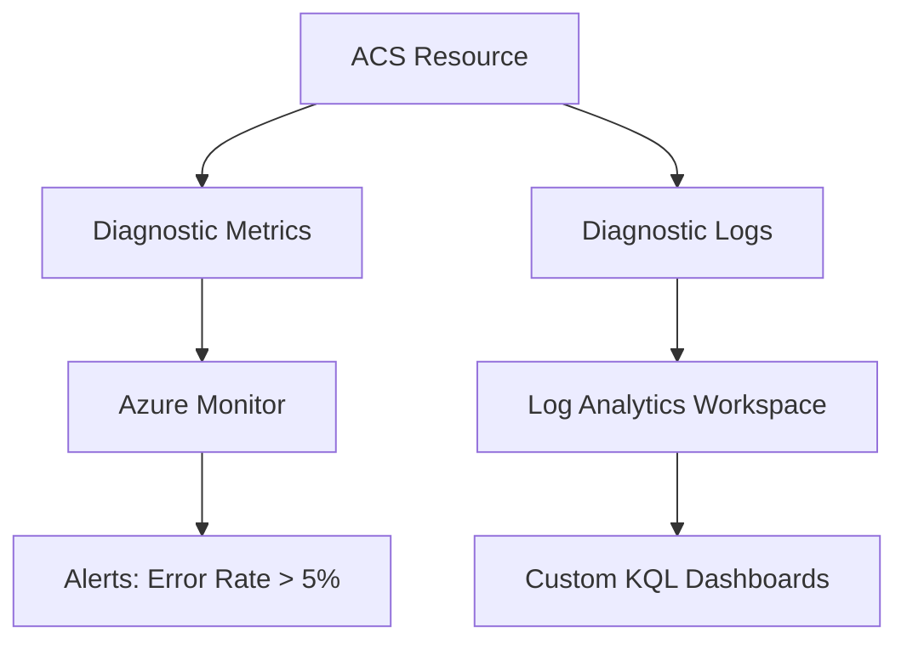

---
content_sources:
  diagrams:
    - id: monitoring-baseline-flow
      type: flowchart
      source: mslearn-adapted
      mslearn_url: https://learn.microsoft.com/en-us/azure/communication-services/concepts/best-practices
content_validation:
  status: verified
  last_reviewed: 2026-07-25
  reviewer: agent
  core_claims:
    - claim: "ACS best-practices guidance recommends establishing a production baseline that covers authentication, observability, and resource configuration before go-live"
      source: https://learn.microsoft.com/en-us/azure/communication-services/concepts/best-practices
      verified: true
    - claim: "ACS integrates with Azure Monitor through diagnostic settings, so a production baseline can route logs to Log Analytics for day-2 operations"
      source: https://learn.microsoft.com/en-us/azure/communication-services/concepts/logging-and-diagnostics
      verified: true
---

# Production Baseline

Moving from a development or proof-of-concept environment to a production deployment of Azure Communication Services (ACS) requires a set of foundational controls. This document defines the minimum production baseline for ACS resources, covering configuration, identity, and monitoring.

## Resource Configuration

For production resources, focus on stability and redundancy:

*   **Redundancy**: Choose regions with Availability Zone support where possible. Although ACS is a global service, certain data residency options and specific resource types (like Email Communication Services) may have regional considerations.
*   **Data Residency**: Define your data residency requirements during resource creation. This cannot be changed later.
*   **Environment Segregation**: Use separate ACS resources for development, staging, and production. Never share a single connection string across multiple environments.

## Identity Strategy

The security of your ACS resource depends entirely on how you manage access.

### Managed Identity vs. Connection Strings

| Feature | Connection String | Managed Identity (Recommended) |
| --- | --- | --- |
| **Storage** | Requires secure vault (Key Vault) | Integrated with Azure AD / Entra ID |
| **Rotation** | Manual or scripted rotation needed | Automated by Azure |
| **Exposure** | High risk if leaked | Low risk (bound to resource) |
| **Auditability** | Difficult to track usage | Integrated with Azure activity logs |

!!! tip "Use Managed Identity"
    Always use System-Assigned or User-Assigned Managed Identity for backend services (Azure Functions, Web Apps) to authenticate with ACS. This eliminates the need to handle secrets in your application code.

## Monitoring Baseline

A production resource must have a monitoring baseline to ensure visibility into failures.

<!-- diagram-id: monitoring-baseline-flow -->

```mermaid
graph TD
    ACS[ACS Resource] --> DM[Diagnostic Metrics]
    ACS --> DL[Diagnostic Logs]
    DM --> AM[Azure Monitor]
    DL --> LAW[Log Analytics Workspace]
    AM --> AL[Alerts: Error Rate > 5%]
    LAW --> KQL[Custom KQL Dashboards]
```

### Telemetry Targets

1.  **Azure Monitor Metrics**: Monitor overall health, including call drops, SMS delivery failures, and email bounce rates.
2.  **Log Analytics**: Enable Diagnostic Settings to capture detailed logs for chat, calling, SMS, and email. This is essential for post-incident analysis.
3.  **Event Grid**: Use Event Grid for real-time notification of events (e.g., incoming SMS, call status changes) instead of polling APIs.

## Phone Number Management

For SMS and PSTN calling, manage your phone numbers carefully:

*   **Acquisition**: Plan for number acquisition lead times, especially for toll-free or international numbers.
*   **Verification**: Ensure all required business verification documents are submitted to avoid service interruptions.
*   **Cleanup**: Regularly audit unused numbers to reduce monthly recurring costs.

## Email Domain Verification

Before sending production emails:

1.  **Domain Ownership**: Verify ownership of your custom domain via DNS records.
2.  **Sender Authentication**: Configure SPF and DKIM to ensure high deliverability and avoid being flagged as spam.
3.  **Volume Warm-up**: If sending large volumes of email, start with a lower volume and gradually increase to warm up your IP reputation.

## Why This Matters

The gap between a proof-of-concept and a production ACS deployment is a set of foundational controls around configuration, identity, and observability. Skipping the baseline is what turns a working demo into an outage with no telemetry to diagnose it. Several of these choices — data residency in particular — cannot be changed after resource creation.

## Recommended Practices

- Segregate environments with separate ACS resources and never share a connection string across them.
- Fix data residency at creation time based on compliance requirements.
- Authenticate backend services with **managed identity** rather than connection strings.
- Enable diagnostic settings to Log Analytics and configure Azure Monitor metrics and alerts before go-live.
- Verify email domains (SPF/DKIM) and plan phone-number acquisition lead times ahead of launch.

## Common Mistakes / Anti-Patterns

- Sharing one ACS resource or connection string across dev, staging, and production.
- Deciding data residency casually, then discovering it is immutable.
- Going live without diagnostic logging, leaving no evidence for incident analysis.
- Launching email at full volume with no domain warm-up, harming deliverability.

## Validation Checklist

- [ ] Separate ACS resources exist per environment.
- [ ] Data residency is set correctly and confirmed.
- [ ] Backend services authenticate with managed identity.
- [ ] Diagnostic settings, metrics, and alerts are configured.
- [ ] Email domains are verified and warmed up before production volume.

## See Also

- [Security Best Practices](security.md)
- [Reliability Best Practices](reliability.md)
- [Operations: Provisioning](../operations/provisioning.md)

## Sources

*   [ACS Authentication Concepts](https://learn.microsoft.com/en-us/azure/communication-services/concepts/authentication)
*   [ACS Logging and Diagnostics](https://learn.microsoft.com/en-us/azure/communication-services/concepts/logging-and-diagnostics)
*   Azure Communication Services Production Readiness Guide (Internal/Microsoft Learn)
