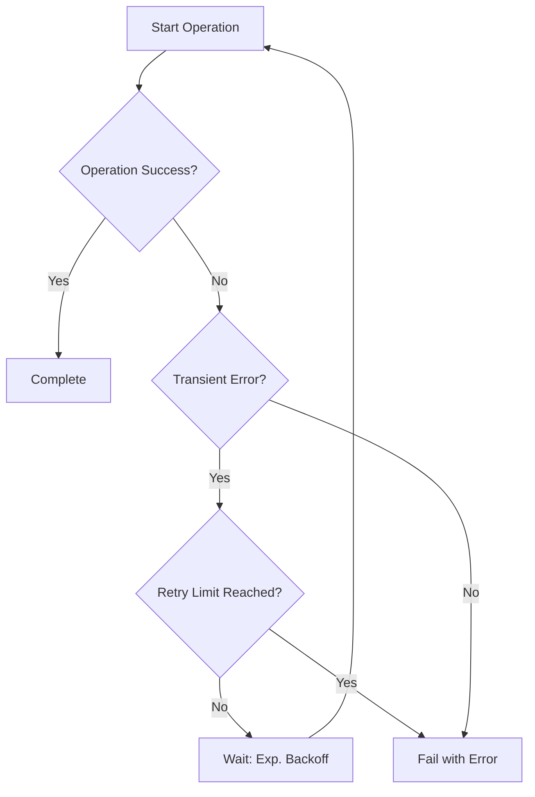

---
content_sources:
  diagrams:
    - id: reliability-retry-logic
      type: flowchart
      source: mslearn-adapted
      mslearn_url: https://learn.microsoft.com/azure/communication-services/concepts/best-practices
---

# Reliability Best Practices

Reliability in Azure Communication Services (ACS) is about ensuring that communication remains possible even when errors occur. This document outlines the best practices for handling transient failures, service interruptions, and maintaining connection resilience.

## SDK Retry Policies and Error Handling

All ACS SDKs have built-in retry mechanisms, but you should still implement your own error handling logic for critical operations.

### Best Practices for Retries

*   **Transient Errors**: Automatically retry operations that fail with transient error codes (e.g., 500, 503, or 429). Use an **exponential backoff** strategy to avoid overwhelming the service.
*   **Non-Transient Errors**: Do not retry operations that fail with non-transient error codes (e.g., 400 or 401). These errors require manual intervention or a change in the request.
*   **Idempotency**: Use idempotency keys where supported (e.g., in some SMS or Email APIs) to safely retry operations without creating duplicate messages.

<!-- diagram-id: reliability-retry-logic -->

## Circuit Breaker Patterns for SMS and Email

When sending large volumes of SMS or email, implement a circuit breaker pattern to prevent cascading failures if the service is experiencing high latency or high error rates.

*   **Open Circuit**: Stop sending requests if the error rate exceeds a predefined threshold.
*   **Half-Open**: Gradually resume sending requests to see if the service has recovered.
*   **Closed**: Resume normal operations once the service is healthy.

## Graceful Degradation

If a communication channel is unavailable, provide a fallback experience for your users.

*   **Fallback Channels**: If SMS delivery fails, fall back to email or an in-app notification.
*   **Reduced Quality**: For voice and video calling, if the network quality is poor, automatically downgrade to audio-only to maintain the connection.

## Connection Resilience for Chat and Calling

For real-time services like chat and calling, maintaining a stable connection is essential.

*   **Heartbeats**: Implement heartbeat monitoring to detect when a client has disconnected.
*   **Automatic Reconnect**: Configure your client application to automatically attempt reconnection when the network is restored.
*   **State Recovery**: When a chat client reconnects, fetch any missed messages from the server to ensure the UI is up to date.

## Health Monitoring and Alerting

Implement robust monitoring and alerting to identify and resolve reliability issues quickly.

*   **Availability Monitoring**: Use Azure Monitor to track the availability of your ACS resource.
*   **Success Rate Alerting**: Set up alerts when the success rate for SMS or email drops below your target SLA.
*   **Latency Monitoring**: Monitor the latency of your API calls to identify potential performance bottlenecks.

## Sources

*   [ACS SDK Error Handling](https://learn.microsoft.com/azure/communication-services/concepts/sdk-options#error-handling)
*   [Azure Well-Architected Framework: Reliability](https://learn.microsoft.com/azure/architecture/framework/resiliency/principles)
*   [Circuit Breaker Pattern (Microsoft Learn)](https://learn.microsoft.com/azure/architecture/patterns/circuit-breaker)
