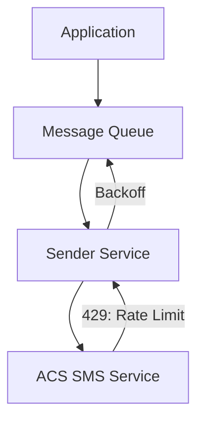

---
content_sources:
  - source: mslearn-adapted
    mslearn_url: https://learn.microsoft.com/azure/communication-services/concepts/best-practices
---

# Scaling Best Practices

Scaling in Azure Communication Services (ACS) is about managing high volume communication workloads while staying within service limits and maintaining performance. This document outlines the best practices for scaling SMS, email, chat, and calling.

## SMS Throughput Limits and Scaling

SMS throughput is restricted by the type of phone number used and the destination country's regulations.

*   **Toll-Free Numbers (US/Canada)**: Offer higher throughput compared to long codes but require mandatory business verification.
*   **Short Codes**: Provide the highest throughput for high volume messaging campaigns but involve a long lead time (8-12 weeks) and higher costs.
*   **Message Queuing**: If your application sends SMS at a rate higher than your number's throughput limit, implement a queuing system to smooth out the traffic and avoid 429 (Too Many Requests) errors.

<!-- diagram-id: scaling-sms-queuing -->

## Email Sending Rates and Warm-up

For high volume email workloads, you must manage your reputation and sending rates.

*   **Email Domain Warm-up**: Start with a small volume of emails and gradually increase to your target volume over several weeks. This builds IP and domain reputation with mailbox providers.
*   **Sending Limits**: Be aware of the default sending limits for your Azure subscription and ACS resource. Contact Azure Support to increase these limits if needed.

## Chat Thread Participant Limits

Chat threads in ACS have limits on the number of concurrent participants.

*   **Thread Limits**: A single chat thread can have up to 250 participants. For larger groups, consider using a broadcasting approach or breaking the conversation into multiple sub-threads.
*   **Concurrent Connections**: Monitor the number of concurrent connections to your chat service to ensure you stay within your resource's limits.

## Concurrent Call Capacity Planning

Voice and video calling capacity is generally limited by your Azure subscription's quotas and the available bandwidth.

*   **Call Quotas**: Review the default quotas for concurrent calls and requests per second (RPS) in the Azure portal.
*   **Scaling Group Calls**: For large group calls (up to 350 participants), use the **Room** or **Teams Interop** features for better management and scalability.

## Rate Limit Handling and Backoff

All ACS APIs have rate limits to ensure service stability.

*   **429 Errors**: When you receive a 429 (Too Many Requests) response, use the `Retry-After` header to determine how long to wait before retrying the request.
*   **Exponential Backoff**: If the `Retry-After` header is not present, use an exponential backoff strategy with jitter to avoid synchronized retries from multiple clients.

## Sources

*   [ACS Service Limits](https://learn.microsoft.com/azure/communication-services/concepts/service-limits)
*   [ACS SMS Concepts](https://learn.microsoft.com/azure/communication-services/concepts/telephony/sms-concepts)
*   [ACS Email Concepts](https://learn.microsoft.com/azure/communication-services/concepts/email/email-concepts)
