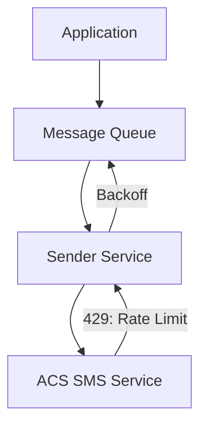

---
content_sources:
  diagrams:
    - id: scaling-sms-queuing
      type: flowchart
      source: mslearn-adapted
      mslearn_url: https://learn.microsoft.com/azure/communication-services/concepts/best-practices
content_validation:
  status: verified
  last_reviewed: 2026-07-25
  reviewer: agent
  core_claims:
    - claim: "ACS publishes service limits by feature, which makes scaling guidance channel-specific instead of one global throughput number for every workload"
      source: https://learn.microsoft.com/en-us/azure/communication-services/concepts/service-limits
      verified: true
    - claim: "Chat has documented service limits such as participant caps, so thread and room design must account for those limits during scale planning"
      source: https://learn.microsoft.com/en-us/azure/communication-services/concepts/service-limits
      verified: true
---

# Scaling Best Practices

Scaling in Azure Communication Services (ACS) is about managing high volume communication workloads while staying within service limits and maintaining performance. This document outlines the best practices for scaling SMS, email, chat, and calling.

## SMS Throughput Limits and Scaling

SMS throughput is restricted by the type of phone number used and the destination country's regulations.

*   **Toll-Free Numbers (US/Canada)**: Offer higher throughput compared to long codes but require mandatory business verification.
*   **Short Codes**: Provide the highest throughput for high volume messaging campaigns but involve a long lead time (8-12 weeks) and higher costs.
*   **Message Queuing**: If your application sends SMS at a rate higher than your number's throughput limit, implement a queuing system to smooth out the traffic and avoid 429 (Too Many Requests) errors.

<!-- diagram-id: scaling-sms-queuing -->

```mermaid
graph TD
    App[Application] --> Queue[Message Queue]
    Queue --> Sender[Sender Service]
    Sender --> ACS[ACS SMS Service]
    ACS -- 429: Rate Limit --> Sender
    Sender -- Backoff --> Queue
```

## Email Sending Rates and Warm-up

For high volume email workloads, you must manage your reputation and sending rates.

*   **Email Domain Warm-up**: Start with a small volume of emails and gradually increase to your target volume over several weeks. This builds IP and domain reputation with mailbox providers.
*   **Sending Limits**: Be aware of the default sending limits for your Azure subscription and ACS resource. Contact Azure Support to increase these limits if needed.

## Chat Thread Participant Limits

Chat threads in ACS have limits on the number of concurrent participants.

*   **Thread Limits**: A single chat thread can have up to 250 participants. For larger groups, consider using a broadcasting approach or breaking the conversation into multiple sub-threads.
*   **Concurrent Connections**: Monitor the number of concurrent connections to your chat service to ensure you stay within your resource's limits.

## Concurrent Call Capacity Planning

Voice and video calling capacity is generally limited by your Azure subscription's quotas and the available bandwidth.

*   **Call Quotas**: Review the default quotas for concurrent calls and requests per second (RPS) in the Azure portal.
*   **Scaling Group Calls**: For large group calls (up to 350 participants), use the **Room** or **Teams Interop** features for better management and scalability.

## Rate Limit Handling and Backoff

All ACS APIs have rate limits to ensure service stability.

*   **429 Errors**: When you receive a 429 (Too Many Requests) response, use the `Retry-After` header to determine how long to wait before retrying the request.
*   **Exponential Backoff**: If the `Retry-After` header is not present, use an exponential backoff strategy with jitter to avoid synchronized retries from multiple clients.

## Why This Matters

ACS enforces service limits per channel, not as a single global throughput number. Scaling a workload means designing each channel — SMS throughput, email warm-up, chat participant caps, concurrent call quotas — against its own documented limit. Ignoring those limits surfaces as 429 errors and dropped traffic exactly when volume peaks.

## Recommended Practices

- Match the SMS number type (long code, toll-free, short code) to required throughput, and queue traffic that exceeds the number's limit.
- Warm up email domains gradually and request limit increases from Azure Support ahead of peak.
- Design chat around the 250-participant thread cap, using broadcasting or sub-threads for larger audiences.
- Review concurrent-call and RPS quotas, and use Rooms or Teams Interop for large group calls.
- On 429, honor `Retry-After`; when absent, use exponential backoff with jitter.

## Common Mistakes / Anti-Patterns

- Sending SMS faster than the number's throughput with no queue, triggering 429 storms.
- Blasting full email volume from a cold domain and cratering deliverability.
- Designing chat threads without accounting for the participant cap.
- Synchronized client retries with no jitter, amplifying rate-limit pressure.

## Validation Checklist

- [ ] SMS number type matches required throughput, with queuing for overflow.
- [ ] Email warm-up plan and any needed limit increases are in place.
- [ ] Chat design respects the participant cap.
- [ ] Concurrent-call and RPS quotas are reviewed against peak demand.
- [ ] Rate-limit handling honors `Retry-After` and uses backoff with jitter.

## See Also

- [Reliability Best Practices](reliability.md)
- [Cost Optimization](cost-optimization.md)

## Sources

*   [ACS Service Limits](https://learn.microsoft.com/azure/communication-services/concepts/service-limits)
*   [ACS SMS Concepts](https://learn.microsoft.com/azure/communication-services/concepts/telephony/sms-concepts)
*   [ACS Email Concepts](https://learn.microsoft.com/azure/communication-services/concepts/email/email-concepts)
