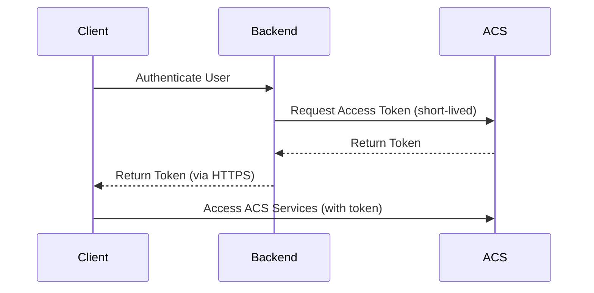

---
content_sources:
  - source: mslearn-adapted
    mslearn_url: https://learn.microsoft.com/azure/communication-services/concepts/authentication
---

# Security Best Practices

Security in Azure Communication Services (ACS) is built on the principle of least privilege and defense in depth. This document outlines the best practices for protecting your communication assets, user data, and infrastructure.

## Token Management

ACS uses short-lived user access tokens to authenticate client applications.

### Best Practices for Tokens

*   **Generate Tokens on the Backend**: Never generate or store access tokens on the client-side. Use a secure backend service (e.g., Azure Functions or a Web API) to request tokens from ACS.
*   **Use Short TTLs**: Default token lifetimes are 24 hours. Consider reducing this for highly sensitive applications (e.g., healthcare or financial services).
*   **Secure Distribution**: Transmit tokens to client applications over HTTPS only.
*   **Refresh Tokens Gracefully**: Implement logic in your client applications to refresh tokens before they expire to avoid service interruptions.

<!-- diagram-id: security-token-flow -->

## Connection String Protection

The connection string is a "master key" for your ACS resource.

*   **Never Hardcode**: Do not store connection strings in source code, configuration files, or environment variables in plain text.
*   **Use Managed Identity**: As discussed in the [Production Baseline](production-baseline.md), use Managed Identity for authentication to avoid connection strings altogether.
*   **Azure Key Vault**: If you must use a connection string, store it in Azure Key Vault and access it using a Managed Identity.

## RBAC Roles for ACS

Use Azure Role-Based Access Control (RBAC) to restrict administrative access:

| Role | Permissions | Use Case |
| --- | --- | --- |
| **Azure Communication Services Owner** | Full access to all resources. | Initial setup and management. |
| **Azure Communication Services Contributor** | Can create/manage resources but cannot assign roles. | DevOps and operational management. |
| **Azure Communication Services Reader** | Read-only access to resource settings. | Monitoring and auditing. |
| **Azure Communication Services User** | Access to data-plane operations (e.g., sending messages). | Backend application services. |

## Data Privacy

Data privacy is critical for communication services, especially in regulated industries.

*   **Recording Consent**: Always obtain explicit user consent before recording a voice or video call. Use the ACS recording API built-in notification features to inform all participants.
*   **Data Residency**: Choose your ACS resource region carefully to comply with local data residency regulations (e.g., GDPR, CCPA).
*   **Content Moderation**: For chat applications, implement content moderation to filter offensive language or malicious URLs. Integrate with Azure AI Content Safety for automated moderation.

## Secure Webhook Endpoints

If you use Event Grid to receive webhooks from ACS:

1.  **Validate Webhook Calls**: Ensure your endpoint validates that incoming requests are actually from Azure Event Grid (use validation tokens).
2.  **HTTPS Only**: Your webhook endpoint must be reachable only over HTTPS.
3.  **Authentication**: Use a secret key or Azure AD authentication for your webhook endpoint to prevent unauthorized access.

## Sources

*   [ACS Authentication Concepts](https://learn.microsoft.com/azure/communication-services/concepts/authentication)
*   [ACS Data Privacy](https://learn.microsoft.com/azure/communication-services/concepts/privacy)
*   [Azure AI Content Safety](https://learn.microsoft.com/azure/ai-services/content-safety/overview)
