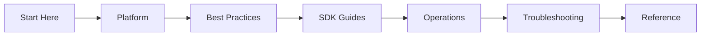

---
content_sources:
  diagrams:
    - id: learning-flow
      type: Mermaid
      source: self-generated
      justification: "https://learn.microsoft.com/azure/communication-services/overview"
      based_on: "https://learn.microsoft.com/azure/communication-services/overview"
---

# Azure Communication Services Practical Guide

Welcome to the Azure Communication Services Practical Guide. This is a comprehensive, practitioner-focused documentation resource for building, operating, and troubleshooting Azure Communication Services (ACS).

-   **New to ACS?**
    Start with the orientation to understand the platform and choose your learning path.
    [:octicons-arrow-right-24: Start Here](start-here/overview.md)

-   **Running Production?**
    Review operational best practices and implementation recipes for scale.
    [:octicons-arrow-right-24: Best Practices](best-practices/index.md)

-   **Investigating an Issue?**
    Jump directly to the troubleshooting section for diagnostic steps and playbooks.
    [:octicons-arrow-right-24: Troubleshooting](troubleshooting/index.md)

## Navigate the Guide

| Section | Description | Key Topics |
| :--- | :--- | :--- |
| [**Start Here**](start-here/overview.md) | Guide orientation and learning paths | Role-based paths, guide map |
| [**Platform**](platform/index.md) | ACS architectural foundation | Identity, Tokens, Resource management |
| [**Best Practices**](best-practices/index.md) | Production implementation patterns | Security, Scalability, Cost optimization |
| [**SDK Guides**](sdk-guides/index.md) | Language-specific implementation | Python, JS, Java, .NET |
| [**Operations**](operations/index.md) | Managing ACS at scale | Monitoring, Alerting, Quotas |
| [**Troubleshooting**](troubleshooting/index.md) | Systematic diagnostic playbooks | Logs, KQL, Error codes |
| [**Reference**](reference/index.md) | Quick access to specs and docs | API limits, Service specs |

## Learning Flow

<!-- diagram-id: learning-flow -->

## Scope and Disclaimer

This guide is designed for developers, architects, and SREs who need to go beyond the basics. It focuses on practical implementation, operational stability, and rapid troubleshooting. 

This is not an official Microsoft product. While based on official documentation and real-world experience, always verify critical architecture decisions with the [Official Microsoft Documentation](https://learn.microsoft.com/azure/communication-services/).

## Sources

- [Azure Communication Services Overview](https://learn.microsoft.com/azure/communication-services/overview)
- [ACS Documentation Architecture](https://learn.microsoft.com/azure/communication-services/)
