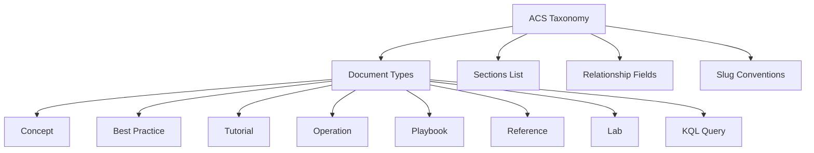

# ACS Documentation Taxonomy

The taxonomy defines the document types, sections, and metadata schemas used throughout the Azure Communication Services (ACS) Practical Guide.

<!-- diagram-id: taxonomy-diagram -->

## Document Types for ACS

| Type | Description |
| --- | --- |
| `concept` | Fundamental communication and ACS concepts. |
| `best_practice` | Recommended patterns and practices for ACS. |
| `tutorial` | Step-by-step guides for common tasks. |
| `operation` | Lifecycle management and operational tasks. |
| `playbook` | Strategic guides for communication solutions. |
| `reference` | Technical details, CLI commands, and limits. |
| `lab` | Hands-on exercises and experiments. |
| `kql` | Kusto queries for monitoring and diagnostics. |

## Sections List

The ACS Practical Guide is organized into the following main sections:

- **Operations**: Provisioning, monitoring, security, and deployment.
- **Reference**: CLI cheatsheet, platform limits, and SDK reference.
- **Visualization**: Interactive knowledge graphs and learning paths.
- **Meta**: Documentation taxonomy and governance.

## Relationship Fields Documentation

Use the following frontmatter fields to define relationships between documents:

- `related_concepts`: Links to relevant conceptual documentation.
- `related_operations`: Links to operational guides.
- `related_references`: Links to technical reference materials.

## Frontmatter Schema

Each documentation file must include the following YAML frontmatter:

### Required Fields
- `title`: The title of the document.
- `description`: A brief summary of the content.
- `type`: One of the document types listed above.

### Recommended Fields
- `hide: [toc]`: Hides the Table of Contents if not needed.
- `content_sources`: A list of URLs for official ACS documentation.

## Slug Conventions

Follow these rules when naming documentation files (slugs):

1. Use only lowercase letters, numbers, and hyphens.
2. Avoid spaces, underscores, and special characters.
3. Keep slugs short, descriptive, and consistent with the document title.

## See Also
- [Azure Communication Services Overview](https://learn.microsoft.com/azure/communication-services/overview)

## Sources
- [ACS Documentation Overview](https://learn.microsoft.com/azure/communication-services/overview)
