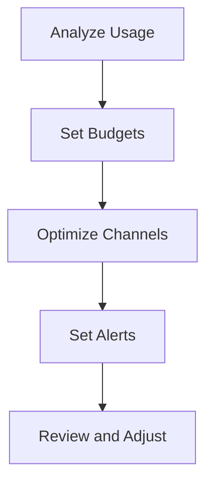

---
content_sources:
  - https://learn.microsoft.com/azure/communication-services/concepts/pricing
content_validation:
  status: pending_review
  last_reviewed: null
  reviewer: agent
  core_claims: []
---

# Cost Optimization for ACS

Ongoing cost management is vital to ensure communication services stay within budget while meeting performance requirements.

<!-- diagram-id: cost-optimization-workflow -->


## Day-2 Cost Monitoring

ACS follows a consumption-based pricing model, meaning you pay for what you use across SMS, Email, Chat, and Calling.

### Budget Alerts Setup
1. Use Azure Cost Management to create a budget for your ACS resource.
2. Configure budget alerts at 50%, 75%, and 90% of your budget.
3. Use the Azure CLI to list your current usage and costs:
   ```bash
   az consumption usage list --resource-group my-rg --top 10
   ```

## Usage Analysis Queries

Analyze ACS consumption patterns with Kusto (KQL) in Log Analytics:

| Query | Description |
| --- | --- |
| `ACSBilling` | Sum of billing units per operation. |
| `ACSSmsUsage` | Count of SMS messages sent and received. |
| `ACSEmailUsage` | Count of email messages sent and delivery status. |

## Right-sizing Communication Channels

To optimize your ACS costs:

- **SMS**: Use 10-digit long code (10DLC) for high-volume SMS.
- **Email**: Use Azure Managed Domains for development and custom domains for production.
- **Chat**: Minimize the number of participants per thread to reduce message volume.
- **Calling**: Use VoIP calling where possible instead of PSTN.

## See Also
- [Pricing details for ACS](https://azure.microsoft.com/pricing/details/communication-services/)
- [How to: Create and manage Azure budgets](https://learn.microsoft.com/azure/cost-management-billing/costs/tutorial-acm-create-budgets)

## Sources
- [ACS Pricing Page](https://azure.microsoft.com/pricing/details/communication-services/)
