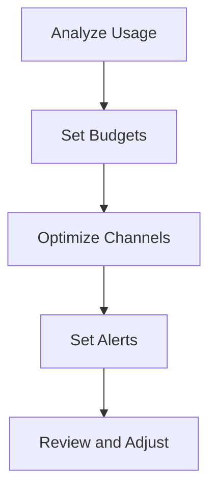

---
content_sources:
  diagrams:
    - id: cost-optimization-workflow
      type: flowchart
      source: mslearn-adapted
      mslearn_url: https://learn.microsoft.com/en-us/azure/communication-services/concepts/pricing
content_validation:
  status: verified
  last_reviewed: 2026-07-25
  reviewer: agent
  core_claims:
    - claim: "ACS costs are driven by channel-specific usage and purchased resources, so day-2 optimization starts with the service pricing model"
      source: https://learn.microsoft.com/en-us/azure/communication-services/concepts/pricing
      verified: true
    - claim: "Azure Cost Management budgets can alert on spending thresholds, which makes them a valid operational control for ACS cost governance"
      source: https://learn.microsoft.com/en-us/azure/cost-management-billing/costs/tutorial-acm-create-budgets
      verified: true
---

# Cost Optimization for ACS

Ongoing cost management is vital to ensure communication services stay within budget while meeting performance requirements.

<!-- diagram-id: cost-optimization-workflow -->

```mermaid
graph TD
    Analyze[Analyze Usage] --> Budget[Set Budgets]
    Budget --> Optimize[Optimize Channels]
    Optimize --> Alert[Set Alerts]
    Alert --> Review[Review and Adjust]
```

## Day-2 Cost Monitoring

ACS follows a consumption-based pricing model, meaning you pay for what you use across SMS, Email, Chat, and Calling.

### Budget Alerts Setup
1. Use Azure Cost Management to create a budget for your ACS resource.
2. Configure budget alerts at 50%, 75%, and 90% of your budget.
3. Use the Azure CLI to list your current usage and costs:
   ```bash
   az consumption usage list --top 10
   ```

| Command | Purpose |
|---------|---------|
| `az consumption usage list` | Lists consumption usage details for the subscription. |
| `--top 10` | Limits the output to the first 10 usage records. |

## Usage Analysis Queries

Analyze ACS consumption patterns with Kusto (KQL) in Log Analytics:

| Query | Description |
| --- | --- |
| `ACSBilling` | Sum of billing units per operation. |
| `ACSSmsUsage` | Count of SMS messages sent and received. |
| `ACSEmailUsage` | Count of email messages sent and delivery status. |

## Right-sizing Communication Channels

To optimize your ACS costs:

- **SMS**: Use 10-digit long code (10DLC) for high-volume SMS.
- **Email**: Use Azure Managed Domains for development and custom domains for production.
- **Chat**: Minimize the number of participants per thread to reduce message volume.
- **Calling**: Use VoIP calling where possible instead of PSTN.

## Prerequisites

- An ACS resource with at least one active channel (SMS, Email, Chat, or Calling) generating billable usage.
- **Cost Management Reader** (or higher) on the subscription or resource group to view costs and create budgets.
- A Log Analytics workspace receiving ACS diagnostic logs if you plan to run the usage-analysis KQL queries.

## When to Use

Run this cost-optimization loop as a recurring day-2 activity rather than a one-time task:

- During monthly or quarterly cost reviews.
- After onboarding a new high-volume channel (for example, bulk SMS or PSTN calling).
- When a budget alert fires, or when the ACS line item on the invoice grows unexpectedly.

## Procedure

1. **Establish visibility** — create an Azure Cost Management budget for the ACS resource and enable alerts at 50%, 75%, and 90% as described in [Day-2 Cost Monitoring](#day-2-cost-monitoring).
2. **Analyze usage** — run the KQL queries in [Usage Analysis Queries](#usage-analysis-queries) to attribute spend to specific channels and operations.
3. **Right-size channels** — apply the per-channel guidance in [Right-sizing Communication Channels](#right-sizing-communication-channels), such as 10DLC for high-volume SMS and VoIP in place of PSTN.
4. **Iterate** — feed the results back into the budget thresholds and repeat on your review cadence.

## Verification

- Confirm the budget appears in **Cost Management → Budgets** with the expected thresholds and alert recipients.
- Confirm the usage KQL queries return non-empty results for the channels you actually use.
- After a right-sizing change, compare the next billing period's channel cost against the prior period to confirm the reduction is real rather than seasonal.

## Rollback / Troubleshooting

- **Budget alerts not firing** — verify the alert action group has valid recipients and that spend has actually crossed the threshold; budgets evaluate on a delay of several hours.
- **KQL queries return no rows** — confirm diagnostic settings route the relevant ACS log categories to the workspace and that enough time has passed for logs to land.
- **A right-sizing change hurts deliverability or quality** — revert the channel change (for example, move back from 10DLC to the previous sender) and re-evaluate; cost optimization must never override reliability requirements.

## See Also
- [Cost Optimization Best Practices](../best-practices/cost-optimization.md)
- [Monitoring](./monitoring.md)

## Sources
- [Pricing details for Azure Communication Services](https://azure.microsoft.com/pricing/details/communication-services/)
- [Tutorial: Create and manage Azure budgets](https://learn.microsoft.com/en-us/azure/cost-management-billing/costs/tutorial-acm-create-budgets)
