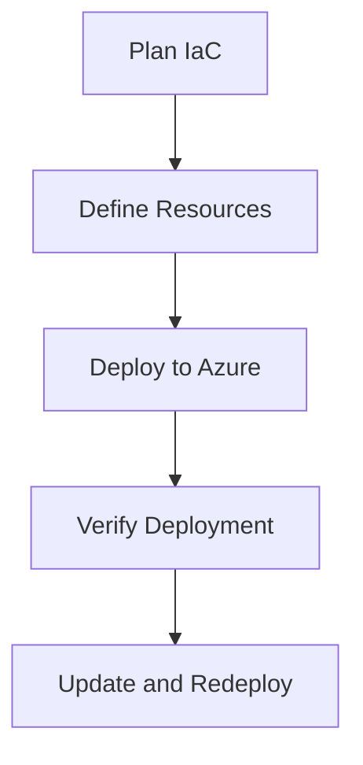

---
content_sources:
  diagrams:
    - id: iac-workflow
      type: flowchart
      source: mslearn-adapted
      mslearn_url: https://learn.microsoft.com/en-us/azure/communication-services/quickstarts/create-communication-resource
content_validation:
  status: verified
  last_reviewed: 2026-07-25
  reviewer: agent
  core_claims:
    - claim: "Azure Communication Services resources can be deployed declaratively because Microsoft publishes the ARM and Bicep resource type for Microsoft.Communication/communicationServices"
      source: https://learn.microsoft.com/en-us/azure/templates/microsoft.communication/communicationservices
      verified: true
    - claim: "The Communication Services quickstart documents automated resource creation, which makes ACS suitable for infrastructure-as-code deployment pipelines"
      source: https://learn.microsoft.com/en-us/azure/communication-services/quickstarts/create-communication-resource
      verified: true
---

# Infrastructure as Code for ACS

Automating the deployment of Azure Communication Services using Bicep or Terraform to ensure consistent and reproducible environments.

<!-- diagram-id: iac-workflow -->


## Bicep Template Examples

The following Bicep code creates an ACS resource:

```bicep
resource acsResource 'Microsoft.Communication/communicationServices@2023-04-01-preview' = {
  name: 'my-acs-resource'
  location: 'Global'
  properties: {
    dataLocation: 'UnitedStates'
  }
}
```

### Bicep Resource Dependencies
ACS resources may depend on other resources like Log Analytics for diagnostic logging.

```bicep
resource logAnalytics 'Microsoft.OperationalInsights/workspaces@2021-06-01' = {
  name: 'my-log-analytics'
  location: 'eastus'
}

resource diagnosticSettings 'Microsoft.Insights/diagnosticSettings@2021-05-01-preview' = {
  name: 'acs-diagnostics'
  scope: acsResource
  properties: {
    workspaceId: logAnalytics.id
    logs: [
      {
        category: 'SmsLogs'
        enabled: true
      }
      {
        category: 'EmailLogs'
        enabled: true
      }
    ]
  }
}
```

## Terraform Provider Configuration

To deploy ACS with Terraform, use the `azurerm` provider.

```hcl
resource "azurerm_communication_service" "acs" {
  name                = "my-acs-resource"
  resource_group_name = "my-rg"
  data_location       = "United States"
}
```

### Resource Dependencies and Ordering
Terraform automatically handles dependencies between resources. However, you can explicitly define them using `depends_on` if necessary.

## Prerequisites

- Azure CLI or Terraform installed, and **Contributor** on the target resource group.
- A resource group to hold the ACS resource, plus a Log Analytics workspace if you enable diagnostic logging.
- A source-controlled location for the Bicep or Terraform templates.

## When to Use

- When you need reproducible, reviewable ACS provisioning instead of portal click-ops.
- When promoting the same ACS configuration across dev, test, and production environments.
- When wiring ACS provisioning into a CI/CD pipeline (see [GitHub Actions Deployment](./github-actions.md)).

## Procedure

1. **Author the template** — define the ACS resource with Bicep (see [Bicep Template Examples](#bicep-template-examples)) or Terraform (see [Terraform Provider Configuration](#terraform-provider-configuration)).
2. **Wire dependencies** — attach diagnostic settings and any Log Analytics workspace as shown in [Bicep Resource Dependencies](#bicep-resource-dependencies) or [Resource Dependencies and Ordering](#resource-dependencies-and-ordering).
3. **Deploy** — run the deployment through your IaC tool: `az deployment group create` for Bicep, or `terraform apply` for Terraform.
4. **Promote** — parameterize environment-specific values so the same template deploys to each environment.

## Verification

- Confirm the ACS resource exists with the expected `dataLocation` and appears in the target resource group.
- Confirm diagnostic settings are attached and routing the expected log categories to the workspace.
- Re-run the deployment to confirm it is idempotent — a second apply should report no changes.

## Rollback / Troubleshooting

- **Deployment fails on data location** — `dataLocation` is immutable after creation; to change it, delete and recreate the resource in a controlled window.
- **Terraform drift** — run `terraform plan` to detect out-of-band portal changes and reconcile them back into the template.
- **Need to roll back** — redeploy the previous known-good template version from source control rather than editing resources by hand.

## See Also
- [GitHub Actions Deployment](./github-actions.md)
- [Deployment Overview](./index.md)
- [Provisioning](../provisioning.md)

## Sources
- [Bicep reference for Microsoft.Communication](https://learn.microsoft.com/en-us/azure/templates/microsoft.communication/communicationservices)
- [Terraform azurerm_communication_service resource](https://registry.terraform.io/providers/hashicorp/azurerm/latest/docs/resources/communication_service)
- [Quickstart: Create and manage Communication Services resources](https://learn.microsoft.com/en-us/azure/communication-services/quickstarts/create-communication-resource)
