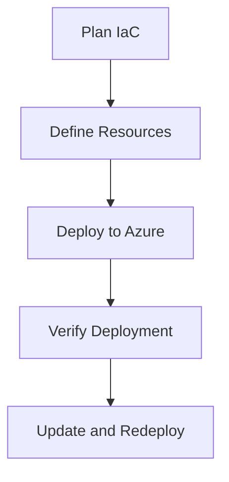

---
content_sources:
  diagrams:
    - id: iac-workflow
      type: flowchart
      source: mslearn-adapted
      mslearn_url: https://learn.microsoft.com/azure/communication-services/quickstarts/create-communication-resource
content_validation:
  status: verified
  last_reviewed: 2026-07-25
  reviewer: agent
  core_claims:
    - claim: "Azure Communication Services resources can be deployed declaratively because Microsoft publishes the ARM and Bicep resource type for Microsoft.Communication/communicationServices"
      source: https://learn.microsoft.com/en-us/azure/templates/microsoft.communication/communicationservices
      verified: true
    - claim: "The Communication Services quickstart documents automated resource creation, which makes ACS suitable for infrastructure-as-code deployment pipelines"
      source: https://learn.microsoft.com/en-us/azure/communication-services/quickstarts/create-communication-resource
      verified: true
---

# Infrastructure as Code for ACS

Automating the deployment of Azure Communication Services using Bicep or Terraform to ensure consistent and reproducible environments.

<!-- diagram-id: iac-workflow -->


## Bicep Template Examples

The following Bicep code creates an ACS resource:

```bicep
resource acsResource 'Microsoft.Communication/communicationServices@2023-04-01-preview' = {
  name: 'my-acs-resource'
  location: 'Global'
  properties: {
    dataLocation: 'UnitedStates'
  }
}
```

### Bicep Resource Dependencies
ACS resources may depend on other resources like Log Analytics for diagnostic logging.

```bicep
resource logAnalytics 'Microsoft.OperationalInsights/workspaces@2021-06-01' = {
  name: 'my-log-analytics'
  location: 'eastus'
}

resource diagnosticSettings 'Microsoft.Insights/diagnosticSettings@2021-05-01-preview' = {
  name: 'acs-diagnostics'
  scope: acsResource
  properties: {
    workspaceId: logAnalytics.id
    logs: [
      {
        category: 'SmsLogs'
        enabled: true
      }
      {
        category: 'EmailLogs'
        enabled: true
      }
    ]
  }
}
```

## Terraform Provider Configuration

To deploy ACS with Terraform, use the `azurerm` provider.

```hcl
resource "azurerm_communication_service" "acs" {
  name                = "my-acs-resource"
  resource_group_name = "my-rg"
  data_location       = "United States"
}
```

### Resource Dependencies and Ordering
Terraform automatically handles dependencies between resources. However, you can explicitly define them using `depends_on` if necessary.

## See Also
- [Bicep documentation for ACS](https://learn.microsoft.com/azure/templates/microsoft.communication/communicationservices)
- [Terraform documentation for ACS](https://registry.terraform.io/providers/hashicorp/azurerm/latest/docs/resources/communication_service)

## Sources
- [ACS Bicep Quickstart](https://learn.microsoft.com/azure/communication-services/quickstarts/create-communication-resource)
