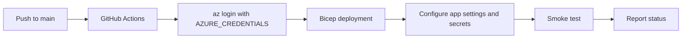

# GitHub Actions Deployment

Use GitHub Actions to deploy ACS-related infrastructure, configure secrets, and run smoke tests after deployment.

<!-- diagram-id: acs-github-actions-cicd -->


## Secret management

| Secret | Usage |
| --- | --- |
| `AZURE_CREDENTIALS` | Service principal JSON for `azure/login` |
| `ACS_CONNECTION_STRING` | Runtime secret for app settings |
| `APP_NAME` | Target app name |
| `RESOURCE_GROUP` | Deployment scope |

!!! warning "Never print secrets"
    Pass secrets through GitHub Actions `secrets` and Azure app settings. Do not echo them into logs.

## Workflow example

```yaml
name: deploy-acs

on:
  workflow_dispatch:
  push:
    branches: [main]

jobs:
  deploy:
    runs-on: ubuntu-latest
    steps:
      - name: Checkout
        uses: actions/checkout@v4

      - name: Azure login
        uses: azure/login@v2
        with:
          creds: ${{ secrets.AZURE_CREDENTIALS }}

      - name: Deploy Bicep
        uses: azure/cli@v2
        with:
          inlineScript: |
            az deployment group create \
              --resource-group "$RESOURCE_GROUP" \
              --template-file infra/main.bicep \
              --parameters environment=prod
        env:
          RESOURCE_GROUP: ${{ secrets.RESOURCE_GROUP }}

      - name: Set app settings
        uses: azure/cli@v2
        with:
          inlineScript: |
            az webapp config appsettings set \
              --resource-group "$RESOURCE_GROUP" \
              --name "$APP_NAME" \
              --settings ACS_CONNECTION_STRING="$ACS_CONNECTION_STRING"
        env:
          RESOURCE_GROUP: ${{ secrets.RESOURCE_GROUP }}
          APP_NAME: ${{ secrets.APP_NAME }}
          ACS_CONNECTION_STRING: ${{ secrets.ACS_CONNECTION_STRING }}

      - name: Validation smoke test
        run: |
          curl --fail --retry 5 --retry-delay 10 https://${APP_NAME}.azurewebsites.net/healthz
        env:
          APP_NAME: ${{ secrets.APP_NAME }}
```

## Bicep deployment step

Keep the template focused on core resources:

- Resource group scoped deployment
- Communication Services resource
- App Service or Container App target
- Key Vault for runtime secrets

## Validation and smoke tests

Run at least one post-deploy check:

1. Confirm the resource exists with `az resource show`
2. Verify the app responds on `/healthz`
3. Send a lightweight ACS request if the app exposes one

## Practical guidance

!!! tip "Deploy infra first"
    Separate infrastructure and application deployment so you can fail fast on template issues.

## See Also

- [Bicep and Terraform deployment patterns](../deployment/bicep-terraform.md)
- [Managed Identity](../../sdk-guides/dotnet/recipes/managed-identity.md)

## Sources

- https://docs.github.com/actions
- https://learn.microsoft.com/azure/azure-resource-manager/bicep/
- https://learn.microsoft.com/azure/communication-services/quickstarts/create-communication-resource
