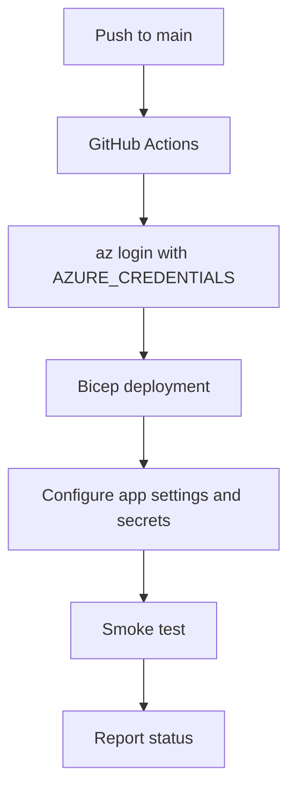

# GitHub Actions Deployment

Use GitHub Actions to deploy ACS-related infrastructure, configure secrets, and run smoke tests after deployment.

<!-- diagram-id: acs-github-actions-cicd -->

```mermaid
flowchart TD
  A[Push to main] --> B[GitHub Actions]
  B --> C[az login with AZURE_CREDENTIALS]
  C --> D[Bicep deployment]
  D --> E[Configure app settings and secrets]
  E --> F[Smoke test]
  F --> G[Report status]
```

## Secret management

| Secret | Usage |
| --- | --- |
| `AZURE_CREDENTIALS` | Service principal JSON for `azure/login` |
| `ACS_CONNECTION_STRING` | Runtime secret for app settings |
| `APP_NAME` | Target app name |
| `RESOURCE_GROUP` | Deployment scope |

!!! warning "Never print secrets"
    Pass secrets through GitHub Actions `secrets` and Azure app settings. Do not echo them into logs.

## Workflow example

```yaml
name: deploy-acs

on:
  workflow_dispatch:
  push:
    branches: [main]

jobs:
  deploy:
    runs-on: ubuntu-latest
    steps:
      - name: Checkout
        uses: actions/checkout@v4

      - name: Azure login
        uses: azure/login@v2
        with:
          creds: ${{ secrets.AZURE_CREDENTIALS }}

      - name: Deploy Bicep
        uses: azure/cli@v2
        with:
          inlineScript: |
            az deployment group create \
              --resource-group "$RESOURCE_GROUP" \
              --template-file infra/main.bicep \
              --parameters environment=prod
        env:
          RESOURCE_GROUP: ${{ secrets.RESOURCE_GROUP }}

      - name: Set app settings
        uses: azure/cli@v2
        with:
          inlineScript: |
            az webapp config appsettings set \
              --resource-group "$RESOURCE_GROUP" \
              --name "$APP_NAME" \
              --settings ACS_CONNECTION_STRING="$ACS_CONNECTION_STRING"
        env:
          RESOURCE_GROUP: ${{ secrets.RESOURCE_GROUP }}
          APP_NAME: ${{ secrets.APP_NAME }}
          ACS_CONNECTION_STRING: ${{ secrets.ACS_CONNECTION_STRING }}

      - name: Validation smoke test
        run: |
          curl --fail --retry 5 --retry-delay 10 https://${APP_NAME}.azurewebsites.net/healthz
        env:
          APP_NAME: ${{ secrets.APP_NAME }}
```

The workflow runs these Azure CLI commands:

| Command | Purpose |
| --- | --- |
| `az deployment group create` | Deploys the Bicep template to the target resource group. |
| `--resource-group` | Names the resource group that receives the deployment. |
| `--template-file` | Path to the Bicep template to deploy. |
| `--parameters` | Passes environment parameters to the template. |
| `az webapp config appsettings set` | Writes runtime app settings on the target web app. |
| `--name` | Names the web app whose settings are updated. |
| `--settings` | Key-value app settings to apply, such as the ACS connection string. |

## Bicep deployment step

Keep the template focused on core resources:

- Resource group scoped deployment
- Communication Services resource
- App Service or Container App target
- Key Vault for runtime secrets

## Validation and smoke tests

Run at least one post-deploy check:

1. Confirm the resource exists with `az resource show`
2. Verify the app responds on `/healthz`
3. Send a lightweight ACS request if the app exposes one

## Practical guidance

!!! tip "Deploy infra first"
    Separate infrastructure and application deployment so you can fail fast on template issues.

## Prerequisites

- A GitHub repository containing the ACS Bicep template and application code.
- An Azure service principal (or OIDC federated credential) with **Contributor** on the target resource group, stored as the `AZURE_CREDENTIALS` secret.
- The runtime secrets listed in [Secret management](#secret-management) configured as GitHub Actions secrets.

## When to Use

- When you want every push to `main` to provision or update ACS infrastructure automatically.
- When you need an auditable, repeatable deployment trail instead of manual CLI runs.
- When coordinating infrastructure and application deployment through a single pipeline.

## Procedure

1. **Store secrets** — add the values from [Secret management](#secret-management) to the repository's Actions secrets.
2. **Define the workflow** — commit the pipeline in [Workflow example](#workflow-example), which logs in with `azure/login`, deploys the Bicep template, and applies app settings.
3. **Deploy infrastructure first** — keep the [Bicep deployment step](#bicep-deployment-step) focused on core resources so template errors fail fast.
4. **Smoke test** — run the checks in [Validation and smoke tests](#validation-and-smoke-tests) after each deployment.

## Verification

- Confirm the workflow run completes green with no masked-secret leaks in the logs.
- Confirm the ACS resource and target app exist after the run (`az resource show`).
- Confirm the post-deploy `/healthz` smoke test returns success.

## Rollback / Troubleshooting

- **`az login` fails** — verify the `AZURE_CREDENTIALS` secret is valid JSON and the principal still has access to the resource group.
- **Deployment succeeds but the app is unhealthy** — re-run only the application step, or roll back by redeploying the previous known-good commit.
- **Secret accidentally printed** — rotate the exposed secret immediately and confirm the workflow never echoes secrets into logs.

## See Also

- [Bicep and Terraform deployment patterns](../deployment/bicep-terraform.md)
- [Managed Identity](../../sdk-guides/dotnet/recipes/managed-identity.md)

## Sources

- https://docs.github.com/actions
- https://learn.microsoft.com/en-us/azure/azure-resource-manager/bicep/
- https://learn.microsoft.com/en-us/azure/communication-services/quickstarts/create-communication-resource
