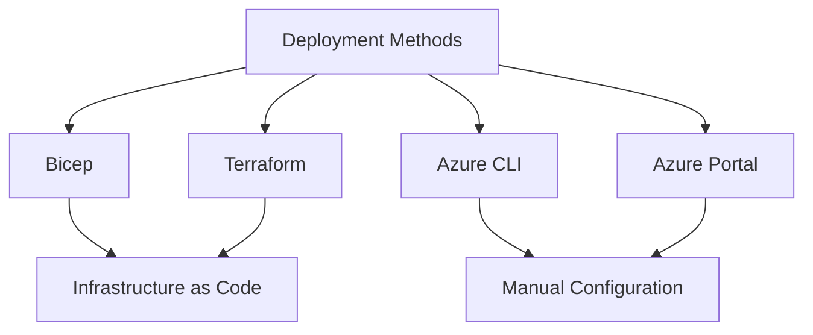

---
content_sources:
  - https://learn.microsoft.com/azure/communication-services/quickstarts/create-communication-resource
content_validation:
  status: pending_review
  last_reviewed: null
  reviewer: agent
  core_claims: []
---

# Deployment Methods Overview

Azure Communication Services can be deployed using several methods, ranging from infrastructure as code to manual portal setup.

<!-- diagram-id: deployment-methods -->

## Deployment Table

| Method | Best For | Level of Automation |
| --- | --- | --- |
| **Bicep** | Azure-native projects. | High |
| **Terraform** | Multi-cloud or multi-service projects. | High |
| **Azure CLI** | Quick setup and simple scripting. | Medium |
| **Azure Portal** | Testing and learning. | Low |

## Comparison

| Feature | Bicep | Terraform | CLI |
| --- | --- | --- | --- |
| State Management | Azure Managed | Self-Managed or Terraform Cloud | N/A |
| Language | Domain-specific | HashiCorp Configuration Language (HCL) | Bash/PowerShell |
| Integration | Deeply integrated with ARM | Broad integration with many providers | Cross-platform |

## See Also
- [Deployment options for ACS](https://learn.microsoft.com/azure/communication-services/quickstarts/create-communication-resource)
- [Bicep vs Terraform for Azure deployments](https://learn.microsoft.com/azure/azure-resource-manager/bicep/compare-terraform)

## Sources
- [ACS Documentation](https://learn.microsoft.com/azure/communication-services/)
