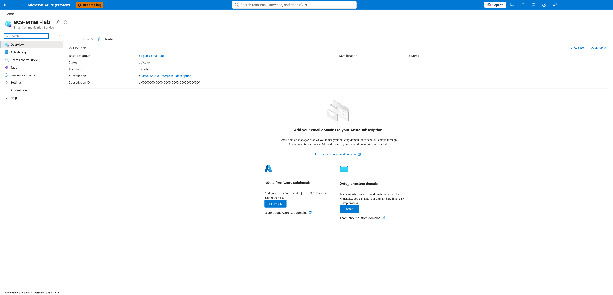
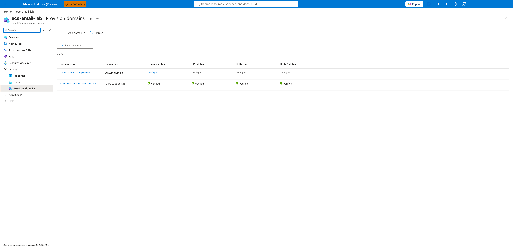
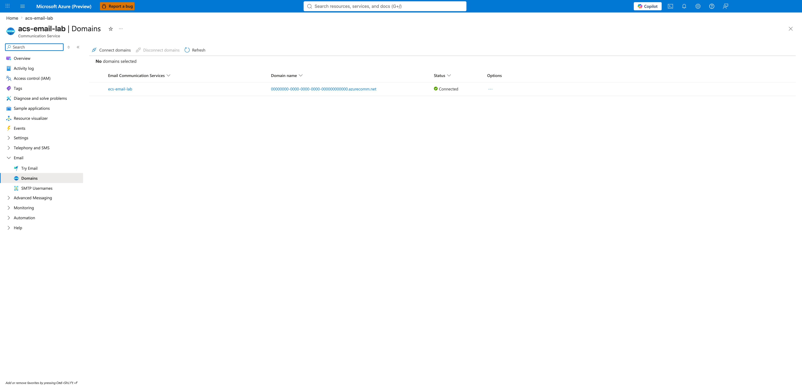
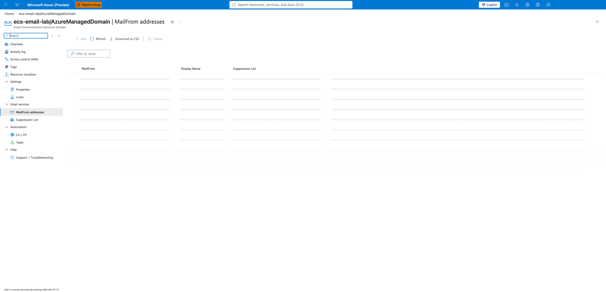

---
content_sources:
  - https://learn.microsoft.com/azure/communication-services/quickstarts/email/create-email-communication-resource
  - https://learn.microsoft.com/azure/communication-services/quickstarts/email/add-azure-managed-domains
  - https://learn.microsoft.com/azure/communication-services/quickstarts/email/add-custom-verified-domains
  - https://learn.microsoft.com/azure/communication-services/quickstarts/email/connect-email-communication-resource
content_validation:
  status: verified
  last_reviewed: 2026-06-26
  reviewer: agent
  core_claims:
    - claim: "An Email Communication Service is a separate Azure resource from the ACS resource and must be linked explicitly"
      source: https://learn.microsoft.com/azure/communication-services/quickstarts/email/create-email-communication-resource
      verified: true
    - claim: "AzureManagedDomain is auto-verified and surfaces all domain/SPF/DKIM/DKIM2 columns as 'Verified' in the Provision domains grid"
      source: https://learn.microsoft.com/azure/communication-services/quickstarts/email/add-azure-managed-domains
      verified: true
    - claim: "Custom domain verification renders one wizard per DNS record (Domain TXT, SPF, DKIM, DKIM2) — not a single consolidated table"
      source: https://learn.microsoft.com/azure/communication-services/quickstarts/email/add-custom-verified-domains
      verified: true
    - claim: "Linking a domain to an ACS resource is required before the ACS connection string can send from that domain"
      source: https://learn.microsoft.com/azure/communication-services/quickstarts/email/connect-email-communication-resource
      verified: true
    - claim: "For an AzureManagedDomain, the MailFrom addresses blade renders with the Add command disabled"
      source: https://learn.microsoft.com/azure/communication-services/quickstarts/email/add-azure-managed-domains
      verified: true
---

# Email Service Provisioning

This page walks through provisioning an Azure Communication Services (ACS) Email channel end to end, with screenshots from a real deployment. It covers the order in which resources must be created, the difference between Azure Managed Domains and custom verified domains, and the linkage required between the Email Communication Service and the ACS resource that ultimately sends mail.

For a generic ACS resource walk-through (without email), see [Provisioning ACS Resources](provisioning.md).

## Prerequisites

- An Azure subscription with the `Microsoft.Communication` resource provider registered.
- An existing or planned ACS resource (will be linked to the Email Communication Service).
- For custom domains: control of the DNS zone (ability to add TXT records).
- Azure CLI 2.50+ with the `communication` extension, or Portal access.

## When to Use

| Situation | Use this page |
|---|---|
| First time setting up email for an ACS workload | Yes — walk through all five steps |
| Adding a second domain to an existing Email Service | Yes — skip to step 2 |
| Switching from AzureManagedDomain to a custom verified domain | Yes — skip to step 3 |
| Migrating away from ACS Email | No — see [Health & Recovery](health-recovery.md) |

## Procedure

### Step 1. Create the Email Communication Service

The Email Communication Service is a distinct Azure resource from the ACS resource. It owns the verified domains; the ACS resource owns the connection string that the SDK uses. They are linked in a later step.

```bash
az communication email create \
  --name "ecs-email-lab" \
  --location "Global" \
  --data-location "Korea" \
  --resource-group "rg-acs-email-lab"
```

After creation, the Email Service Overview blade renders with the Essentials section populated and two call-to-action cards prompting domain setup:

{ loading=lazy }

!!! tip "Data location is immutable"
    The `--data-location` value (here `Korea`) cannot be changed after creation. If you need to move data to a different region you must create a new Email Communication Service. Pick the location that matches your customer base and compliance requirements before running the create command.

### Step 2. Provision domains (managed vs. custom)

Open the **Provision domains** blade from the Email Service left navigation. This is the grid where every domain associated with the service appears, regardless of whether it is Azure-managed or a custom verified domain.

{ loading=lazy }

The grid contrasts the two domain types you can attach:

| Type | Verification | Sender address format | Use case |
|---|---|---|---|
| **AzureManagedDomain** | Auto-verified by Azure | `<sender>@<random-guid>.azurecomm.net` | Testing, internal tooling, development |
| **Custom verified domain** | DNS-based (you add TXT records) | `<sender>@<your-domain>` | Production, brand-aligned mail |

To add an AzureManagedDomain via CLI:

```bash
az communication email domain create \
  --domain-name "AzureManagedDomain" \
  --email-service-name "ecs-email-lab" \
  --resource-group "rg-acs-email-lab" \
  --location "Global" \
  --domain-management AzureManaged
```

To add a custom domain (verification follows in step 3):

```bash
az communication email domain create \
  --domain-name "contoso-demo.example.com" \
  --email-service-name "ecs-email-lab" \
  --resource-group "rg-acs-email-lab" \
  --location "Global" \
  --domain-management CustomerManaged
```

### Step 3. Verify a custom domain via DNS

When you click `Configure` on any of the four status columns (Domain, SPF, DKIM, DKIM2) for a custom domain, the Portal opens a **separate wizard per record**. The capture below shows the first wizard (Domain TXT), which is the gating record that proves you own the domain.

{ loading=lazy }

!!! warning "Each DNS record is its own wizard"
    Despite what older documentation may suggest, the Portal does **not** render a single consolidated DNS-records table. You must run the wizard four times — once for Domain TXT, once for SPF, once for DKIM, and once for DKIM2. DMARC is not surfaced as a Portal wizard at all; configure it directly in your DNS provider following [RFC 7489](https://datatracker.ietf.org/doc/html/rfc7489).

The four wizards must complete in order: Domain TXT first (proves ownership), then SPF (sender policy), then DKIM and DKIM2 (signing keys). Each wizard polls the DNS resolver after you click `Done` — propagation typically completes within minutes but can take up to 30 minutes depending on your DNS provider and TTL.

After all four records verify, the Provision domains grid (step 2) will show all four columns as `Verified` for the custom domain.

### Step 4. Link the domain to the ACS resource

The Email Communication Service owns the domain; the ACS resource owns the connection string the SDK uses. Until you connect them, calling `EmailClient.send` with the ACS connection string returns a permission error.

Open the ACS resource → **Email** → **Domains** blade and use **Connect domain**:

{ loading=lazy }

CLI equivalent:

```bash
az communication update \
  --name "acs-email-lab" \
  --resource-group "rg-acs-email-lab" \
  --linked-domains "/subscriptions/<subscription-id>/resourceGroups/rg-acs-email-lab/providers/Microsoft.Communication/emailServices/ecs-email-lab/domains/AzureManagedDomain"
```

The `--linked-domains` flag is additive: pass every domain you want the ACS resource to be allowed to send from. Removing a domain from this list immediately revokes the ACS resource's ability to send from it.

### Step 5. Configure sender usernames (MailFrom)

Each linked domain exposes a **MailFrom addresses** blade where you can manage the local-part of sender addresses (the bit before the `@`).

{ loading=lazy }

!!! warning "AzureManagedDomain has restricted MailFrom"
    For an `AzureManagedDomain` the `Add` command is **disabled** and the grid is empty. The implicit `DoNotReply@<guid>.azurecomm.net` identity is the only sender — it exists at the SMTP-envelope level but is not represented as a Portal row. This is by design: Azure-managed domains are intended for testing and internal tooling, and rewriting the MailFrom would defeat the auto-verification guarantees.

    To use a custom sender username (e.g., `support@contoso.com`), you must complete steps 2–4 with a custom verified domain. The MailFrom blade for a custom verified domain renders with `Add` enabled.

CLI equivalent for a custom domain:

```bash
az communication email domain sender-username create \
  --domain-name "contoso-demo.example.com" \
  --email-service-name "ecs-email-lab" \
  --resource-group "rg-acs-email-lab" \
  --sender-username "support" \
  --display-name "Contoso Support"
```

## Verification

After completing all five steps, verify the deployment by sending one email through the SDK:

```bash
# Confirm the domain is linked
az communication show \
  --name "acs-email-lab" \
  --resource-group "rg-acs-email-lab" \
  --query "linkedDomains" -o tsv

# Confirm the domain is verified
az communication email domain show \
  --domain-name "AzureManagedDomain" \
  --email-service-name "ecs-email-lab" \
  --resource-group "rg-acs-email-lab" \
  --query "verificationStates" -o json
```

Then send a test email using one of the SDK tutorials:

- [Python — Send Email](../sdk-guides/python/tutorial/03-send-email.md)
- [JavaScript — Send Email](../sdk-guides/javascript/tutorial/03-send-email.md)
- [Java — Send Email](../sdk-guides/java/tutorial/03-send-email.md)
- [.NET — Send Email](../sdk-guides/dotnet/tutorial/03-send-email.md)

A successful send returns a message ID with `status: "Succeeded"`. The mail typically reaches the recipient inbox within 3–6 seconds for AzureManagedDomain → Gmail/Outlook routes (measured during this guide's capture session).

## Rollback / Troubleshooting

| Symptom | Likely cause | Fix |
|---|---|---|
| `403 Forbidden` from `EmailClient.send` | Domain not linked to ACS resource | Re-run step 4; verify with `az communication show --query linkedDomains` |
| Custom domain stuck on "Configure" for SPF/DKIM after Domain TXT verified | Each record is a separate wizard — you must run all four | Open Provision domains grid → click `Configure` on each pending column |
| `Add` button greyed out on MailFrom blade | You are on an AzureManagedDomain | Switch to a custom verified domain (steps 2–4 with `--domain-management CustomerManaged`) |
| Verification wizard reports "DNS record not found" after you added it | DNS propagation delay | Wait up to 30 min and click `Done` again; check TTL on your DNS provider |
| Recipient marks mail as spam after AzureManagedDomain send | Azure-managed domain has neutral reputation | Move to a custom verified domain with proper SPF/DKIM/DMARC alignment |

For deeper troubleshooting (delivery failures, bounce analysis, DMARC interaction) see:

- [Email Delivery Failures Playbook](../troubleshooting/playbooks/email/delivery-failures.md)
- [Domain Verification Playbook](../troubleshooting/playbooks/email/domain-verification.md)
- [Email Delivery Checklist (First 10 Minutes)](../troubleshooting/first-10-minutes/email-delivery.md)

## See Also

- [Provisioning ACS Resources](provisioning.md) — generic ACS resource creation (without email)
- [Monitoring Azure Communication Services](monitoring.md) — diagnostic settings + Log Analytics for the resources created here
- [Send Email Tutorial (Python)](../sdk-guides/python/tutorial/03-send-email.md)
- [Email with Attachments Recipe (Python)](../sdk-guides/python/recipes/email-with-attachments.md)

## Sources

- [Quickstart: Create an Email Communication Service resource](https://learn.microsoft.com/azure/communication-services/quickstarts/email/create-email-communication-resource)
- [Quickstart: How to add Azure Managed Domains to Email Communication Service](https://learn.microsoft.com/azure/communication-services/quickstarts/email/add-azure-managed-domains)
- [Quickstart: How to add custom verified domains to Email Communication Service](https://learn.microsoft.com/azure/communication-services/quickstarts/email/add-custom-verified-domains)
- [Quickstart: How to connect a verified email domain](https://learn.microsoft.com/azure/communication-services/quickstarts/email/connect-email-communication-resource)
