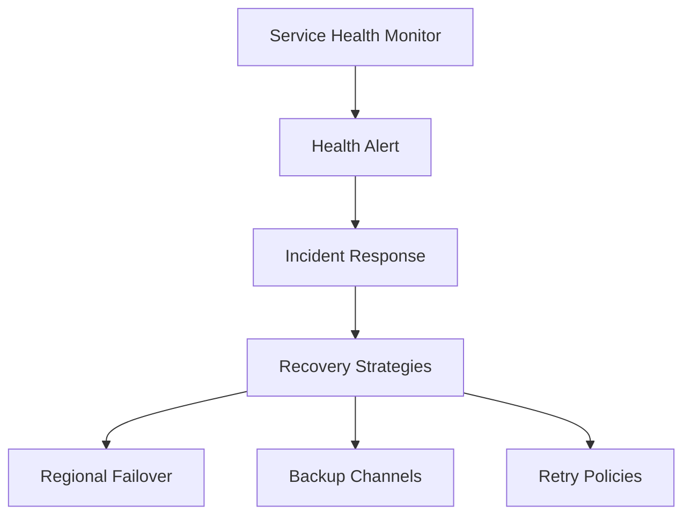

---
content_sources:
  diagrams:
    - id: health-recovery-diagram
      type: flowchart
      source: mslearn-adapted
      mslearn_url: https://learn.microsoft.com/en-us/azure/communication-services/concepts/troubleshooting-info
content_validation:
  status: verified
  last_reviewed: 2026-07-25
  reviewer: agent
  core_claims:
    - claim: "ACS troubleshooting guidance explicitly recommends learning how to implement a disaster recovery plan and high availability strategy for Azure applications"
      source: https://learn.microsoft.com/en-us/azure/communication-services/concepts/troubleshooting-info
      verified: true
    - claim: "Azure Service Health can emit service notifications and alerts, which is the documented Azure mechanism for tracking platform incidents that may affect ACS"
      source: https://learn.microsoft.com/en-us/azure/service-health/alerts-activity-log-service-notifications-portal
      verified: true
---

# Health and Recovery for ACS

Maintaining high availability and having a robust recovery plan for Azure Communication Services.

<!-- diagram-id: health-recovery-diagram -->

```mermaid
graph TD
    ServiceHealth[Service Health Monitor] --> Alert[Health Alert]
    Alert --> Incident[Incident Response]
    Incident --> Recovery[Recovery Strategies]
    
    Recovery --> Failover[Regional Failover]
    Recovery --> Backup[Backup Channels]
    Recovery --> Retry[Retry Policies]
```

## Service Health Monitoring

ACS is a global service with data residency in specific regions. Monitor the following for health:

- **Service Health Dashboard**: Check for Azure-wide outages.
- **Resource Health**: Check for specific ACS resource issues.
- **Diagnostic Settings**: Monitor logs for delivery failures.

## Incident Response Procedures

If a communication channel fails:

1. Identify the impacted channel (SMS, Email, Chat, Calling).
2. Check the Azure Service Health Dashboard for outages.
3. Check your diagnostic logs for API errors or delivery failures.
4. Notify your stakeholders and switch to backup communication methods.

## Failover Strategies

To ensure high availability, consider the following strategies:

- **Regional Redundancy**: Use multiple ACS resources in different regions.
- **Application-Level Failover**: Implement logic in your application to switch between ACS resources.
- **Backup Communication Channels**: Have a backup channel (e.g., if Email fails, send SMS).

## Backup Communication Channels

| Primary Channel | Backup Channel |
| --- | --- |
| SMS | Email or Push Notifications |
| Email | SMS or Voice Call |
| Chat | SMS or Voice Call |
| Calling | PSTN or Chat |

## Prerequisites

- At least one ACS resource, and ideally a second resource in a different region if you plan to test regional failover.
- Access to **Azure Service Health** and **Resource Health** for the subscription hosting the ACS resource.
- Diagnostic settings sending ACS logs to Log Analytics so delivery failures are observable.

## When to Use

- When designing the availability and disaster-recovery posture for a communication workload.
- During an active incident affecting a channel (SMS, Email, Chat, or Calling).
- When rehearsing failover as part of a scheduled resiliency exercise.

## Procedure

1. **Monitor health** — watch the signals in [Service Health Monitoring](#service-health-monitoring): Service Health for platform outages, Resource Health for resource-specific issues, and diagnostic logs for delivery failures.
2. **Respond to incidents** — follow the [Incident Response Procedures](#incident-response-procedures) to identify the impacted channel and confirm whether the cause is a platform outage or an application issue.
3. **Fail over** — apply the [Failover Strategies](#failover-strategies): shift to a redundant regional resource or an alternate channel from [Backup Communication Channels](#backup-communication-channels).
4. **Communicate** — notify stakeholders and track the incident to resolution.

## Verification

- Confirm Service Health and Resource Health alerts are configured and deliver to a monitored action group.
- After a failover test, confirm messages send successfully through the backup resource or channel.
- Confirm diagnostic logs show recovery — delivery success rates return to baseline — once the primary path is restored.

## Rollback / Troubleshooting

- **Failover did not restore service** — the backup channel or region may share the same dependency; verify the backup path is genuinely independent before relying on it.
- **False health alerts** — tune Resource Health alert conditions so transient blips that self-recover do not page the on-call.
- **Returning to primary too early** — confirm the platform incident is fully resolved on Service Health before shifting traffic back, to avoid a second outage.

## See Also
- [High availability and disaster recovery](https://learn.microsoft.com/en-us/azure/communication-services/concepts/troubleshooting-info)
- [How to: Set up Service Health alerts](https://learn.microsoft.com/azure/service-health/alerts-activity-log-service-notifications-portal)

## Sources
- [ACS High Availability Overview](https://learn.microsoft.com/en-us/azure/communication-services/concepts/troubleshooting-info)
