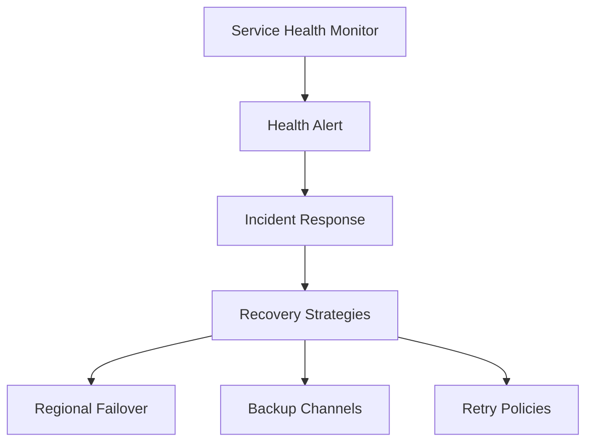

---
content_sources:
  diagrams:
    - id: health-recovery-diagram
      type: flowchart
      source: mslearn-adapted
      mslearn_url: https://learn.microsoft.com/azure/communication-services/concepts/high-availability
content_validation:
  status: verified
  last_reviewed: 2026-07-25
  reviewer: agent
  core_claims:
    - claim: "ACS documents service high-availability and disaster-recovery behavior, so health-and-recovery runbooks can distinguish platform guarantees from app-level mitigations"
      source: https://learn.microsoft.com/en-us/azure/communication-services/concepts/high-availability
      verified: true
    - claim: "Azure Service Health can emit service notifications and alerts, which is the documented Azure mechanism for tracking platform incidents that may affect ACS"
      source: https://learn.microsoft.com/en-us/azure/service-health/alerts-activity-log-service-notifications-portal
      verified: true
---

# Health and Recovery for ACS

Maintaining high availability and having a robust recovery plan for Azure Communication Services.

<!-- diagram-id: health-recovery-diagram -->

```mermaid
graph TD
    ServiceHealth[Service Health Monitor] --> Alert[Health Alert]
    Alert --> Incident[Incident Response]
    Incident --> Recovery[Recovery Strategies]
    
    Recovery --> Failover[Regional Failover]
    Recovery --> Backup[Backup Channels]
    Recovery --> Retry[Retry Policies]
```

## Service Health Monitoring

ACS is a global service with data residency in specific regions. Monitor the following for health:

- **Service Health Dashboard**: Check for Azure-wide outages.
- **Resource Health**: Check for specific ACS resource issues.
- **Diagnostic Settings**: Monitor logs for delivery failures.

## Incident Response Procedures

If a communication channel fails:

1. Identify the impacted channel (SMS, Email, Chat, Calling).
2. Check the Azure Service Health Dashboard for outages.
3. Check your diagnostic logs for API errors or delivery failures.
4. Notify your stakeholders and switch to backup communication methods.

## Failover Strategies

To ensure high availability, consider the following strategies:

- **Regional Redundancy**: Use multiple ACS resources in different regions.
- **Application-Level Failover**: Implement logic in your application to switch between ACS resources.
- **Backup Communication Channels**: Have a backup channel (e.g., if Email fails, send SMS).

## Backup Communication Channels

| Primary Channel | Backup Channel |
| --- | --- |
| SMS | Email or Push Notifications |
| Email | SMS or Voice Call |
| Chat | SMS or Voice Call |
| Calling | PSTN or Chat |

## See Also
- [High availability and disaster recovery](https://learn.microsoft.com/azure/communication-services/concepts/high-availability)
- [How to: Set up Service Health alerts](https://learn.microsoft.com/azure/service-health/alerts-activity-log-service-notifications-portal)

## Sources
- [ACS High Availability Overview](https://learn.microsoft.com/azure/communication-services/concepts/high-availability)
