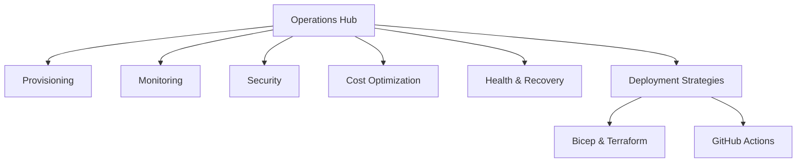

---
content_sources:
  diagrams:
    - id: operations-nav
      type: flowchart
      source: mslearn-adapted
      mslearn_url: https://learn.microsoft.com/azure/communication-services/overview
---

# Operations Overview

The Operations section provides guidance on managing Azure Communication Services (ACS) resources throughout their lifecycle, from initial provisioning to ongoing monitoring, security, and cost optimization.

<!-- diagram-id: operations-nav -->


## Operations Documentation

| Document | Description |
| --- | --- |
| [Provisioning](provisioning.md) | Resource creation, configuration, and channel setup (SMS/Email). |
| [Monitoring](monitoring.md) | Azure Monitor integration, key metrics, and diagnostic settings. |
| [Security](security.md) | Key rotation, RBAC, audit logging, and compliance. |
| [Cost Optimization](cost-optimization.md) | Budgeting, usage analysis, and right-sizing. |
| [Health & Recovery](health-recovery.md) | Incident response, failover, and backup strategies. |
| [Deployment Index](deployment/index.md) | Overview of deployment methods. |
| [Bicep & Terraform](deployment/bicep-terraform.md) | Infrastructure as Code examples for ACS. |
| [GitHub Actions](deployment/github-actions.md) | CI/CD pipelines for communication resources. |

## Quick Operational Commands

Common `az communication` commands for resource management:

```bash
# List all ACS resources in a subscription
az communication list --output table

# Get connection string for a specific resource
az communication list-key --name my-acs-resource --resource-group my-rg --query primaryConnectionString --output tsv

# Update a resource tag
az communication update --name my-acs-resource --resource-group my-rg --tags environment=prod
```

| Command | Purpose |
|---------|---------|
| `az communication list` | Lists all ACS resources in the subscription. |
| `--output table` | Formats the output as a readable table. |
| `az communication list-key` | Retrieves the access keys and connection strings for a resource. |
| `--name my-acs-resource` | Names the ACS resource to query. |
| `--resource-group my-rg` | Names the resource group that holds the resource. |
| `--query primaryConnectionString` | Projects only the primary connection string from the result. |
| `--output tsv` | Prints the value as tab-separated values (no quotes or table chrome). |
| `az communication update` | Updates the ACS resource configuration. |
| `--tags environment=prod` | Sets or replaces the resource tags. |

## See Also
- [Azure Communication Services CLI Reference](https://learn.microsoft.com/cli/azure/communication)
- [Service limits and quotas](https://learn.microsoft.com/azure/communication-services/concepts/service-limits)

## Sources
- [ACS Documentation Overview](https://learn.microsoft.com/azure/communication-services/overview)
