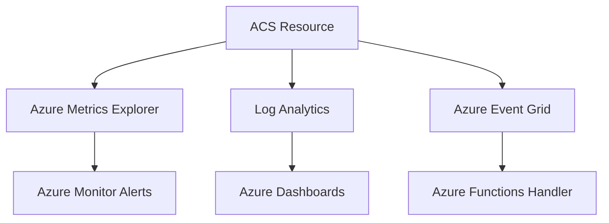

---
content_sources:
  - https://learn.microsoft.com/azure/communication-services/concepts/logging-and-diagnostics
  - https://learn.microsoft.com/azure/communication-services/concepts/metrics
content_validation:
  status: verified
  last_reviewed: 2026-06-26
  reviewer: agent
  core_claims:
    - claim: "ACS integrates with Azure Monitor via Diagnostic settings that route logs to a Log Analytics workspace"
      source: https://learn.microsoft.com/azure/communication-services/concepts/logging-and-diagnostics
      verified: true
    - claim: "The categoryGroup 'allLogs' enables all available log categories in a single diagnostic setting"
      source: https://learn.microsoft.com/azure/azure-monitor/essentials/diagnostic-settings
      verified: true
    - claim: "ACS Email surfaces three log categories: Email Service Send Mail Logs, Email Service Delivery Status Update Logs, and Email Service User Engagement Logs"
      source: https://learn.microsoft.com/azure/communication-services/concepts/analytics/logs/email-logs
      verified: true
    - claim: "The ACSEmailStatusUpdateOperational table holds delivery lifecycle events for sent emails"
      source: https://learn.microsoft.com/azure/communication-services/concepts/analytics/logs/email-logs
      verified: true
---

# Monitoring Azure Communication Services

Monitoring ensures your ACS application is healthy, messages are delivered, and communication latency is within acceptable limits.

<!-- diagram-id: monitoring-architecture -->


## Azure Monitor Integration

ACS integrates with Azure Monitor to provide key metrics and diagnostic logs for troubleshooting.

### Log Analytics Workspace Setup

1. Create a Log Analytics workspace.
2. In the Azure Portal, go to your ACS resource > Diagnostic settings.
3. Select "Add diagnostic setting" and choose your workspace.
4. Select the logs and metrics you want to collect (e.g., SMS, Email, Chat, Recording).

Alternatively, use Azure CLI:

```bash
# Create Log Analytics Workspace
az monitor log-analytics workspace create \
  --resource-group rg-acs-email-lab \
  --workspace-name law-acs-email-lab \
  --location koreacentral

# Create Diagnostic Settings for ACS resource
az monitor diagnostic-settings create \
  --name "acs-diag-all" \
  --resource "/subscriptions/{subscription-id}/resourceGroups/rg-acs-email-lab/providers/Microsoft.Communication/communicationServices/acs-email-lab" \
  --workspace "/subscriptions/{subscription-id}/resourceGroups/rg-acs-email-lab/providers/Microsoft.OperationalInsights/workspaces/law-acs-email-lab" \
  --logs '[{"categoryGroup":"allLogs","enabled":true}]' \
  --metrics '[{"category":"AllMetrics","enabled":true}]'
```

### Portal view after diagnostic setting is applied

After running the CLI commands above (or completing the Portal-driven steps 1–4), the ACS resource's **Diagnostic settings** blade shows the configured setting plus the categories it enables:

{ loading=lazy }

The three Email log categories visible in the capture are what ACS Email emits. They map to the Log Analytics tables you query later:

| Portal category | Log Analytics table | What it records |
|---|---|---|
| Email Service Send Mail Logs | `ACSEmailSendMailOperational` | Initial send request, sender, recipients, message ID |
| Email Service Delivery Status Update Logs | `ACSEmailStatusUpdateOperational` | Delivery lifecycle (`OutForDelivery` → `Delivered` / `Bounced`) |
| Email Service User Engagement Logs | `ACSEmailUserEngagementOperational` | Recipient interactions (opens, clicks) when tracking enabled |

!!! tip "Use categoryGroup: allLogs in IaC"
    Rather than enumerating individual categories, set `--logs '[{"categoryGroup":"allLogs","enabled":true}]'` in CLI or `categoryGroup: allLogs` in Bicep/Terraform. The Portal-shown categories are dynamic — Azure adds new ones as features ship, and `allLogs` opts you into them automatically. The capture above shows the dynamic set rendered for an ACS resource whose only enabled channel is Email.

## Viewing Email Metrics in Azure Monitor

Logs answer "what happened to each message"; metrics answer "how much volume and how often". Both flow from the same diagnostic setting above, but metrics appear in the Portal's **Monitoring → Metrics** blade with no KQL required.

To see Email send-request volume:

1. Open your ACS resource (`acs-email-lab`) in the Portal.
2. Left nav → **Monitoring → Metrics**.
3. **Metric Namespace**: `Communication Services standard metrics` (auto-selected).
4. **Metric**: `Email Service API Requests` (counts `SendEmail` REST calls).
5. **Aggregation**: `Count` (auto-selected; sums requests in each time bucket).

ACS Email surfaces three metrics on this blade:

| Metric name | What it counts |
|---|---|
| `Email Service API Requests` | Inbound `SendEmail` REST/SDK calls (one per send attempt, including retries) |
| `Email Service Delivery Status Updates` | Lifecycle transitions per recipient (`OutForDelivery`, `Delivered`, `Bounced`, etc.) |
| `Email Service User Engagement` | Recipient interactions (opens, clicks) when engagement tracking is enabled |

{ loading=lazy }

The capture above shows a 24-request spike at the right edge of the chart — that is the test burst that produced the 31 status-update rows in the [Email Delivery Checklist KQL view](../troubleshooting/first-10-minutes/email-delivery.md#key-kql-queries). The 24 metric requests vs. 21 status-update lifecycle events on Log Analytics is expected: API requests count once per `SendEmail` call (some of which are internal retries that do not advance the delivery state), while status updates count once per *recipient lifecycle transition*. Reconcile the two only loosely — they answer different questions.

!!! tip "Pin metric charts to a dashboard"
    Once a chart configuration is useful, click **Save to dashboard** to pin it to a shared Azure Dashboard. SRE on-call runbooks typically pin `Email Service API Requests`, `Email Service Delivery Status Updates`, and the `EmailDeliveryRate` percentage side-by-side so a single glance shows volume, lifecycle, and success rate together.

## Key Metrics for ACS

| Metric | Category | Description |
| --- | --- | --- |
| `SmsDeliveryRate` | SMS | Percentage of SMS messages successfully delivered. |
| `EmailDeliveryRate` | Email | Percentage of emails successfully delivered. |
| `ChatLatency` | Chat | End-to-end latency for chat message delivery. |
| `CallQuality` | Calling | Mean Opinion Score (MOS) and network jitter. |

## Diagnostic Settings Configuration

To capture granular data, enable the following categories in Diagnostic settings:

- **SMS logs**: Detailed delivery and status information.
- **Email logs**: Delivery, bounce, and spam report tracking.
- **Chat logs**: Message events and participant updates.
- **Calling logs**: Call summary and call diagnostic details.

## Verified Setup (April 2026)

!!! success "Verified: Real Diagnostic Setup"
    This configuration was tested with actual ACS resources on April 14, 2026. Logs appeared in Log Analytics within 5 minutes of email transmission. The Portal capture above was retaken on June 26, 2026 using the same setup, confirming the layout remains current.

The CLI commands shown in the [Log Analytics Workspace Setup](#log-analytics-workspace-setup) section above were used to provision the test environment.

**Actual log table discovered: `ACSEmailStatusUpdateOperational`**

Schema:
| Column | Type | Description |
|---|---|---|
| TimeGenerated | datetime | Event timestamp |
| CorrelationId | string | Maps to SDK message ID |
| DeliveryStatus | string | "", "OutForDelivery", "Delivered", "Bounced", etc. |
| SmtpStatusCode | string | SMTP response code |
| EnhancedSmtpStatusCode | string | Extended SMTP code |
| SenderDomain | string | Verified sender domain |
| SenderUsername | string | Sender username (e.g., DoNotReply) |
| RecipientMailServerHostName | string | Target mail server |
| IsHardBounce | string | "True"/"False" |
| FailureReason | string | Error category |
| FailureMessage | string | Detailed error message |

**Verified monitoring results:**
- Log ingestion delay: < 5 minutes from email send to Log Analytics availability
- Retention: 30 days (default PerGB2018 tier)
- All 9 test emails appeared in logs with full lifecycle tracking
- Each email generates 3-4 log events (status transitions: "" → "OutForDelivery" → "Delivered")

## Alert Rules and Action Groups

Set up alerts for critical thresholds:

- **SMS Delivery Alert**: Trigger when `SmsDeliveryRate` drops below 95%.
- **Email Bounce Alert**: Trigger when bounce rate exceeds 5%.
- **Action Groups**: Notify SRE teams via email, SMS, or webhook when an alert is fired.

## See Also
- [Email Service Provisioning](email-provisioning.md) — provisions the ACS resource and Email Service that this page monitors
- [Email Delivery Checklist (First 10 Minutes)](../troubleshooting/first-10-minutes/email-delivery.md) — quick KQL checks for the tables above
- [Monitoring ACS using Azure Monitor](https://learn.microsoft.com/azure/communication-services/concepts/logging-and-diagnostics)
- [How to: Create diagnostic settings in Azure Monitor](https://learn.microsoft.com/azure/monitor/essentials/diagnostic-settings)

## Sources
- [ACS Metrics Reference](https://learn.microsoft.com/azure/communication-services/concepts/metrics)
- [ACS Email Logs Reference](https://learn.microsoft.com/azure/communication-services/concepts/analytics/logs/email-logs)
