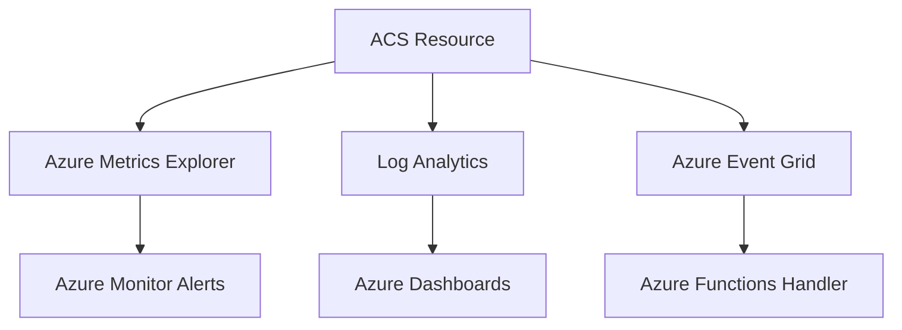

# Monitoring Azure Communication Services

Monitoring ensures your ACS application is healthy, messages are delivered, and communication latency is within acceptable limits.

<!-- diagram-id: monitoring-architecture -->

## Azure Monitor Integration

ACS integrates with Azure Monitor to provide key metrics and diagnostic logs for troubleshooting.

### Log Analytics Workspace Setup
1. Create a Log Analytics workspace.
2. In the Azure Portal, go to your ACS resource > Diagnostic settings.
3. Select "Add diagnostic setting" and choose your workspace.
4. Select the logs and metrics you want to collect (e.g., SMS, Email, Chat, Recording).

## Key Metrics for ACS

| Metric | Category | Description |
| --- | --- | --- |
| `SmsDeliveryRate` | SMS | Percentage of SMS messages successfully delivered. |
| `EmailDeliveryRate` | Email | Percentage of emails successfully delivered. |
| `ChatLatency` | Chat | End-to-end latency for chat message delivery. |
| `CallQuality` | Calling | Mean Opinion Score (MOS) and network jitter. |

## Diagnostic Settings Configuration

To capture granular data, enable the following categories in Diagnostic settings:

- **SMS logs**: Detailed delivery and status information.
- **Email logs**: Delivery, bounce, and spam report tracking.
- **Chat logs**: Message events and participant updates.
- **Calling logs**: Call summary and call diagnostic details.

## Alert Rules and Action Groups

Set up alerts for critical thresholds:

- **SMS Delivery Alert**: Trigger when `SmsDeliveryRate` drops below 95%.
- **Email Bounce Alert**: Trigger when bounce rate exceeds 5%.
- **Action Groups**: Notify SRE teams via email, SMS, or webhook when an alert is fired.

## See Also
- [Monitoring ACS using Azure Monitor](https://learn.microsoft.com/azure/communication-services/concepts/logging-and-diagnostics)
- [How to: Create diagnostic settings in Azure Monitor](https://learn.microsoft.com/azure/monitor/essentials/diagnostic-settings)

## Sources
- [ACS Metrics Reference](https://learn.microsoft.com/azure/communication-services/concepts/metrics)
