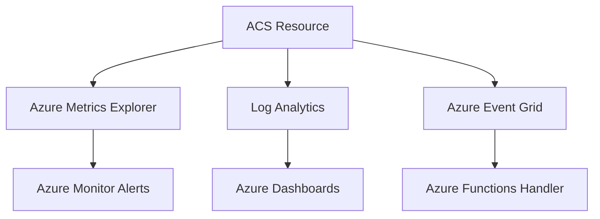

---
content_sources:
  - type: mslearn
    url: https://learn.microsoft.com/azure/communication-services/concepts/analytics/enable-logging
  - type: mslearn
    url: https://learn.microsoft.com/azure/communication-services/concepts/metrics
  - type: mslearn
    url: https://learn.microsoft.com/azure/azure-monitor/reference/tables/microsoft-communication-communicationservices
  - type: mslearn
    url: https://learn.microsoft.com/azure/azure-monitor/reference/tables/acsemailstatusupdateoperational
content_validation:
  status: verified
  last_reviewed: 2026-05-21
  reviewer: agent
  core_claims:
    - claim: "ACS diagnostic settings can send logs and metrics to destinations such as Log Analytics workspaces, Event Hubs, and Storage accounts."
      source: https://learn.microsoft.com/azure/communication-services/concepts/analytics/enable-logging
      verified: true
    - claim: "ACS API request metrics are available in Azure Metrics Explorer and include Operation, Status Code, and StatusSubClass dimensions."
      source: https://learn.microsoft.com/azure/communication-services/concepts/metrics
      verified: true
    - claim: "ACS email delivery status updates are stored in the ACSEmailStatusUpdateOperational Log Analytics table."
      source: https://learn.microsoft.com/azure/azure-monitor/reference/tables/acsemailstatusupdateoperational
      verified: true
---

# Monitoring Azure Communication Services

Monitoring ensures your ACS application is healthy, messages are delivered, and communication latency is within acceptable limits.

<!-- diagram-id: monitoring-architecture -->


## Prerequisites

- An Azure Communication Services resource.
- A Log Analytics workspace for diagnostic logs.
- Permission to create diagnostic settings and Azure Monitor alert rules.
- Channel-specific diagnostic categories selected for the ACS features you use.

## When to Use

Use this runbook when you need to:

- Enable ACS logs before a launch or lab.
- Build a first dashboard for SMS, Email, Chat, or Voice & Video operations.
- Create alerts that are based on documented metrics or KQL-derived indicators.
- Prove whether a delivery or quality symptom is visible in Azure Monitor.

## Procedure

### 1. Create a Log Analytics Workspace

1. Create a Log Analytics workspace.
2. In the Azure Portal, go to your ACS resource > Diagnostic settings.
3. Select "Add diagnostic setting" and choose your workspace.
4. Select the logs and metrics you want to collect (e.g., SMS, Email, Chat, Recording).

Alternatively, use Azure CLI:

```bash
# Create Log Analytics Workspace
az monitor log-analytics workspace create \
  --resource-group rg-acs-email-lab \
  --workspace-name law-acs-email-lab \
  --location koreacentral

# Create Diagnostic Settings for ACS resource
az monitor diagnostic-settings create \
  --name "acs-diag-all" \
  --resource "/subscriptions/{subscription-id}/resourceGroups/rg-acs-email-lab/providers/Microsoft.Communication/communicationServices/acs-email-lab" \
  --workspace "/subscriptions/{subscription-id}/resourceGroups/rg-acs-email-lab/providers/Microsoft.OperationalInsights/workspaces/law-acs-email-lab" \
  --logs '[{"categoryGroup":"allLogs","enabled":true}]' \
  --metrics '[{"category":"AllMetrics","enabled":true}]'
```

| Command | Key fields | Expected result |
| --- | --- | --- |
| `az monitor log-analytics workspace create` | `--resource-group`, `--workspace-name`, `--location` | Creates the workspace that stores ACS diagnostic logs. |
| `az monitor diagnostic-settings create` | `--resource`, `--workspace`, `--logs`, `--metrics` | Routes ACS logs and metrics to the workspace. |

### 2. Use Documented Metric Signals

ACS exposes API request metrics for service primitives. Microsoft Learn describes these metrics as request metrics with the following dimensions:

| Dimension | How to use it |
| --- | --- |
| `Operation` | Filter to operations such as `SMSMessageSent`, `CreateChatThread`, `SendChatMessage`, or email send/status operations. |
| `Status Code` | Separate successful requests from 4xx/5xx responses. |
| `StatusSubClass` | Group status-code families when exact codes are too granular. |

Avoid alert rules that reference undocumented metric names such as `SmsDeliveryRate`, `EmailDeliveryRate`, `ChatLatency`, or `CallQuality`. Use Azure Monitor metrics for API request volume and error status, then derive delivery or quality indicators from logs.

### 3. Use Current Log Analytics Tables

| Capability | Current Log Analytics table | Use for |
| --- | --- | --- |
| SMS | `ACSSMSIncomingOperations` | SMS operation outcomes, result codes, request duration, message identifiers. |
| Email send | `ACSEmailSendMailOperational` | Send operations, recipient counts, request size, sender domain context. |
| Email delivery status | `ACSEmailStatusUpdateOperational` | Per-message and per-recipient delivery status, SMTP codes, failure reason, bounce classification. |
| Email engagement | `ACSEmailUserEngagementOperational` | Email engagement events when enabled. |
| Chat | `ACSChatIncomingOperations` | Chat operation outcomes, duration, thread ID, user ID, status codes. |
| Voice & Video call summary | `ACSCallSummary` | Participant-level call duration, participant end reason, endpoint and SDK context. |
| Voice & Video diagnostics | `ACSCallDiagnostics` | Media stream diagnostics, jitter, packet loss, round-trip time, codec, stream direction. |
| Voice & Video client media stats | `ACSCallClientMediaStatsTimeSeries` | Client-side media statistics used for granular call quality analysis. |
| Billing | `ACSBillingUsage` | Usage records across ACS modes. |

### 4. Configure Diagnostic Categories

To capture granular data, enable the following categories in Diagnostic settings:

- **SMS logs**: Detailed delivery and status information.
- **Email logs**: Delivery, bounce, and spam report tracking.
- **Chat logs**: Message events and participant updates.
- **Calling logs**: Call summary and call diagnostic details.

## Verification

## Verified Setup (April 2026)

!!! success "Verified: Real Diagnostic Setup"
    This configuration was tested with actual ACS resources on April 14, 2026. Logs appeared in Log Analytics within 5 minutes of email transmission.

The CLI commands shown in the [Create a Log Analytics Workspace](#1-create-a-log-analytics-workspace) section above were used to provision the test environment.

**Actual log table discovered: `ACSEmailStatusUpdateOperational`**

Schema:
| Column | Type | Description |
|---|---|---|
| TimeGenerated | datetime | Event timestamp |
| CorrelationId | string | Maps to SDK message ID |
| DeliveryStatus | string | "", "OutForDelivery", "Delivered", "Bounced", etc. |
| SmtpStatusCode | string | SMTP response code |
| EnhancedSmtpStatusCode | string | Extended SMTP code |
| SenderDomain | string | Verified sender domain |
| SenderUsername | string | Sender username (e.g., DoNotReply) |
| RecipientMailServerHostName | string | Target mail server |
| IsHardBounce | string | "True"/"False" |
| FailureReason | string | Error category |
| FailureMessage | string | Detailed error message |

**Verified monitoring results:**
- Log ingestion delay: < 5 minutes from email send to Log Analytics availability
- Retention: 30 days (default PerGB2018 tier)
- All 9 test emails appeared in logs with full lifecycle tracking
- Each email generates 3-4 log events (status transitions: "" → "OutForDelivery" → "Delivered")

Run a basic table-presence query after enabling diagnostics:

```kusto
union isfuzzy=true
    ACSSMSIncomingOperations,
    ACSEmailSendMailOperational,
    ACSEmailStatusUpdateOperational,
    ACSChatIncomingOperations,
    ACSCallSummary,
    ACSCallDiagnostics
| where TimeGenerated > ago(24h)
| summarize Rows=count() by Type
| order by Rows desc
```

| Field | Description |
| --- | --- |
| `union isfuzzy=true` | Lets the query run even when a table is not present yet because that channel has not emitted logs. |
| `Type` | Confirms which ACS Log Analytics tables have received data. |
| `Rows` | Shows recent ingestion volume by table. |

## Rollback / Troubleshooting

- If logs are missing, confirm the ACS diagnostic setting targets the intended workspace and includes the channel category.
- If metric alerts fail validation, remove undocumented metric names and build the alert from available ACS API request metrics or a scheduled KQL query.
- If email delivery data is missing, query `ACSEmailStatusUpdateOperational` and correlate with the send message ID via `CorrelationId`.
- If call quality data is missing, confirm Voice & Video diagnostic categories are enabled before the call. ACS logs are not retroactive.

## Advanced Topics

### Alert Rules and Action Groups

Set up alerts for critical thresholds:

- **API request error alert**: Trigger on ACS API request metrics filtered by `Status Code` or `StatusSubClass`.
- **Email bounce alert**: Use a scheduled query over `ACSEmailStatusUpdateOperational` where `DeliveryStatus != "Delivered"` or `IsHardBounce == "True"`.
- **SMS throttling alert**: Use a scheduled query over `ACSSMSIncomingOperations` where `ResultSignature == "429"` or `ResultDescription` contains throttling text.
- **Call quality alert**: Use a scheduled query over `ACSCallDiagnostics` for high `PacketLossRateAvg`, high `JitterAvg`, or high `RoundTripTimeAvg`.
- **Action Groups**: Notify SRE teams via email, SMS, or webhook when an alert is fired.

## See Also
- [Enable logging with Azure Monitor](https://learn.microsoft.com/azure/communication-services/concepts/analytics/enable-logging)
- [How to: Create diagnostic settings in Azure Monitor](https://learn.microsoft.com/azure/monitor/essentials/diagnostic-settings)

## Sources
- [ACS Metrics Reference](https://learn.microsoft.com/azure/communication-services/concepts/metrics)
- [ACS Log Analytics tables](https://learn.microsoft.com/azure/azure-monitor/reference/tables/microsoft-communication-communicationservices)
