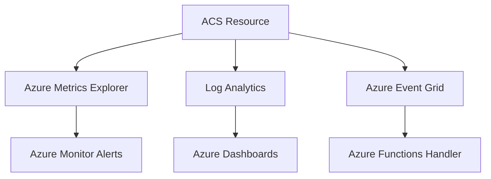

---
content_sources:
  - https://learn.microsoft.com/azure/communication-services/concepts/logging-and-diagnostics
  - https://learn.microsoft.com/azure/communication-services/concepts/metrics
---

# Monitoring Azure Communication Services

Monitoring ensures your ACS application is healthy, messages are delivered, and communication latency is within acceptable limits.

<!-- diagram-id: monitoring-architecture -->


## Azure Monitor Integration

ACS integrates with Azure Monitor to provide key metrics and diagnostic logs for troubleshooting.

### Log Analytics Workspace Setup
1. Create a Log Analytics workspace.
2. In the Azure Portal, go to your ACS resource > Diagnostic settings.
3. Select "Add diagnostic setting" and choose your workspace.
4. Select the logs and metrics you want to collect (e.g., SMS, Email, Chat, Recording).

Alternatively, use Azure CLI:

```bash
# Create Log Analytics Workspace
az monitor log-analytics workspace create \
  --resource-group rg-acs-email-lab \
  --workspace-name law-acs-email-lab \
  --location koreacentral

# Create Diagnostic Settings for ACS resource
az monitor diagnostic-settings create \
  --name "acs-diag-all" \
  --resource "/subscriptions/{subscription-id}/resourceGroups/rg-acs-email-lab/providers/Microsoft.Communication/communicationServices/acs-email-lab" \
  --workspace "/subscriptions/{subscription-id}/resourceGroups/rg-acs-email-lab/providers/Microsoft.OperationalInsights/workspaces/law-acs-email-lab" \
  --logs '[{"categoryGroup":"allLogs","enabled":true}]' \
  --metrics '[{"category":"AllMetrics","enabled":true}]'
```

## Key Metrics for ACS

| Metric | Category | Description |
| --- | --- | --- |
| `SmsDeliveryRate` | SMS | Percentage of SMS messages successfully delivered. |
| `EmailDeliveryRate` | Email | Percentage of emails successfully delivered. |
| `ChatLatency` | Chat | End-to-end latency for chat message delivery. |
| `CallQuality` | Calling | Mean Opinion Score (MOS) and network jitter. |

## Diagnostic Settings Configuration

To capture granular data, enable the following categories in Diagnostic settings:

- **SMS logs**: Detailed delivery and status information.
- **Email logs**: Delivery, bounce, and spam report tracking.
- **Chat logs**: Message events and participant updates.
- **Calling logs**: Call summary and call diagnostic details.

## Verified Setup (April 2026)

!!! success "Verified: Real Diagnostic Setup"
    This configuration was tested with actual ACS resources on April 14, 2026. Logs appeared in Log Analytics within 5 minutes of email transmission.

The CLI commands shown in the [Log Analytics Workspace Setup](#log-analytics-workspace-setup) section above were used to provision the test environment.

**Actual log table discovered: `ACSEmailStatusUpdateOperational`**

Schema:
| Column | Type | Description |
|---|---|---|
| TimeGenerated | datetime | Event timestamp |
| CorrelationId | string | Maps to SDK message ID |
| DeliveryStatus | string | "", "OutForDelivery", "Delivered", "Bounced", etc. |
| SmtpStatusCode | string | SMTP response code |
| EnhancedSmtpStatusCode | string | Extended SMTP code |
| SenderDomain | string | Verified sender domain |
| SenderUsername | string | Sender username (e.g., DoNotReply) |
| RecipientMailServerHostName | string | Target mail server |
| IsHardBounce | string | "True"/"False" |
| FailureReason | string | Error category |
| FailureMessage | string | Detailed error message |

**Verified monitoring results:**
- Log ingestion delay: < 5 minutes from email send to Log Analytics availability
- Retention: 30 days (default PerGB2018 tier)
- All 9 test emails appeared in logs with full lifecycle tracking
- Each email generates 3-4 log events (status transitions: "" → "OutForDelivery" → "Delivered")

## Alert Rules and Action Groups

Set up alerts for critical thresholds:

- **SMS Delivery Alert**: Trigger when `SmsDeliveryRate` drops below 95%.
- **Email Bounce Alert**: Trigger when bounce rate exceeds 5%.
- **Action Groups**: Notify SRE teams via email, SMS, or webhook when an alert is fired.

## See Also
- [Monitoring ACS using Azure Monitor](https://learn.microsoft.com/azure/communication-services/concepts/logging-and-diagnostics)
- [How to: Create diagnostic settings in Azure Monitor](https://learn.microsoft.com/azure/monitor/essentials/diagnostic-settings)

## Sources
- [ACS Metrics Reference](https://learn.microsoft.com/azure/communication-services/concepts/metrics)
