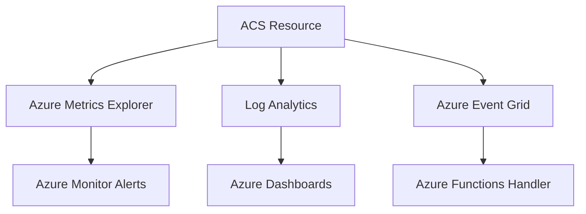

---
content_sources:
  - https://learn.microsoft.com/azure/communication-services/concepts/logging-and-diagnostics
  - https://learn.microsoft.com/azure/communication-services/concepts/metrics
  - https://learn.microsoft.com/azure/communication-services/concepts/analytics/logs/email-logs
  - https://learn.microsoft.com/azure/azure-monitor/alerts/alerts-create-new-alert-rule
  - https://learn.microsoft.com/azure/azure-monitor/alerts/action-groups
content_validation:
  status: verified
  last_reviewed: 2026-06-26
  reviewer: agent
  core_claims:
    - claim: "ACS integrates with Azure Monitor via Diagnostic settings that route logs to a Log Analytics workspace"
      source: https://learn.microsoft.com/azure/communication-services/concepts/logging-and-diagnostics
      verified: true
    - claim: "The categoryGroup 'allLogs' enables all available log categories in a single diagnostic setting"
      source: https://learn.microsoft.com/azure/azure-monitor/essentials/diagnostic-settings
      verified: true
    - claim: "ACS Email surfaces three log categories: Email Service Send Mail Logs, Email Service Delivery Status Update Logs, and Email Service User Engagement Logs"
      source: https://learn.microsoft.com/azure/communication-services/concepts/analytics/logs/email-logs
      verified: true
    - claim: "The ACSEmailStatusUpdateOperational table holds delivery lifecycle events for sent emails"
      source: https://learn.microsoft.com/azure/communication-services/concepts/analytics/logs/email-logs
      verified: true
    - claim: "Azure Monitor alert rules can run scheduled KQL queries against a Log Analytics workspace and fire when the result crosses a threshold"
      source: https://learn.microsoft.com/azure/azure-monitor/alerts/alerts-create-new-alert-rule
      verified: true
    - claim: "Action groups are the reusable notification + automation target that alert rules invoke when they fire"
      source: https://learn.microsoft.com/azure/azure-monitor/alerts/action-groups
      verified: true
---

# Monitoring Azure Communication Services

Monitoring ensures your ACS application is healthy, messages are delivered, and communication latency is within acceptable limits. This page walks through the full setup — Log Analytics workspace, diagnostic settings, verification, and alerting — in the order you should run it.

<!-- diagram-id: monitoring-architecture -->


## Prerequisites

- An ACS resource that you can write diagnostic settings to. To create one with an Email channel, see [Email Service Provisioning](email-provisioning.md). To create a resource without email, see [Provisioning ACS Resources](provisioning.md).
- Permissions to create and modify Log Analytics workspaces, diagnostic settings, alert rules, and action groups. The built-in **Monitoring Contributor** role is sufficient; **Reader** is not.
- Azure CLI 2.50+ (the `monitor`, `monitor log-analytics`, `monitor diagnostic-settings`, `monitor scheduled-query`, and `monitor action-group` command groups are built into the base CLI), or equivalent Portal access.
- For alert receivers: SMTP email addresses, SMS-capable phone numbers, or webhook endpoints that you control.

## When to Use

| Situation | Use this page |
|---|---|
| Stand up monitoring for a brand-new ACS resource | Yes — start at Step 1 |
| Add diagnostic settings to an existing ACS resource that has none | Yes — skip to Step 2 |
| Tune existing alerts because thresholds are noisy | Partial — see [Step 4](#step-4-create-an-alert-rule) and [Alert Rule Tuning](#alert-rule-tuning) |
| Investigate why logs are missing | No — see the [Email Delivery Checklist](../troubleshooting/first-10-minutes/email-delivery.md) (Step 0 covers the diagnostic-pipeline check) |

## Procedure

The five steps below build on each other. Run them in order on a new resource; revisit individual steps when changing thresholds or destinations later.

### Step 1. Create the Log Analytics workspace

The Log Analytics workspace is the durable store that every diagnostic setting on every Azure resource routes telemetry into. Create it **before** the diagnostic setting so the setting can point at a workspace that already exists.

**Portal (UI flow):**

1. In the Azure Portal, search for **Log Analytics workspaces** in the top search bar and open the service blade.
2. Click **+ Create** on the command bar.
3. On the **Basics** tab:
    - **Subscription**: the same subscription that hosts the ACS resource.
    - **Resource group**: the same resource group as the ACS resource (e.g., `rg-acs-email-lab`) so cost rolls up together.
    - **Name**: a stable name like `law-acs-email-lab`. Workspace names are immutable.
    - **Region**: the **same region** as the ACS resource for the lowest ingestion latency and to keep data sovereignty consistent.
4. Click **Review + create**, then **Create**. Provisioning takes 30–60 seconds.
5. When deployment finishes, click **Go to resource** to confirm the workspace Overview blade renders with Essentials populated (resource group, region, pricing tier `PerGB2018`, retention `30 days`).

!!! info "Capture pending"
    A 5120×2472 Portal screenshot of the LAW Overview blade is queued as capture #8 in `scripts/email-capture-plan.md` and will land in a follow-up commit. Until then, follow the textual steps above or use the CLI equivalent.

**CLI equivalent:**

```bash
# Set variables to match your environment
RG="rg-acs-email-lab"
LOCATION="koreacentral"
LAW="law-acs-email-lab"

az monitor log-analytics workspace create \
  --resource-group "$RG" \
  --workspace-name "$LAW" \
  --location "$LOCATION"
```

The command is idempotent: re-running it on an existing workspace updates the SKU and tags but does not destroy data.

### Step 2. Add a diagnostic setting on the ACS resource

Diagnostic settings on the **ACS resource** (not the Email Communication Service) are what route emitted telemetry into your Log Analytics workspace. Without this step, every KQL query in this guide returns zero rows regardless of how much email you send.

**Portal (UI flow):**

1. Open your ACS resource (e.g., `acs-email-lab`) in the Portal.
2. Left navigation → **Monitoring → Diagnostic settings**. The URL fragment should end with `/diagnostics` (the older `/diagnosticLogs` path silently redirects to the resource overview).
3. Click **+ Add diagnostic setting** on the command bar.
4. On the diagnostic setting form:
    - **Diagnostic setting name**: a stable identifier like `acs-diag-all`.
    - **Logs**: check **categoryGroup → allLogs**. This single checkbox enables every current and future log category — including the three Email categories (Send Mail, Delivery Status Update, User Engagement) and any new channels you add later.
    - **Metrics**: check **AllMetrics**.
    - **Destination details**: check **Send to Log Analytics workspace**. Select the subscription and the workspace you created in Step 1 (`law-acs-email-lab`).
5. Click **Save**. The list view refreshes and the new setting appears with its destination and category counts.

!!! info "Capture pending"
    The Edit/Add form is queued as capture #9 in `scripts/email-capture-plan.md`. The Portal SPA's `<span role="button">Edit setting</span>` control did not respond to scripted clicks during the prior capture session (see the 6a Reality note in the plan), so capture #9 will use the **Add** flow on a fresh setting rather than the Edit flow on the existing one. The list view that confirms the setting is wired up correctly is shown below as capture #6a.

**CLI equivalent:**

```bash
# Continue with the variables from Step 1
ACS_NAME="acs-email-lab"
DIAG_NAME="acs-diag-all"
SUBSCRIPTION_ID="<subscription-id>"

az monitor diagnostic-settings create \
  --name "$DIAG_NAME" \
  --resource "/subscriptions/$SUBSCRIPTION_ID/resourceGroups/$RG/providers/Microsoft.Communication/communicationServices/$ACS_NAME" \
  --workspace "/subscriptions/$SUBSCRIPTION_ID/resourceGroups/$RG/providers/Microsoft.OperationalInsights/workspaces/$LAW" \
  --logs '[{"categoryGroup":"allLogs","enabled":true}]' \
  --metrics '[{"category":"AllMetrics","enabled":true}]'
```

After running the CLI commands above (or completing the Portal-driven steps), the ACS resource's **Diagnostic settings** blade shows the configured setting plus the categories it enables:

{ loading=lazy }

The three Email log categories visible in the capture are what ACS Email emits. They map to the Log Analytics tables you query later:

| Portal category | Log Analytics table | What it records |
|---|---|---|
| Email Service Send Mail Logs | `ACSEmailSendMailOperational` | Initial send request, sender, recipients, message ID |
| Email Service Delivery Status Update Logs | `ACSEmailStatusUpdateOperational` | Delivery lifecycle (`OutForDelivery` → `Delivered` / `Bounced`) |
| Email Service User Engagement Logs | `ACSEmailUserEngagementOperational` | Recipient interactions (opens, clicks) when tracking enabled |

!!! tip "Use categoryGroup: allLogs in IaC"
    Rather than enumerating individual categories, set `--logs '[{"categoryGroup":"allLogs","enabled":true}]'` in CLI or `categoryGroup: allLogs` in Bicep/Terraform. The Portal-shown categories are dynamic — Azure adds new ones as features ship, and `allLogs` opts you into them automatically. The capture above shows the dynamic set rendered for an ACS resource whose only enabled channel is Email.

### Step 3. Verify logs are flowing

The diagnostic setting is a *contract*, not an *acknowledgement*. Until ACS actually emits a log and Log Analytics actually ingests it, the pipeline is unproven. Send one test email, wait five minutes, then run the sanity-check query below.

**Send a test email** using one of the SDK tutorials (any language is fine — the diagnostic pipeline does not care):

- [Python — Send Email](../sdk-guides/python/tutorial/03-send-email.md)
- [JavaScript — Send Email](../sdk-guides/javascript/tutorial/03-send-email.md)
- [Java — Send Email](../sdk-guides/java/tutorial/03-send-email.md)
- [.NET — Send Email](../sdk-guides/dotnet/tutorial/03-send-email.md)

**Wait ~5 minutes.** Log Analytics ingestion latency for ACS Email is consistently under 5 minutes in the testing this guide is built on, but the absolute floor is ~2 minutes even for tiny payloads.

**Run the sanity-check query** in the LAW Logs blade:

```kusto
// Confirm the diagnostic pipeline is wired up end to end
ACSEmailSendMailOperational
| where TimeGenerated > ago(15m)
| project TimeGenerated, OperationName, ResultType, CorrelationId, SenderDomain
| order by TimeGenerated desc
| take 10
```

| Result | What it means | Next action |
|---|---|---|
| One or more rows with `ResultType = Succeeded` | Diagnostic pipeline is wired up. Move to Step 4. | None — proceed |
| Zero rows after 5 minutes, but new rows appear at 10–15 minutes | Slow ingestion. Acceptable on a new workspace. | None — proceed |
| Zero rows after 15 minutes | Diagnostic setting is not wired up. Most common causes: wrong resource (Email Communication Service instead of ACS resource), wrong workspace, or `--logs` payload missing `enabled: true`. | Re-run Step 2 and re-check the setting in the Portal. |
| Rows present but `ResultType = Failed` | Send pipeline is failing before delivery. Skip to the [Email Delivery Checklist](../troubleshooting/first-10-minutes/email-delivery.md). | Triage the failure first; revisit alerting after |

The status-update table arrives a few seconds *after* the send-mail table (it tracks the asynchronous post-send lifecycle), so use `ACSEmailSendMailOperational` for the initial sanity check — it confirms the API hit ACS — and `ACSEmailStatusUpdateOperational` for delivery state.

### Step 4. Create an alert rule

Alerts turn "data exists" into "the on-call gets paged when something is wrong". An alert rule is a saved KQL query (for log alerts) or metric threshold (for metric alerts) plus the action group it should fire on. This step creates a log alert because the most useful Email signals come from `ACSEmailStatusUpdateOperational` — a metric alert on `EmailDeliveryRate` works too, but the log-based rule is more flexible.

**Portal (UI flow):**

1. Open your Log Analytics workspace (`law-acs-email-lab`) in the Portal.
2. Left navigation → **Monitoring → Alerts** → **+ Create → Alert rule**.
3. On the **Scope** tab, the workspace is already selected. Click **Next: Condition**.
4. On the **Condition** tab:
    - **Signal name**: select **Custom log search** (under Log alerts).
    - **Search query**: paste the high-bounce-rate query below.
    - **Measurement**: `Table rows` → `Count`.
    - **Aggregation granularity**: `5 minutes`.
    - **Evaluation frequency**: `5 minutes`.
    - **Threshold**: `Static` → `Greater than` → `0`.
5. Click **Next: Actions** and attach the action group you create in Step 5. (Create the alert rule first with no action group if needed; you can attach later via Edit.)
6. On the **Details** tab:
    - **Severity**: `2 - Warning` (start conservative; raise to `1` once tuned).
    - **Alert rule name**: `acs-email-bounce-rate-high`.
    - **Region**: the same region as the workspace.
7. Click **Review + create**, then **Create**.

!!! info "Capture pending"
    Portal screenshots of the alert wizard's Condition step (#11) and Details/Review step (#12) are queued in `scripts/email-capture-plan.md`. They will replace the textual steps above with annotated visuals.

**The KQL the alert evaluates:**

```kusto
// Fires when bounce rate exceeds 5% over a 5-minute window with at least 20 attempts
ACSEmailStatusUpdateOperational
| where TimeGenerated > ago(5m)
| summarize
    Total = count(),
    Bounced = countif(DeliveryStatus == "Bounced" or IsHardBounce == "True")
| extend BounceRate = todouble(Bounced) / todouble(Total)
| where Total >= 20 and BounceRate > 0.05
```

The `Total >= 20` floor prevents the alert from firing on tiny send volumes where a single bounce produces a misleading rate (1 bounce out of 3 sends is 33% but is not actionable signal).

**CLI equivalent (using a scheduled query rule):**

```bash
# Continue with the variables from Steps 1-2
WORKSPACE_ID=$(az monitor log-analytics workspace show \
  --resource-group "$RG" \
  --workspace-name "$LAW" \
  --query id -o tsv)

az monitor scheduled-query create \
  --name "acs-email-bounce-rate-high" \
  --resource-group "$RG" \
  --scopes "$WORKSPACE_ID" \
  --condition "count 'ACSEmailStatusUpdateOperational | where TimeGenerated > ago(5m) | summarize Total=count(), Bounced=countif(DeliveryStatus == \"Bounced\" or IsHardBounce == \"True\") | extend BounceRate = todouble(Bounced)/todouble(Total) | where Total >= 20 and BounceRate > 0.05' > 0" \
  --description "ACS email bounce rate exceeded 5% over 5 minutes (min 20 sends)" \
  --evaluation-frequency 5m \
  --window-size 5m \
  --severity 2
```

#### Alert Rule Tuning

After the rule has fired (or failed to fire) a few times, adjust:

| Symptom | Tuning |
|---|---|
| Alert fires on every spam wave but you only care about transient infrastructure issues | Increase the `Total >= 20` floor; add `| where SmtpStatusCode startswith "5"` to filter only permanent failures |
| Alert is silent during real incidents | Lower the evaluation window from 5m → 1m, or remove the floor |
| Alert is too noisy | Add `| where DeliveryStatus != "Suppressed"` (Suppressed = recipient on your suppression list, not an infra failure) |

### Step 5. Create an action group

Action groups are the reusable receiver of notifications. The same action group can be attached to many alert rules — create one per on-call rotation, not one per alert.

**Portal (UI flow):**

1. In the Portal, search for **Monitor** and open the service.
2. Left navigation → **Alerts → Action groups** → **+ Create**.
3. On the **Basics** tab:
    - **Subscription** / **Resource group**: same as the ACS resource.
    - **Region**: `Global` (action groups are global by design — alert evaluation happens regionally but the action group can fire from anywhere).
    - **Action group name**: e.g., `ag-acs-oncall`.
    - **Display name**: a short name (≤12 chars) used as the SMS/Email subject prefix, e.g., `ACSOnCall`.
4. On the **Notifications** tab, click **+** to add a receiver:
    - **Notification type**: `Email/SMS message/Push/Voice`.
    - **Name**: `oncall-email`.
    - Check **Email** and enter the on-call distribution list address.
    - Optionally check **SMS** and enter a phone number for high-severity rotations.
    - **Common alert schema**: leave **Yes** (newer payload format that downstream automation expects).
5. On the **Actions** tab (optional): attach an Automation Runbook or Logic App to auto-remediate. Skip for the initial setup.
6. Click **Review + create**, then **Create**.

!!! info "Capture pending"
    Portal screenshots of the Notifications tab (#13) and Review+Create tab (#14) are queued in `scripts/email-capture-plan.md`.

**CLI equivalent:**

```bash
AG_NAME="ag-acs-oncall"
EMAIL_ADDR="acs-oncall@example.com"

az monitor action-group create \
  --name "$AG_NAME" \
  --resource-group "$RG" \
  --short-name "ACSOnCall" \
  --action email oncall-email "$EMAIL_ADDR" use-common-alert-schema
```

**Attach the action group to the alert rule** (created in Step 4):

```bash
ACTION_GROUP_ID=$(az monitor action-group show \
  --name "$AG_NAME" \
  --resource-group "$RG" \
  --query id -o tsv)

az monitor scheduled-query update \
  --name "acs-email-bounce-rate-high" \
  --resource-group "$RG" \
  --action-groups "$ACTION_GROUP_ID"
```

After this, fire a test by manually triggering a high bounce condition (e.g., send 25 emails to a known-bad address) and confirm the notification arrives within ~5–7 minutes of the burst.

## Viewing Email Metrics in Azure Monitor

Logs answer "what happened to each message"; metrics answer "how much volume and how often". Both flow from the same diagnostic setting above, but metrics appear in the Portal's **Monitoring → Metrics** blade with no KQL required.

To see Email send-request volume:

1. Open your ACS resource (`acs-email-lab`) in the Portal.
2. Left nav → **Monitoring → Metrics**.
3. **Metric Namespace**: `Communication Services standard metrics` (auto-selected).
4. **Metric**: `Email Service API Requests` (counts `SendEmail` REST calls).
5. **Aggregation**: `Count` (auto-selected; sums requests in each time bucket).

ACS Email surfaces three metrics on this blade:

| Metric name | What it counts |
|---|---|
| `Email Service API Requests` | Inbound `SendEmail` REST/SDK calls (one per send attempt, including retries) |
| `Email Service Delivery Status Updates` | Lifecycle transitions per recipient (`OutForDelivery`, `Delivered`, `Bounced`, etc.) |
| `Email Service User Engagement` | Recipient interactions (opens, clicks) when engagement tracking is enabled |

{ loading=lazy }

The capture above shows a 24-request spike at the right edge of the chart — that is the test burst that produced the 31 status-update rows in the [Email Delivery Checklist KQL view](../troubleshooting/first-10-minutes/email-delivery.md#key-kql-queries). The 24 metric requests vs. 21 status-update lifecycle events on Log Analytics is expected: API requests count once per `SendEmail` call (some of which are internal retries that do not advance the delivery state), while status updates count once per *recipient lifecycle transition*. Reconcile the two only loosely — they answer different questions.

!!! tip "Pin metric charts to a dashboard"
    Once a chart configuration is useful, click **Save to dashboard** to pin it to a shared Azure Dashboard. SRE on-call runbooks typically pin `Email Service API Requests`, `Email Service Delivery Status Updates`, and the `EmailDeliveryRate` percentage side-by-side so a single glance shows volume, lifecycle, and success rate together.

## Key Metrics for ACS

| Metric | Category | Description |
| --- | --- | --- |
| `SmsDeliveryRate` | SMS | Percentage of SMS messages successfully delivered. |
| `EmailDeliveryRate` | Email | Percentage of emails successfully delivered. |
| `ChatLatency` | Chat | End-to-end latency for chat message delivery. |
| `CallQuality` | Calling | Mean Opinion Score (MOS) and network jitter. |

## Diagnostic Settings Reference

To capture granular data, enable the following categories in Diagnostic settings — `categoryGroup: allLogs` (recommended in [Step 2](#step-2-add-a-diagnostic-setting-on-the-acs-resource)) opts you into all of them in one click:

- **SMS logs**: Detailed delivery and status information.
- **Email logs**: Delivery, bounce, and spam report tracking (3 categories — see the table in Step 2).
- **Chat logs**: Message events and participant updates.
- **Calling logs**: Call summary and call diagnostic details.

## Verification

A monitoring setup is complete when all of the following are true:

- [ ] LAW workspace exists in the same region/RG as the ACS resource and is reachable from the Portal.
- [ ] Diagnostic setting on the ACS resource routes `allLogs` + `AllMetrics` to that workspace.
- [ ] A test email send produces rows in `ACSEmailSendMailOperational` within ~5 minutes ([Step 3](#step-3-verify-logs-are-flowing)).
- [ ] At least one alert rule is attached to an action group, and a manual trigger confirms the notification path works end to end.
- [ ] The on-call rotation knows the alert rule exists, the threshold rationale, and the runbook to follow when it fires.

## Verified Setup (June 2026)

!!! success "Verified: Real Diagnostic Setup"
    This configuration was tested with actual ACS resources on April 14, 2026 and re-verified on June 26, 2026 against the same `rg-acs-email-lab` deployment. Logs appeared in Log Analytics within 5 minutes of email transmission on both runs. The Portal capture in [Step 2](#step-2-add-a-diagnostic-setting-on-the-acs-resource) was taken on June 26, 2026, confirming the layout remains current.

The CLI commands shown in the [Log Analytics Workspace Setup](#step-1-create-the-log-analytics-workspace) and [diagnostic settings](#step-2-add-a-diagnostic-setting-on-the-acs-resource) steps above were used to provision the test environment.

**Actual log table discovered: `ACSEmailStatusUpdateOperational`**

Schema:

| Column | Type | Description |
|---|---|---|
| TimeGenerated | datetime | Event timestamp |
| CorrelationId | string | Maps to SDK message ID |
| DeliveryStatus | string | "", "OutForDelivery", "Delivered", "Bounced", etc. |
| SmtpStatusCode | string | SMTP response code |
| EnhancedSmtpStatusCode | string | Extended SMTP code |
| SenderDomain | string | Verified sender domain |
| SenderUsername | string | Sender username (e.g., DoNotReply) |
| RecipientMailServerHostName | string | Target mail server |
| IsHardBounce | string | "True"/"False" |
| FailureReason | string | Error category |
| FailureMessage | string | Detailed error message |

**Verified monitoring results:**

- Log ingestion delay: < 5 minutes from email send to Log Analytics availability
- Retention: 30 days (default PerGB2018 tier)
- All 9 test emails appeared in logs with full lifecycle tracking
- Each email generates 3-4 log events (status transitions: "" → "OutForDelivery" → "Delivered")

## See Also

- [Email Service Provisioning](email-provisioning.md) — provisions the ACS resource and Email Service that this page monitors
- [Email Delivery Checklist (First 10 Minutes)](../troubleshooting/first-10-minutes/email-delivery.md) — quick KQL checks for the tables above
- [Email Delivery Failures Playbook](../troubleshooting/playbooks/email/delivery-failures.md) — uses the alert rule from Step 4 as a starting signal
- [Monitoring ACS using Azure Monitor](https://learn.microsoft.com/azure/communication-services/concepts/logging-and-diagnostics)
- [How to: Create diagnostic settings in Azure Monitor](https://learn.microsoft.com/azure/monitor/essentials/diagnostic-settings)

## Sources

- [ACS Metrics Reference](https://learn.microsoft.com/azure/communication-services/concepts/metrics)
- [ACS Email Logs Reference](https://learn.microsoft.com/azure/communication-services/concepts/analytics/logs/email-logs)
- [Create an Azure Monitor alert rule](https://learn.microsoft.com/azure/azure-monitor/alerts/alerts-create-new-alert-rule)
- [Action groups](https://learn.microsoft.com/azure/azure-monitor/alerts/action-groups)
