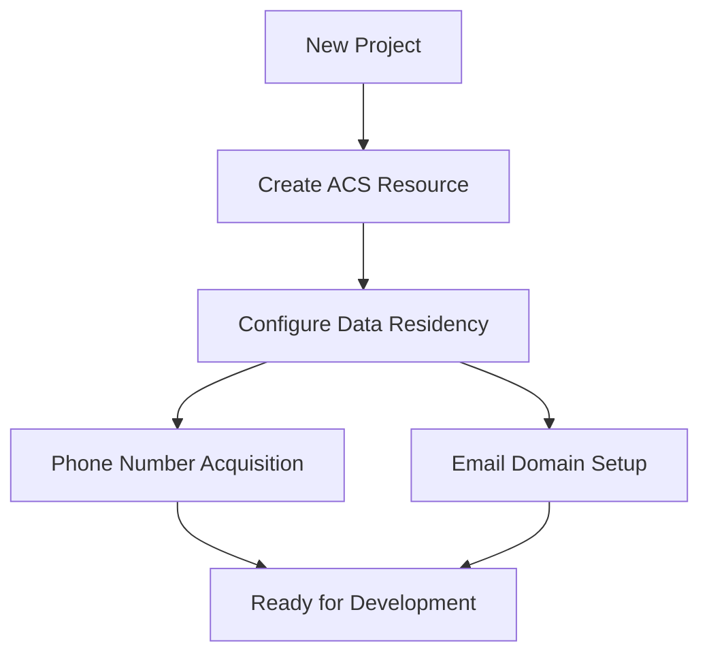

---
content_sources:
  diagrams:
    - id: provisioning-workflow
      type: flowchart
      source: mslearn-adapted
      mslearn_url: https://learn.microsoft.com/azure/communication-services/quickstarts/create-communication-resource
      based_on:
        - https://learn.microsoft.com/azure/communication-services/quickstarts/email/create-email-communication-resource
---

# Provisioning ACS Resources

Provisioning Azure Communication Services (ACS) involves creating the core resource, configuring data residency, and optionally setting up communication channels like SMS and Email.

<!-- diagram-id: provisioning-workflow -->


## Creating ACS Resources

### Azure CLI
The most efficient way to create a resource for repeatable environments.

```bash
az communication create \
    --name my-acs-resource \
    --location Global \
    --data-location UnitedStates \
    --resource-group my-rg
```

| Command | Purpose |
|---------|---------|
| `az communication create` | Creates an Azure Communication Services resource. |
| `--name my-acs-resource` | Names the ACS resource to create. |
| `--location Global` | Sets the resource location (ACS resources are Global). |
| `--data-location UnitedStates` | Sets the immutable region where data at rest is stored. |
| `--resource-group my-rg` | Places the resource in the named resource group. |

### Bicep
For Infrastructure as Code, use the `Microsoft.Communication/communicationServices` resource type.

```bicep
resource acsResource 'Microsoft.Communication/communicationServices@2023-04-01-preview' = {
  name: 'my-acs-resource'
  location: 'Global'
  properties: {
    dataLocation: 'UnitedStates'
  }
}
```

## Resource Configuration Options

| Option | Description |
| --- | --- |
| `dataLocation` | Specifies where data at rest is stored (e.g., UnitedStates, Europe, Australia). |
| `linkedDomains` | Connects an Email Communication Service domain to the ACS resource. |
| `tags` | Key-value pairs for resource organization and billing. |

## Communication Channels Setup

### Phone Number Acquisition
Phone numbers can be acquired via the Azure Portal or via CLI:
```bash
az communication phone-number list-area-codes \
    --location US \
    --number-type TollFree
```

| Command | Purpose |
|---------|---------|
| `az communication phone-number list-area-codes` | Lists available area codes for phone-number acquisition. |
| `--location US` | Sets the country/region to search for area codes. |
| `--number-type TollFree` | Filters results to the toll-free number type. |

### Email Domain Setup
1. Create an Email Communication Service resource.
2. Add and verify a custom domain or use an Azure Managed Domain.
3. Link the verified domain to your ACS resource.

## See Also
- [Quickstart: Create and manage Communication Services resources](https://learn.microsoft.com/azure/communication-services/quickstarts/create-communication-resource)
- [How to: Create an Email Communication Service](https://learn.microsoft.com/azure/communication-services/quickstarts/email/create-email-communication-resource)

## Sources
- [ACS Documentation](https://learn.microsoft.com/azure/communication-services/)
