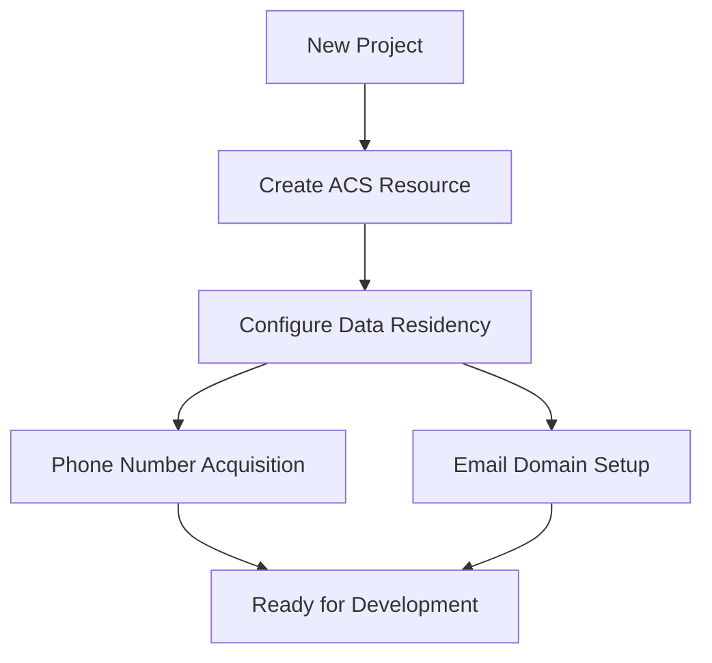

---
content_sources:
  diagrams:
    - id: provisioning-workflow
      type: flowchart
      source: mslearn-adapted
      mslearn_url: https://learn.microsoft.com/en-us/azure/communication-services/quickstarts/create-communication-resource
      based_on:
        - https://learn.microsoft.com/en-us/azure/communication-services/quickstarts/email/create-email-communication-resource
content_validation:
  status: verified
  last_reviewed: 2026-07-25
  reviewer: agent
  core_claims:
    - claim: "A Communication Services resource is the primary Azure resource used to enable ACS capabilities in a subscription and resource group"
      source: https://learn.microsoft.com/en-us/azure/communication-services/quickstarts/create-communication-resource
      verified: true
    - claim: "ACS Email provisioning uses a separate Email Communication Service resource before a domain is connected to a Communication Services resource"
      source: https://learn.microsoft.com/en-us/azure/communication-services/quickstarts/email/create-email-communication-resource
      verified: true
---

# Provisioning ACS Resources

Provisioning Azure Communication Services (ACS) involves creating the core resource, configuring data residency, and optionally setting up communication channels like SMS and Email.

<!-- diagram-id: provisioning-workflow -->

```mermaid
graph TD
    Start[New Project] --> Core[Create ACS Resource]
    Core --> Data[Configure Data Residency]
    Data --> SMS[Phone Number Acquisition]
    Data --> Email[Email Domain Setup]
    SMS --> Ready[Ready for Development]
    Email --> Ready
```

## Creating ACS Resources

### Azure CLI
The most efficient way to create a resource for repeatable environments.

```bash
az communication create \
    --name my-acs-resource \
    --location Global \
    --data-location UnitedStates \
    --resource-group my-rg
```

| Command | Purpose |
|---------|---------|
| `az communication create` | Creates an Azure Communication Services resource. |
| `--name my-acs-resource` | Names the ACS resource to create. |
| `--location Global` | Sets the resource location (ACS resources are Global). |
| `--data-location UnitedStates` | Sets the immutable region where data at rest is stored. |
| `--resource-group my-rg` | Places the resource in the named resource group. |

### Bicep
For Infrastructure as Code, use the `Microsoft.Communication/communicationServices` resource type.

```bicep
resource acsResource 'Microsoft.Communication/communicationServices@2023-04-01-preview' = {
  name: 'my-acs-resource'
  location: 'Global'
  properties: {
    dataLocation: 'UnitedStates'
  }
}
```

## Resource Configuration Options

| Option | Description |
| --- | --- |
| `dataLocation` | Specifies where data at rest is stored (e.g., UnitedStates, Europe, Australia). |
| `linkedDomains` | Connects an Email Communication Service domain to the ACS resource. |
| `tags` | Key-value pairs for resource organization and billing. |

## Communication Channels Setup

### Phone Number Acquisition
Phone numbers are acquired via the Azure Portal (Communication Service → Phone numbers → Get). The Azure CLI does not search or purchase numbers; use it to inventory numbers already acquired on the resource:
```bash
az communication phonenumber list \
    --connection-string "<connection-string>"
```

| Command | Purpose |
|---------|---------|
| `az communication phonenumber list` | Lists the phone numbers already acquired on the ACS resource. |
| `--connection-string "<connection-string>"` | Authenticates the request using the ACS connection string. |

### Email Domain Setup
1. Create an Email Communication Service resource.
2. Add and verify a custom domain or use an Azure Managed Domain.
3. Link the verified domain to your ACS resource.

## Prerequisites

- An Azure subscription and a resource group to hold the ACS resource.
- Azure CLI (with the `communication` extension) or a Bicep/IaC toolchain configured.
- Permission to create `Microsoft.Communication/communicationServices` resources (for example Contributor on the resource group).
- A decided data residency region, since `dataLocation` is immutable after creation.

## When to Use

Follow this procedure when standing up ACS for a new project, adding a new environment (dev, staging, production), or enabling a new channel such as SMS or Email on an existing resource. Data residency and domain decisions should be settled before provisioning, because the data location cannot be changed later.

## Procedure

1. Create the core ACS resource with the CLI or Bicep, setting `dataLocation` to the required residency region.
2. Configure resource options — `linkedDomains`, `tags` — for organization and billing.
3. Acquire phone numbers through the Azure Portal for SMS/voice channels, then inventory them with the CLI.
4. For Email, create an Email Communication Service resource, verify a custom or Azure Managed Domain, and link it to the ACS resource.

## Verification

- The ACS resource exists in the target resource group and reports the expected `dataLocation`.
- Acquired phone numbers appear in `az communication phonenumber list`.
- Any linked email domain shows a verified status before it is used to send.

## Rollback / Troubleshooting

- To roll back a bad provisioning run, delete the ACS (and any Email Communication Service) resource and recreate it with corrected settings — remember `dataLocation` cannot be edited in place.
- If domain linking fails, confirm DNS verification records are in place before retrying the link.
- If phone-number acquisition is unavailable, verify the country/subtype eligibility and that the resource's data location supports the number type.

## See Also
- [Email Provisioning](./email-provisioning.md)
- [Bicep & Terraform Deployment](./deployment/bicep-terraform.md)
- [Resource Types](../platform/resource-types.md)

## Sources
- [Azure Communication Services documentation](https://learn.microsoft.com/en-us/azure/communication-services/)
- [Quickstart: Create and manage Communication Services resources](https://learn.microsoft.com/en-us/azure/communication-services/quickstarts/create-communication-resource)
- [How to: Create an Email Communication Service](https://learn.microsoft.com/en-us/azure/communication-services/quickstarts/email/create-email-communication-resource)
