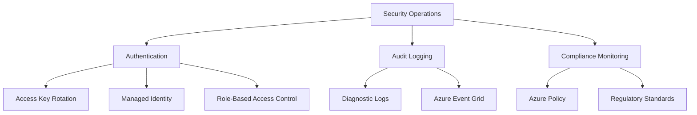

---
content_sources:
  - https://learn.microsoft.com/azure/communication-services/concepts/authentication
  - https://learn.microsoft.com/azure/communication-services/concepts/managed-identity
---

# Security Operations for ACS

Managing the security of your communication infrastructure requires focus on authentication, key management, and auditing.

<!-- diagram-id: security-operations -->


## Authentication and Key Management

ACS supports two primary authentication methods:

1. **Access Keys**: Use Primary and Secondary keys for API authentication.
2. **Managed Identity**: Use Azure Active Directory (Azure AD) for passwordless authentication.

### Key Rotation Procedures
To rotate your access keys with zero downtime:

1. Update your application to use the Secondary key.
2. Regenerate the Primary key in the Azure Portal or via CLI:
   ```bash
   az communication regenerate-key --name my-acs-resource --resource-group my-rg --key-type Primary
   ```
3. Update your application to use the new Primary key.
4. Regenerate the Secondary key if desired.

## RBAC Role Assignments

Assign specific roles to users and applications based on the principle of least privilege.

| Role | Permissions |
| --- | --- |
| `Communication Services Administrator` | Full access to manage resources and settings. |
| `Communication Services User` | Ability to send SMS, Email, and participate in calls. |
| `Communication Services Reader` | Read-only access to resource configurations. |

## Audit Logging and Compliance

Enable audit logs to track changes to your ACS resources:

- **Resource Operations**: Track when resources are created, updated, or deleted.
- **Access Logs**: Track who accessed your communication endpoints.
- **Compliance**: Use Azure Policy to enforce data residency and security standards.

## See Also
- [Authentication and authorization](https://learn.microsoft.com/azure/communication-services/concepts/authentication)
- [How to: Use Managed Identities with ACS](https://learn.microsoft.com/azure/communication-services/quickstarts/managed-identity)

## Sources
- [ACS Security Overview](https://learn.microsoft.com/azure/communication-services/concepts/security)
