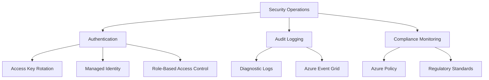

---
content_sources:
  diagrams:
    - id: security-operations
      type: flowchart
      source: mslearn-adapted
      mslearn_url: https://learn.microsoft.com/azure/communication-services/concepts/authentication
      based_on:
        - https://learn.microsoft.com/en-us/azure/communication-services/how-tos/managed-identity
content_validation:
  status: verified
  last_reviewed: 2026-07-25
  reviewer: agent
  core_claims:
    - claim: "ACS supports managed identity for Communication Services resources, which lets Azure-hosted workloads authenticate without distributing connection strings to every runtime"
      source: https://learn.microsoft.com/en-us/azure/communication-services/how-tos/managed-identity
      verified: true
    - claim: "The Microsoft Entra ID quickstart documents how Azure workloads can authenticate to ACS by using Azure Identity credentials instead of embedding secret keys in application configuration"
      source: https://learn.microsoft.com/en-us/azure/communication-services/quickstarts/identity/service-principal
      verified: true
---

# Security Operations for ACS

Managing the security of your communication infrastructure requires focus on authentication, key management, and auditing.

<!-- diagram-id: security-operations -->

```mermaid
graph TD
    SecOps[Security Operations] --> Auth[Authentication]
    SecOps --> Audit[Audit Logging]
    SecOps --> Compliance[Compliance Monitoring]
    
    Auth --> Keys[Access Key Rotation]
    Auth --> MI[Managed Identity]
    Auth --> RBAC[Role-Based Access Control]
    
    Audit --> Logs[Diagnostic Logs]
    Audit --> Events[Azure Event Grid]
    
    Compliance --> Pol[Azure Policy]
    Compliance --> Reg[Regulatory Standards]
```

## Authentication and Key Management

ACS supports two primary authentication methods:

1. **Access Keys**: Use Primary and Secondary keys for API authentication.
2. **Managed Identity**: Use Azure Active Directory (Azure AD) for passwordless authentication.

### Key Rotation Procedures
To rotate your access keys with zero downtime:

1. Update your application to use the Secondary key.
2. Regenerate the Primary key in the Azure Portal or via CLI:
   ```bash
   az communication regenerate-key --name my-acs-resource --resource-group my-rg --key-type Primary
   ```

| Command | Purpose |
|---------|---------|
| `az communication regenerate-key` | Regenerates an access key for the ACS resource. |
| `--name my-acs-resource` | Names the ACS resource whose key is regenerated. |
| `--resource-group my-rg` | Names the resource group that holds the resource. |
| `--key-type Primary` | Selects which key to regenerate (`Primary` or `Secondary`). |

3. Update your application to use the new Primary key.
4. Regenerate the Secondary key if desired.

## RBAC Role Assignments

Assign specific roles to users and applications based on the principle of least privilege.

| Role | Permissions |
| --- | --- |
| `Communication Services Administrator` | Full access to manage resources and settings. |
| `Communication Services User` | Ability to send SMS, Email, and participate in calls. |
| `Communication Services Reader` | Read-only access to resource configurations. |

## Audit Logging and Compliance

Enable audit logs to track changes to your ACS resources:

- **Resource Operations**: Track when resources are created, updated, or deleted.
- **Access Logs**: Track who accessed your communication endpoints.
- **Compliance**: Use Azure Policy to enforce data residency and security standards.

## Prerequisites

- An ACS resource and permission to view and regenerate its access keys (**Owner**, **Contributor**, or a custom role granting `Microsoft.Communication/communicationServices/regenerateKey/action`).
- **User Access Administrator** or **Owner** on the resource scope to assign the ACS RBAC roles.
- Diagnostic settings configured to send ACS logs to Log Analytics if you intend to audit access.

## When to Use

- On a recurring key-rotation schedule, or immediately after a suspected key exposure.
- When migrating an application from connection-string authentication to managed identity.
- During access reviews, to confirm role assignments still follow least privilege.

## Procedure

1. **Choose an authentication model** — prefer managed identity over access keys for Azure-hosted workloads, as described in [Authentication and Key Management](#authentication-and-key-management).
2. **Rotate keys safely** — follow the zero-downtime steps in [Key Rotation Procedures](#key-rotation-procedures): move traffic to the secondary key, regenerate the primary, then cut back.
3. **Apply least-privilege access** — assign the narrowest role from [RBAC Role Assignments](#rbac-role-assignments) that still lets each principal do its job.
4. **Enable auditing** — turn on the diagnostic and access logs described in [Audit Logging and Compliance](#audit-logging-and-compliance).

## Verification

- After rotation, confirm the application continues to authenticate and send messages with no errors in diagnostic logs.
- Confirm each principal holds exactly one ACS role and that no broad `Administrator` grants remain where `User` or `Reader` suffices.
- Confirm resource-operation and access logs are flowing to the workspace.

## Rollback / Troubleshooting

- **Application fails after key regeneration** — the app was still using the regenerated key; repoint it to the current valid key (the secondary during rotation), restart, then complete the rotation.
- **Managed identity returns 401/403** — verify the identity has the correct ACS role assignment and that the assignment has propagated, which can take several minutes.
- **Unexpected access in audit logs** — treat as a potential compromise: rotate both keys immediately and review recent role assignments.

## See Also
- [Authentication and authorization](https://learn.microsoft.com/azure/communication-services/concepts/authentication)
- [How to: Use Managed Identities with ACS](https://learn.microsoft.com/azure/communication-services/quickstarts/managed-identity)

## Sources
- [ACS Security Overview](https://learn.microsoft.com/azure/communication-services/concepts/security)
