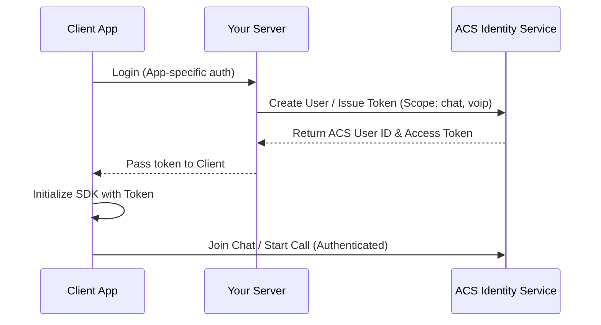

---
content_sources:
  diagrams:
    - id: acs-auth-flow
      type: mslearn-adapted
      mslearn_url: https://learn.microsoft.com/azure/communication-services/concepts/authentication
      based_on: Typical token-based client auth flow
---

# Authentication and Identity

Azure Communication Services (ACS) provides two primary authentication models: one for managing your ACS resources (the control plane) and one for user communication (the data plane).

## Authentication Models

| Method | Best For | Typical Usage |
| --- | --- | --- |
| **Connection String** | Rapid prototyping / Local development | Initial SDK setup, simple server apps |
| **Azure AD (Entra ID)** | Production security | Server-side identity client, SMS, Email |
| **Managed Identity** | Azure-hosted applications (App Service, Functions) | Secretless authentication for server tasks |
| **User Access Tokens** | Client-side SDKs (Web/Mobile) | Authorizing chat, voice, and video actions |

## Control Plane Authentication (Server-Side)

The control plane is how your server interacts with ACS. For production, it's highly recommended to use **Azure Entra ID** or **Managed Identities** over connection strings.

-   **Secretless Authentication**: By using Managed Identity, your application doesn't need to store or rotate connection strings. ACS provides built-in RBAC roles like `Communication Service Contributor`.
-   **HMAC Authentication**: For direct REST API calls without an SDK, ACS supports HMAC-SHA256 signing of requests using your resource key.

## Data Plane Authentication (User-Side)

For clients (web or mobile) to communicate, they must have a **User Access Token**. These tokens are generated by your server and sent to the client.

### Token Scopes
When issuing a token, you specify the required capabilities:
-   `chat`: Access to the Chat SDK.
-   `voip`: Access to Voice and Video Calling.
-   `presence`: Access to user presence states.

!!! warning "Token Refresh"
    User access tokens have a limited lifetime (default 24 hours). Your application must implement a mechanism for the client to request a fresh token before the current one expires.

## Authentication Flow Diagram

The following diagram shows the interaction between your user, your server, and ACS for secure client-side communication.

<!-- diagram-id: acs-auth-flow -->

## Communication Identity Client

The `CommunicationIdentityClient` is the core server-side component for managing identities. It allows you to:
-   **Create a User**: Returns a unique `CommunicationIdentifier`.
-   **Issue a Token**: Generates a JWT for a specific user and scope.
-   **Revoke Tokens**: Invalidates all tokens for a user (useful for security breaches).

## See Also

- [Security Architecture](security-architecture.md)
- [How ACS Works](how-acs-works.md)

## Sources

- [Authentication Concepts](https://learn.microsoft.com/azure/communication-services/concepts/authentication)
- [Communication Identity Model](https://learn.microsoft.com/azure/communication-services/concepts/identity-model)
