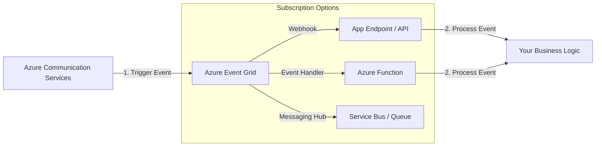

---
hide:
  - toc
content_sources:
  diagrams:
    - id: acs-event-flow
      type: self-generated
      justification: Event handling flow via Azure Event Grid
---

# Event Handling

Azure Communication Services (ACS) provides an event-driven architecture, allowing your application to respond to real-time communication events. This is achieved through integration with **Azure Event Grid**, a high-performance, pub/sub event routing service.

## Why Use Event-Driven Architecture?

Using events is more efficient than polling for status changes. Instead of constantly checking "Did the SMS arrive?", ACS notifies you the moment it happens.

| Scenario | Event Trigger | Application Action |
| --- | --- | --- |
| **Incoming SMS** | `SMSReceived` | Parse content and trigger a response bot. |
| **Email Delivery** | `EmailDeliveryReportReceived` | Update delivery status in your database. |
| **Chat Message** | `ChatMessageReceived` | Update an offline user via push notification. |
| **Call Automation** | `CallStarted` / `CallEnded` | Record call duration or start a recording. |

## Common Event Types

ACS publishes events for various categories:

### Messaging Events
-   `Microsoft.Communication.SMSReceived`
-   `Microsoft.Communication.SMSDeliveryReportReceived`
-   `Microsoft.Communication.ChatMessageReceived`
-   `Microsoft.Communication.ChatThreadCreated`

### Voice and Video Events
-   `Microsoft.Communication.CallStarted`
-   `Microsoft.Communication.CallEnded`
-   `Microsoft.Communication.RecordingFileStatusUpdated`

### Email Events
-   `Microsoft.Communication.EmailDeliveryReportReceived`
-   `Microsoft.Communication.EmailEngagementTrackingReportReceived`

## Event Flow Diagram

The following diagram shows how events flow from ACS to your application via Event Grid.

<!-- diagram-id: acs-event-flow -->

## Webhooks vs. Event Grid Subscriptions

-   **Webhooks**: Best for simple, direct integration into an existing API. Your endpoint must validate the subscription request from Event Grid.
-   **Azure Functions**: The most common serverless approach for processing ACS events at scale.
-   **Service Bus / Storage Queues**: Ideal if you need to buffer events during high-traffic periods before processing them.

!!! tip "Validation"
    When setting up a webhook, Event Grid sends a `SubscriptionValidationEvent`. Your endpoint must return the `validationCode` to prove ownership before events start flowing.

## See Also

- [Messaging Channels Overview](messaging-channels.md)
- [How ACS Works](how-acs-works.md)

## Sources

- [Event Handling Concepts](https://learn.microsoft.com/azure/communication-services/concepts/event-handling)
- [System Event Types for ACS](https://learn.microsoft.com/azure/event-grid/event-schema-communication-services)
