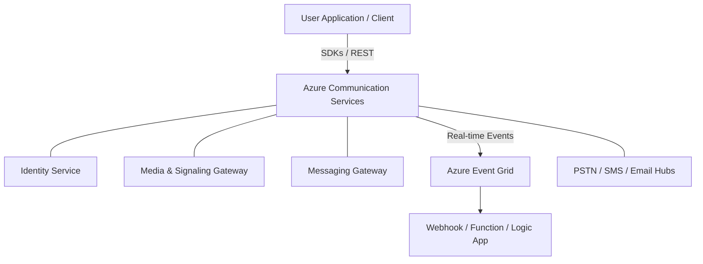

---
content_sources:
  diagrams:
    - id: acs-architecture-overview
      type: mslearn-adapted
      mslearn_url: https://learn.microsoft.com/azure/communication-services/overview
      based_on: Generic ACS architecture
content_validation:
  status: pending_review
  last_reviewed: null
  reviewer: agent
  core_claims: []
---

# How Azure Communication Services Works

Azure Communication Services (ACS) is a multi-tenant cloud service built on the same underlying infrastructure that powers Microsoft Teams. It allows developers to add real-time communication capabilities — such as voice, video, chat, and SMS — to their applications without managing complex telephony and network stacks.

## Core Architecture

The ACS architecture is centered around the **Communication Resource**, which serves as the container for all communication activities, identities, and settings.

### Key Components

-   **Communication Resource**: The root Azure resource where you manage keys, connection strings, and associated assets (phone numbers, email domains).
-   **Identity Service**: Manages user identities (Communication User IDs) and provides user access tokens for client-side authentication.
-   **SDKs & APIs**: Provides language-specific wrappers (Python, JS, Java, .NET) and direct REST interfaces for interaction.
-   **Communication Gateway**: The backbone that handles the signaling, media processing, and routing of voice, video, and messages.
-   **Event Grid Integration**: A pub/sub model for real-time notifications like "message received" or "call ended".

<!-- diagram-id: acs-architecture-overview -->

## The Resource Model

ACS follows the standard Azure Resource Manager (ARM) model. A Communication Resource is a global resource tied to an Azure subscription and a specific geography.

!!! info "Regional Data Residency"
    While the resource is "global", data residency is determined by the geography selected during resource creation. Currently, data at rest is stored within the selected geography (e.g., United States, Europe, Asia Pacific).

## Identity and Access Token Model

ACS uses a decoupled identity model. You don't need to sync your entire user database with ACS. Instead, you map your application's user IDs to **Communication User IDs**.

-   **CommunicationIdentityClient**: Used on the server side to create new users and issue short-lived user access tokens.
-   **User Access Tokens**: These tokens carry specific "scopes" (e.g., `chat`, `voip`) and are passed to the client SDK to authorize actions.

## Integration Patterns

### Server-Side Operations (Control Plane)
Used for SMS, Email, and administrative tasks like creating chat threads or managing phone numbers. These operations use a connection string or Entra ID credentials for authentication.

### Client-Side Operations (Data Plane)
Used for real-time interactions like sending a chat message or joining a video call. These operations use the user access tokens issued by your server.

### Real-Time Eventing
For asynchronous tasks (like receiving an SMS), ACS publishes events to Azure Event Grid. Your application can subscribe to these events via webhooks or Azure Functions to trigger business logic.

## See Also

- [Resource Types](resource-types.md)
- [Authentication and Identity](authentication.md)
- [Event Handling](event-handling.md)

## Sources

- [What is Azure Communication Services?](https://learn.microsoft.com/azure/communication-services/overview)
- [Communication Identity Model](https://learn.microsoft.com/azure/communication-services/concepts/identity-model)
