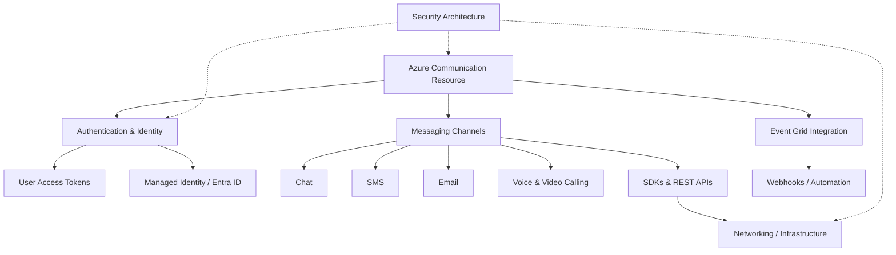

---
hide:
  - toc
content_sources:
  diagrams:
    - id: platform-concept-relationships
      type: self-generated
      justification: Overview of platform documentation structure and relationships
---

# Platform Concepts

Azure Communication Services (ACS) provides a comprehensive set of cloud-based APIs and SDKs to integrate communication into your applications. This section explores the underlying platform architecture, identity models, and infrastructure that power these services.

## Platform Documentation

| Document | Description |
| --- | --- |
| [How ACS Works](how-acs-works.md) | High-level architecture, resource models, and core service components. |
| [Resource Types](resource-types.md) | Detailed breakdown of communication resources, phone numbers, and email domains. |
| [Messaging Channels](messaging-channels.md) | Comparison and technical overview of SMS, Email, and Chat channels. |
| [Authentication and Identity](authentication.md) | Security models including connection strings, Entra ID, and user access tokens. |
| [Networking](networking.md) | Network requirements, firewall configurations, and TURN/STUN infrastructure. |
| [SDKs and REST APIs](sdks-and-apis.md) | Language support matrix and comparison between SDK and REST API approaches. |
| [Event Handling](event-handling.md) | Real-time event integration via Azure Event Grid and event-driven patterns. |
| [Security Architecture](security-architecture.md) | Encryption, compliance, and data residency considerations. |

## Concept Relationships

The following diagram illustrates how the various platform components interact to provide a cohesive communication experience.

<!-- diagram-id: platform-concept-relationships -->

## Recommended Reading Order

If you are new to Azure Communication Services, it's recommended to follow this order to build a solid foundation:

1.  **[How ACS Works](how-acs-works.md)**: Understand the big picture and basic architecture.
2.  **[Authentication and Identity](authentication.md)**: Learn how to secure your resources and manage users.
3.  **[SDKs and REST APIs](sdks-and-apis.md)**: Identify the right tools for your development environment.
4.  **[Networking](networking.md)**: Ensure your environment is ready for real-time traffic.

## See Also

- [Start Here](../start-here/overview.md)
- [Best Practices](../best-practices/index.md)
- [Troubleshooting Reference](../troubleshooting/index.md)

## Sources

- [Azure Communication Services Overview](https://learn.microsoft.com/azure/communication-services/overview)
- [ACS Documentation Hub](https://learn.microsoft.com/azure/communication-services/)
