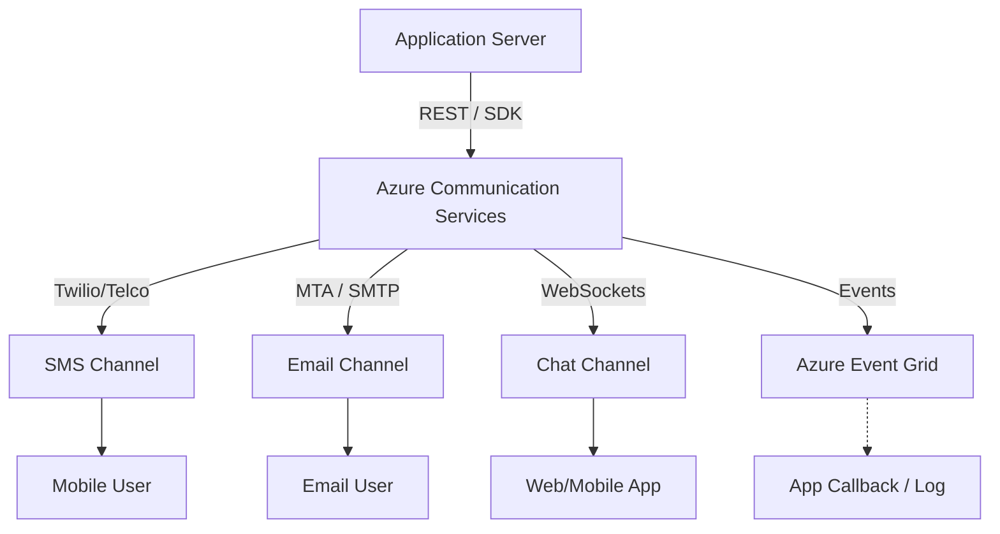

---
content_sources:
  diagrams:
    - id: messaging-channels-architecture
      type: flowchart
      source: self-generated
      justification: Messaging channels architecture overview
content_validation:
  status: verified
  last_reviewed: 2026-06-29
  reviewer: agent
  core_claims:
    - claim: "ACS Email is documented as an outbound (A2P) sending service; Microsoft Learn does not document an inbound mail-receive capability or any MX target for ACS Email"
      source: https://learn.microsoft.com/azure/communication-services/concepts/email/email-overview
      verified: true
    - claim: "Custom email domain verification in the Portal renders four DNS wizards (Domain TXT, SPF, DKIM, DKIM2); DMARC is configured directly at the DNS provider and is not surfaced as a wizard"
      source: https://learn.microsoft.com/azure/communication-services/quickstarts/email/add-custom-verified-domains
      verified: true
---

# Messaging Channels Overview

Azure Communication Services (ACS) provides multiple channels for asynchronous and real-time messaging. Each channel is designed for specific use cases, ranging from high-volume transactional notifications to interactive customer support chats.

## Messaging Channels Comparison

| Feature | SMS | Email | Chat |
| --- | --- | --- | --- |
| **Primary Use Case** | Urgent alerts, MFA, marketing | Invoices, reports, newsletters | Customer support, internal collaboration |
| **Persistence** | Device-dependent | Inbox-dependent | Server-side (stored in ACS) |
| **Real-time** | Near real-time | Low-to-moderate latency | Instant (via WebSockets) |
| **Formatting** | Plain text (mostly) | Rich HTML / Attachments | Plain text, Emoji, Attachments |
| **Capacity** | High volume (Short codes) | Very high (Transactional) | Threads / Large groups |

## SMS Channel

ACS allows you to send and receive text messages globally. To use the SMS channel, you must acquire a phone number within your Communication Resource.

### Key Capabilities
-   **Toll-Free Numbers**: Ideal for high-volume messages and two-way communication.
-   **Short Codes**: Specialized numbers for massive transactional or promotional campaigns.
-   **MMS Support**: Send and receive multimedia content (images, video).
-   **Delivery Status**: Real-time tracking of sent messages via Event Grid.

## Email Channel

The ACS Email channel provides a high-reliability platform for **outbound (application-to-person) transactional email**. Microsoft Learn documents only sending capabilities for ACS Email — `SendMail` plus delivery and engagement tracking — so if your domain must also receive replies, keep the MX record pointed at your separate inbound mail provider (Microsoft 365, Google Workspace, your own MTA, etc.) and use ACS only for the outbound leg.

### Key Capabilities
-   **Azure Managed Domains**: Instant setup using `donotreply@xxxx.azurecomm.net`.
-   **Custom Domains**: Verified domains using four Portal DNS wizards (Domain TXT, SPF, DKIM, DKIM2) plus an optional DMARC TXT for high deliverability. No ACS-specific MX record is needed — the documented DNS setup covers only outbound sending. See [Email provisioning](../operations/email-provisioning.md#step-3-verify-a-custom-domain-via-dns) for the full DNS setup.
-   **Batch Sending**: API-optimized for sending messages to thousands of recipients.
-   **Tracking**: Support for delivery, bounce, and click tracking.

## Chat Channel

The Chat channel enables real-time messaging between users in chat "threads".

### Key Capabilities
-   **Thread Management**: Create, update, and delete threads with up to 250 participants.
-   **Real-time Notifications**: Uses WebSockets to deliver messages instantly to active clients.
-   **Read Receipts & Typing Indicators**: Standard modern chat features built-in.
-   **History Retrieval**: Access to previous messages within a thread.

## Messaging Architecture Diagram

The following diagram illustrates how your application interacts with different messaging channels via ACS.

<!-- diagram-id: messaging-channels-architecture -->

!!! tip "Hybrid Messaging"
    Many applications use a hybrid approach: sending a real-time **Chat** message first and falling back to **SMS** if the user is offline for more than 5 minutes (via Event Grid monitoring).

## See Also

- [Resource Types](resource-types.md)
- [Event Handling](event-handling.md)

## Sources

- [SMS Overview](https://learn.microsoft.com/azure/communication-services/concepts/sms/overview)
- [Email Overview](https://learn.microsoft.com/azure/communication-services/concepts/email/overview)
- [Chat Concepts](https://learn.microsoft.com/azure/communication-services/concepts/chat/concepts)
