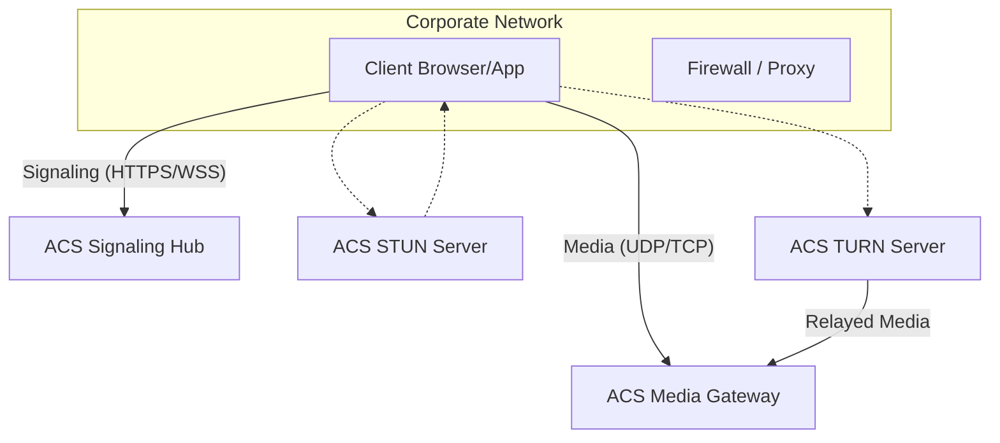

---
content_sources:
  diagrams:
    - id: acs-networking-architecture
      type: self-generated
      justification: Networking and infrastructure requirements for ACS calling
content_validation:
  status: pending_review
  last_reviewed: null
  reviewer: agent
  core_claims: []
---

# Networking

Azure Communication Services (ACS) is built on a globally distributed network designed for low-latency, real-time communication. To ensure high-quality voice, video, and data transmission, your network must be configured to allow specific types of traffic.

## Network Requirements

To use ACS effectively, clients must be able to communicate with the ACS infrastructure across several protocols:

| Protocol | Usage | Destination |
| --- | --- | --- |
| **HTTPS (TCP 443)** | Control plane, signaling, chat, identity | ACS Service Endpoints |
| **WSS (TCP 443)** | Real-time chat notifications | ACS Signaling Gateways |
| **UDP (3478-3481)** | Real-time media (Voice, Video) | ACS STUN/TURN Servers |
| **UDP (49152-65535)** | Peer-to-peer (P2P) media | Other Client Endpoints |

## STUN and TURN Servers

When clients are behind firewalls or NAT (Network Address Translation), ACS uses standard WebRTC mechanisms to establish media paths:

-   **STUN (Session Traversal Utilities for NAT)**: Allows clients to discover their public IP address and port.
-   **TURN (Traversal Using Relays around NAT)**: Acts as a relay when a direct P2P connection cannot be established.

ACS provides a managed TURN service globally, ensuring that clients can always connect regardless of their network complexity.

## Bandwidth Considerations

The bandwidth required for ACS depends on the communication type and quality settings:

-   **Voice Only**: ~100 kbps (per stream)
-   **Video (720p)**: ~1.5 Mbps (per stream)
-   **Video (1080p)**: ~2.5+ Mbps (per stream)
-   **Screen Sharing**: Highly variable based on content complexity (0.5 - 4.0 Mbps)

## Private Link Support

ACS supports **Azure Private Link**, allowing you to restrict management traffic (control plane) to your private network. However, real-time media traffic (data plane) generally requires public internet access for global client connectivity unless specific VPN/ExpressRoute configurations are in place.

## Networking Architecture Diagram

The following diagram shows how media and signaling traffic flows between clients and ACS.

<!-- diagram-id: acs-networking-architecture -->

!!! warning "Firewall Configuration"
    Failing to open the required UDP ports (3478-3481) for STUN/TURN is the most common cause of "no audio" or "call dropped" issues in corporate environments.

## See Also

- [Troubleshooting Reference](../troubleshooting/index.md)
- [How ACS Works](how-acs-works.md)

## Sources

- [Network Requirements](https://learn.microsoft.com/azure/communication-services/concepts/network-requirements)
- [Media Optimisation](https://learn.microsoft.com/azure/communication-services/concepts/voice-video-calling/media-optimization)
