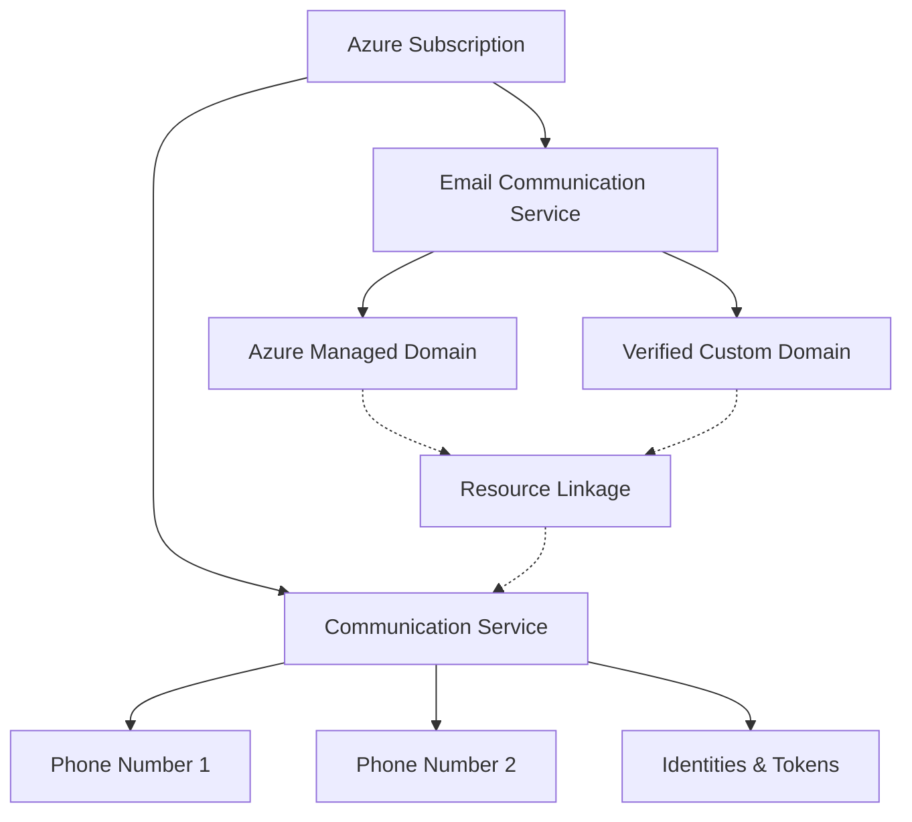

---
content_sources:
  diagrams:
    - id: acs-resource-relationships
      type: flowchart
      source: self-generated
      justification: Relationship overview of ACS resource components
---

# Resource Types and Relationships

Managing Azure Communication Services (ACS) involves interacting with several types of Azure resources. Understanding how these resources are linked and their parent-child relationships is key to effective resource management and automation.

## Core Resource Types

| Resource Type | Description | Parent Resource |
| --- | --- | --- |
| **Communication Service** | The top-level resource that acts as a container for all other ACS assets. | Azure Subscription |
| **Phone Number** | A telephony resource acquired via ACS for SMS and voice calling. | Communication Service |
| **Email Communication Service** | A specialized resource for managing email domains and sender identities. | Azure Subscription |
| **Email Domain** | A specific domain (Azure-managed or custom) verified for sending emails. | Email Communication Service |

## Resource Relationships

The relationship between ACS resources is designed to separate communication capabilities (calling, chat) from messaging infrastructure (SMS, Email).

### Communication Resource (The Hub)
The main **Communication Service** resource handles identities, chat threads, and voice/video calling. You can also link phone numbers to this resource for SMS and PSTN calling.

### Email Communication Service (The Sender)
**Email Communication Services** are standalone resources. To send emails using ACS, you must link an **Email Domain** from an Email Communication Service to your primary **Communication Service**.

### Resource Relationship Diagram

The following diagram illustrates how these resources are connected within an Azure subscription.

<!-- diagram-id: acs-resource-relationships -->

## Phone Number Resources

Phone numbers are distinct assets within your Communication Service. They are categorised by:

-   **Number Type**: Local (Geographic) or Toll-Free.
-   **Capabilities**: Inbound only, Outbound only, or both.
-   **Assignment**: Allocated directly to a user (via SDK) or used as a shared resource for SMS/Calling.

## Email Domains and Managed Resources

Email resources are more specialized and have their own management lifecycle:

1.  **Azure Managed Domain**: A quick-start option where Microsoft provides a sub-domain of `azurecomm.net`.
2.  **Custom Domain**: Requires DNS verification (SPF, DKIM) to prove ownership of a domain you own.
3.  **Sender Username**: Defines the "From" address (e.g., `info@contoso.com`).

!!! warning "Linkage Requirement"
    You cannot send an email until you have explicitly linked the Email Communication Service domain to your primary Communication Service resource in the Azure Portal or via CLI/ARM.

## See Also

- [Messaging Channels Overview](messaging-channels.md)
- [How ACS Works](how-acs-works.md)

## Sources

- [Create and Manage Communication Service Resources](https://learn.microsoft.com/azure/communication-services/quickstarts/create-communication-resource)
- [Email Service Domains](https://learn.microsoft.com/azure/communication-services/concepts/email/email-domains-and-sender-authentication)
