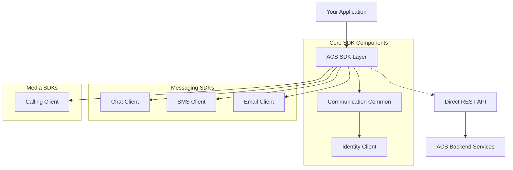

---
content_sources:
  diagrams:
    - id: acs-sdk-architecture
      type: self-generated
      justification: Overview of ACS SDK and API architecture
content_validation:
  status: pending_review
  last_reviewed: null
  reviewer: agent
  core_claims: []
---

# SDKs and REST APIs

Azure Communication Services (ACS) provides multiple ways to interact with its capabilities, ranging from high-level, language-specific SDKs to direct REST API access. This multi-layered approach allows you to choose the best tool for your development environment.

## SDK and API Comparison

| Feature | SDKs | REST APIs |
| --- | --- | --- |
| **Ease of Use** | High (Language-specific models) | Moderate (Manual request/response) |
| **Performance** | Optimized with built-in retries | High (Lowest overhead) |
| **Compatibility** | Subject to versioning | Universal (Any HTTP client) |
| **Maintenance** | Handled by Microsoft | Requires manual implementation |

## Language Support Matrix

ACS offers first-party SDKs for the most common programming languages and platforms:

| SDK Area | JavaScript (Web) | .NET | Python | Java | iOS / Android |
| --- | :---: | :---: | :---: | :---: | :---: |
| **Common / Identity** | ✅ | ✅ | ✅ | ✅ | ✅ |
| **Chat** | ✅ | ✅ | ✅ | ✅ | ✅ |
| **Calling** | ✅ | ✅ | - | - | ✅ |
| **SMS** | ✅ | ✅ | ✅ | ✅ | - |
| **Email** | ✅ | ✅ | ✅ | ✅ | - |
| **Phone Numbers** | ✅ | ✅ | ✅ | ✅ | - |

## SDK Architecture Diagram

The ACS SDKs are architected to separate **Common** functionality (identities, authentication) from **Channel-specific** functionality.

<!-- diagram-id: acs-sdk-architecture -->

## REST API Versioning

The ACS REST APIs are versioned using a query parameter (e.g., `api-version=2023-11-01`). This ensures stability while allowing the platform to evolve.

!!! info "API Versioning Policy"
    New SDK releases are typically tied to specific API versions. Upgrading an SDK may change the underlying API version it communicates with.

## SDK Versioning and Compatibility

ACS SDKs follow **Semantic Versioning (SemVer)**. It is essential to keep your SDKs updated, as older versions may be retired or lose compatibility with new backend features.

-   **General Availability (GA)**: Production-ready and supported by SLAs.
-   **Public Preview**: Includes experimental features that may undergo breaking changes.

## See Also

- [How ACS Works](how-acs-works.md)
- [Authentication and Identity](authentication.md)

## Sources

- [SDK Options and Tools](https://learn.microsoft.com/azure/communication-services/concepts/sdk-options)
- [REST API Reference](https://learn.microsoft.com/rest/api/communication/)
