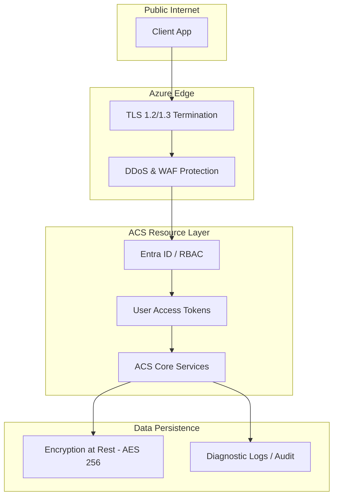

---
hide:
  - toc
content_sources:
  diagrams:
    - id: acs-security-layers
      type: self-generated
      justification: Security layers of ACS from identity to network
---

# Security Architecture

Azure Communication Services (ACS) is built with a defense-in-depth approach, leveraging Microsoft's extensive security infrastructure. This document outlines the security layers that protect your resources, data, and users.

## Security Layers Overview

| Layer | Primary Protection | Key Feature |
| --- | --- | --- |
| **Network Security** | Prevents unauthorized access | Private Link, TLS 1.2+ encryption |
| **Identity Security** | Controls resource access | Entra ID (Azure AD), Managed Identities |
| **Data Security** | Protects data at rest/transit | AES-256 encryption, Customer Managed Keys |
| **Application Security** | Secures user interactions | User Access Tokens, HMAC Signing |

## Data Protection

### Encryption in Transit
All communication between clients and ACS, and between ACS and other Azure services, is encrypted using **Transport Layer Security (TLS) 1.2 or 1.3**.

### Encryption at Rest
Data stored by ACS, such as chat messages, call recordings, and email metadata, is automatically encrypted using **AES-256** with Microsoft-managed keys. For some scenarios, Customer-Managed Keys (CMK) are supported to provide additional control.

## Compliance and Data Residency

ACS is designed to meet rigorous global compliance standards, including:
-   **GDPR (General Data Protection Regulation)**: Built-in tools for data deletion and export.
-   **HIPAA (Health Insurance Portability and Accountability Act)**: Compliant with a BAA (Business Associate Agreement) in place.
-   **PCI DSS (Payment Card Industry Data Security Standard)**: Suitable for many financial application requirements.

!!! info "Data Residency"
    ACS allows you to select the geography where your data is stored at rest (e.g., United States, Europe, UK, Asia Pacific). Real-time media traffic may flow through the nearest Microsoft edge location to optimize performance but is not stored there.

## Security Layers Diagram

The following diagram illustrates the multiple layers of security applied to an ACS environment.

<!-- diagram-id: acs-security-layers -->

## Security Best Practices

1.  **Use Managed Identities**: Avoid storing connection strings in code or configuration files.
2.  **Principle of Least Privilege**: Use Azure RBAC to grant only the necessary permissions to service principals.
3.  **Token Rotation**: Implement a robust mechanism for refreshing user access tokens and revoking them when a user's session is terminated.
4.  **Log Monitoring**: Enable Diagnostic Settings to send ACS logs to **Log Analytics** for auditing and anomaly detection.

## See Also

- [Authentication and Identity](authentication.md)
- [Networking](networking.md)

## Sources

- [Security Concepts in ACS](https://learn.microsoft.com/azure/communication-services/concepts/privacy)
- [Data Residency and Compliance](https://learn.microsoft.com/azure/communication-services/concepts/data-residency)
