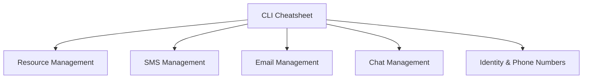

# ACS CLI Cheatsheet

Azure Communication Services-specific Azure CLI commands for common management and operational tasks.

<!-- diagram-id: cli-cheatsheet-diagram -->

## Resource Management

| Command | Description | Example |
| --- | --- | --- |
| `az communication create` | Create a new ACS resource. | `az communication create --name my-acs-resource --location Global --data-location UnitedStates --resource-group my-rg` |
| `az communication list` | List all ACS resources. | `az communication list --output table` |
| `az communication list-key` | Get connection strings for a resource. | `az communication list-key --name my-acs-resource --resource-group my-rg` |

## Identity and Phone Numbers

| Command | Description | Example |
| --- | --- | --- |
| `az communication identity create` | Create a new communication identity. | `az communication identity create --name my-acs-resource --resource-group my-rg` |
| `az communication phone-number list` | List acquired phone numbers. | `az communication phone-number list --name my-acs-resource --resource-group my-rg` |
| `az communication phone-number list-area-codes` | List available area codes. | `az communication phone-number list-area-codes --location US --number-type TollFree` |

## SMS Management

| Command | Description | Example |
| --- | --- | --- |
| `az communication sms send` | Send an SMS message. | `az communication sms send --sender-number "+18001234567" --recipient-numbers "+18007654321" --message "Hello from ACS!"` |

## Email Management

| Command | Description | Example |
| --- | --- | --- |
| `az communication email send` | Send an email message. | `az communication email send --sender-address "do-not-reply@example.com" --recipient-address "user@example.com" --subject "Welcome" --text "Hello!"` |

## Chat Management

| Command | Description | Example |
| --- | --- | --- |
| `az communication chat thread list` | List chat threads. | `az communication chat thread list --name my-acs-resource --resource-group my-rg` |

## See Also
- [Azure Communication Services CLI Reference](https://learn.microsoft.com/cli/azure/communication)
- [How to: Create and manage Communication Services resources](https://learn.microsoft.com/azure/communication-services/quickstarts/create-communication-resource)

## Sources
- [ACS CLI Documentation](https://learn.microsoft.com/cli/azure/communication)
