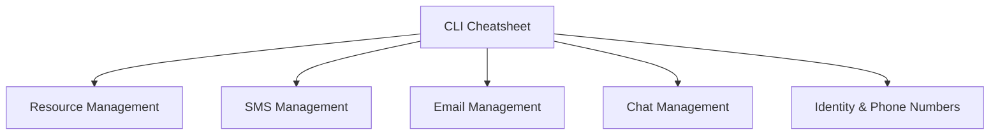

---
content_sources:
  diagrams:
    - id: cli-cheatsheet-diagram
      type: flowchart
      source: self-generated
      justification: Original categorization diagram organizing ACS Azure CLI commands by resource domain.
      based_on: https://learn.microsoft.com/en-us/cli/azure/communication
---

# ACS CLI Cheatsheet

Azure Communication Services-specific Azure CLI commands for common management and operational tasks.

<!-- diagram-id: cli-cheatsheet-diagram -->

```mermaid
graph TD
    CLI[CLI Cheatsheet] --> Res[Resource Management]
    CLI --> SMS[SMS Management]
    CLI --> Email[Email Management]
    CLI --> Chat[Chat Management]
    CLI --> Identity[Identity & Phone Numbers]
```

## Resource Management

| Command | Description | Example |
| --- | --- | --- |
| `az communication create` | Create a new ACS resource. | `az communication create --name my-acs-resource --location Global --data-location UnitedStates --resource-group my-rg` |
| `az communication list` | List all ACS resources. | `az communication list --output table` |
| `az communication list-key` | Get connection strings for a resource. | `az communication list-key --name my-acs-resource --resource-group my-rg` |

## Identity and Phone Numbers

| Command | Description | Example |
| --- | --- | --- |
| `az communication user-identity user create` | Create a new communication user identity. | `az communication user-identity user create --connection-string "<yourConnectionString>"` |
| `az communication phonenumber list` | List purchased phone numbers for a Communication Services resource. | `az communication phonenumber list --connection-string "<yourConnectionString>"` |

## SMS Management

| Command | Description | Example |
| --- | --- | --- |
| `az communication sms send` | Send an SMS message. | `az communication sms send --sender "+18001234567" --recipient "+18007654321" --message "Hello from ACS!" --connection-string "<yourConnectionString>"` |

## Email Management

| Command | Description | Example |
| --- | --- | --- |
| `az communication email send` | Send an email message. | `az communication email send --sender "do-not-reply@example.com" --to "user@example.com" --subject "Welcome" --text "Hello!" --connection-string "<yourConnectionString>"` |

## Chat Management

| Command | Description | Example |
| --- | --- | --- |
| `az communication chat thread list` | List chat threads for the authenticated user. | `az communication chat thread list --endpoint "https://<resource-name>.communication.azure.com" --access-token "<access-token>"` |

## See Also
- [Azure Communication Services CLI Reference](https://learn.microsoft.com/en-us/cli/azure/communication)
- [How to: Create and manage Communication Services resources](https://learn.microsoft.com/en-us/azure/communication-services/quickstarts/create-communication-resource)

## Sources
- [ACS CLI Documentation](https://learn.microsoft.com/en-us/cli/azure/communication)
