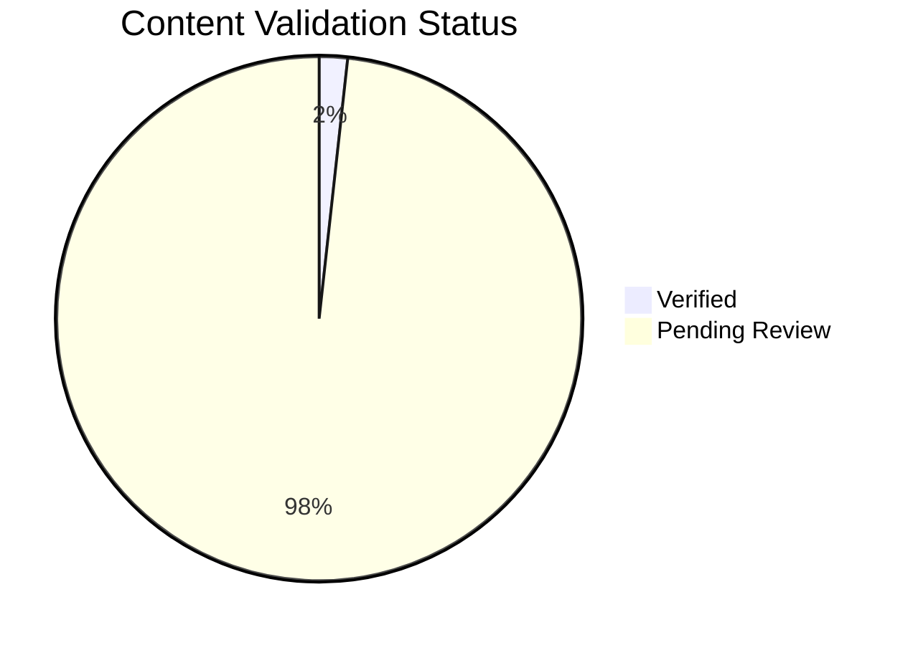

---
content_sources:
  diagrams:
    - id: reference-content-validation-status
      type: pie
      source: self-generated
      justification: Content validation status chart generated from repository frontmatter metadata.
      based_on:
        - docs/
content_validation:
  status: pending_review
  last_reviewed: null
  reviewer: agent
  core_claims: []
---

# Content Validation Status

This page tracks non-tutorial document validation metadata. `pending_review` means the document is registered in the workflow but its individual claims still need source review.

## Summary

*Generated from repository frontmatter metadata.*

| Status | Count |
|---|---:|
| Total non-tutorial documents | 115 |
| Verified | 2 |
| Pending review | 113 |
| Unverified | 0 |
| Missing metadata | 0 |
| Core claims listed | 7 |
| Core claims verified | 7 |

<!-- diagram-id: reference-content-validation-status -->


## Document Matrix

| Document | Status | Core Claims | Verified Claims |
|---|---|---:|---:|
| [about.md](../about.md) | `pending_review` | 0 | 0 |
| [best-practices/common-anti-patterns.md](../best-practices/common-anti-patterns.md) | `pending_review` | 0 | 0 |
| [best-practices/cost-optimization.md](../best-practices/cost-optimization.md) | `pending_review` | 0 | 0 |
| [best-practices/index.md](../best-practices/index.md) | `pending_review` | 0 | 0 |
| [best-practices/networking.md](../best-practices/networking.md) | `pending_review` | 0 | 0 |
| [best-practices/production-baseline.md](../best-practices/production-baseline.md) | `pending_review` | 0 | 0 |
| [best-practices/reliability.md](../best-practices/reliability.md) | `pending_review` | 0 | 0 |
| [best-practices/scaling.md](../best-practices/scaling.md) | `pending_review` | 0 | 0 |
| [best-practices/security.md](../best-practices/security.md) | `pending_review` | 0 | 0 |
| [contributing/index.md](../contributing/index.md) | `pending_review` | 0 | 0 |
| [email-test-report.md](../email-test-report.md) | `pending_review` | 0 | 0 |
| [index.md](../index.md) | `pending_review` | 0 | 0 |
| [meta/taxonomy.md](../meta/taxonomy.md) | `pending_review` | 0 | 0 |
| [operations/cost-optimization.md](../operations/cost-optimization.md) | `pending_review` | 0 | 0 |
| [operations/deployment/bicep-terraform.md](../operations/deployment/bicep-terraform.md) | `pending_review` | 0 | 0 |
| [operations/deployment/github-actions.md](../operations/deployment/github-actions.md) | `pending_review` | 0 | 0 |
| [operations/deployment/index.md](../operations/deployment/index.md) | `pending_review` | 0 | 0 |
| [operations/health-recovery.md](../operations/health-recovery.md) | `pending_review` | 0 | 0 |
| [operations/index.md](../operations/index.md) | `pending_review` | 0 | 0 |
| [operations/monitoring.md](../operations/monitoring.md) | `verified` | 3 | 3 |
| [operations/provisioning.md](../operations/provisioning.md) | `pending_review` | 0 | 0 |
| [operations/security.md](../operations/security.md) | `pending_review` | 0 | 0 |
| [platform/authentication.md](../platform/authentication.md) | `pending_review` | 0 | 0 |
| [platform/event-handling.md](../platform/event-handling.md) | `pending_review` | 0 | 0 |
| [platform/how-acs-works.md](../platform/how-acs-works.md) | `pending_review` | 0 | 0 |
| [platform/index.md](../platform/index.md) | `pending_review` | 0 | 0 |
| [platform/messaging-channels.md](../platform/messaging-channels.md) | `pending_review` | 0 | 0 |
| [platform/networking.md](../platform/networking.md) | `pending_review` | 0 | 0 |
| [platform/resource-types.md](../platform/resource-types.md) | `pending_review` | 0 | 0 |
| [platform/sdks-and-apis.md](../platform/sdks-and-apis.md) | `pending_review` | 0 | 0 |
| [platform/security-architecture.md](../platform/security-architecture.md) | `pending_review` | 0 | 0 |
| [reference/cli-cheatsheet.md](../reference/cli-cheatsheet.md) | `pending_review` | 0 | 0 |
| [reference/content-validation-status.md](../reference/content-validation-status.md) | `pending_review` | 0 | 0 |
| [reference/index.md](../reference/index.md) | `pending_review` | 0 | 0 |
| [reference/kql-queries.md](../reference/kql-queries.md) | `pending_review` | 0 | 0 |
| [reference/platform-limits.md](../reference/platform-limits.md) | `verified` | 4 | 4 |
| [reference/sdk-reference.md](../reference/sdk-reference.md) | `pending_review` | 0 | 0 |
| [reference/validation-status.md](../reference/validation-status.md) | `pending_review` | 0 | 0 |
| [sdk-guides/dotnet/index.md](../sdk-guides/dotnet/index.md) | `pending_review` | 0 | 0 |
| [sdk-guides/dotnet/recipes/email-with-attachments.md](../sdk-guides/dotnet/recipes/email-with-attachments.md) | `pending_review` | 0 | 0 |
| [sdk-guides/dotnet/recipes/event-grid-webhooks.md](../sdk-guides/dotnet/recipes/event-grid-webhooks.md) | `pending_review` | 0 | 0 |
| [sdk-guides/dotnet/recipes/index.md](../sdk-guides/dotnet/recipes/index.md) | `pending_review` | 0 | 0 |
| [sdk-guides/dotnet/recipes/key-vault-reference.md](../sdk-guides/dotnet/recipes/key-vault-reference.md) | `pending_review` | 0 | 0 |
| [sdk-guides/dotnet/recipes/managed-identity.md](../sdk-guides/dotnet/recipes/managed-identity.md) | `pending_review` | 0 | 0 |
| [sdk-guides/dotnet/recipes/phone-number-management.md](../sdk-guides/dotnet/recipes/phone-number-management.md) | `pending_review` | 0 | 0 |
| [sdk-guides/dotnet/recipes/teams-interop.md](../sdk-guides/dotnet/recipes/teams-interop.md) | `pending_review` | 0 | 0 |
| [sdk-guides/index.md](../sdk-guides/index.md) | `pending_review` | 0 | 0 |
| [sdk-guides/java/index.md](../sdk-guides/java/index.md) | `pending_review` | 0 | 0 |
| [sdk-guides/java/recipes/email-with-attachments.md](../sdk-guides/java/recipes/email-with-attachments.md) | `pending_review` | 0 | 0 |
| [sdk-guides/java/recipes/event-grid-webhooks.md](../sdk-guides/java/recipes/event-grid-webhooks.md) | `pending_review` | 0 | 0 |
| [sdk-guides/java/recipes/index.md](../sdk-guides/java/recipes/index.md) | `pending_review` | 0 | 0 |
| [sdk-guides/java/recipes/key-vault-reference.md](../sdk-guides/java/recipes/key-vault-reference.md) | `pending_review` | 0 | 0 |
| [sdk-guides/java/recipes/managed-identity.md](../sdk-guides/java/recipes/managed-identity.md) | `pending_review` | 0 | 0 |
| [sdk-guides/java/recipes/phone-number-management.md](../sdk-guides/java/recipes/phone-number-management.md) | `pending_review` | 0 | 0 |
| [sdk-guides/java/recipes/teams-interop.md](../sdk-guides/java/recipes/teams-interop.md) | `pending_review` | 0 | 0 |
| [sdk-guides/javascript/index.md](../sdk-guides/javascript/index.md) | `pending_review` | 0 | 0 |
| [sdk-guides/javascript/recipes/calling-ui-composite.md](../sdk-guides/javascript/recipes/calling-ui-composite.md) | `pending_review` | 0 | 0 |
| [sdk-guides/javascript/recipes/email-with-attachments.md](../sdk-guides/javascript/recipes/email-with-attachments.md) | `pending_review` | 0 | 0 |
| [sdk-guides/javascript/recipes/event-grid-webhooks.md](../sdk-guides/javascript/recipes/event-grid-webhooks.md) | `pending_review` | 0 | 0 |
| [sdk-guides/javascript/recipes/index.md](../sdk-guides/javascript/recipes/index.md) | `pending_review` | 0 | 0 |
| [sdk-guides/javascript/recipes/key-vault-reference.md](../sdk-guides/javascript/recipes/key-vault-reference.md) | `pending_review` | 0 | 0 |
| [sdk-guides/javascript/recipes/managed-identity.md](../sdk-guides/javascript/recipes/managed-identity.md) | `pending_review` | 0 | 0 |
| [sdk-guides/javascript/recipes/phone-number-management.md](../sdk-guides/javascript/recipes/phone-number-management.md) | `pending_review` | 0 | 0 |
| [sdk-guides/javascript/recipes/teams-interop.md](../sdk-guides/javascript/recipes/teams-interop.md) | `pending_review` | 0 | 0 |
| [sdk-guides/python/index.md](../sdk-guides/python/index.md) | `pending_review` | 0 | 0 |
| [sdk-guides/python/recipes/chat-with-file-sharing.md](../sdk-guides/python/recipes/chat-with-file-sharing.md) | `pending_review` | 0 | 0 |
| [sdk-guides/python/recipes/email-with-attachments.md](../sdk-guides/python/recipes/email-with-attachments.md) | `pending_review` | 0 | 0 |
| [sdk-guides/python/recipes/event-grid-webhooks.md](../sdk-guides/python/recipes/event-grid-webhooks.md) | `pending_review` | 0 | 0 |
| [sdk-guides/python/recipes/index.md](../sdk-guides/python/recipes/index.md) | `pending_review` | 0 | 0 |
| [sdk-guides/python/recipes/key-vault-reference.md](../sdk-guides/python/recipes/key-vault-reference.md) | `pending_review` | 0 | 0 |
| [sdk-guides/python/recipes/managed-identity.md](../sdk-guides/python/recipes/managed-identity.md) | `pending_review` | 0 | 0 |
| [sdk-guides/python/recipes/phone-number-management.md](../sdk-guides/python/recipes/phone-number-management.md) | `pending_review` | 0 | 0 |
| [sdk-guides/python/recipes/teams-interop.md](../sdk-guides/python/recipes/teams-interop.md) | `pending_review` | 0 | 0 |
| [start-here/learning-paths.md](../start-here/learning-paths.md) | `pending_review` | 0 | 0 |
| [start-here/overview.md](../start-here/overview.md) | `pending_review` | 0 | 0 |
| [start-here/repository-map.md](../start-here/repository-map.md) | `pending_review` | 0 | 0 |
| [troubleshooting/decision-tree.md](../troubleshooting/decision-tree.md) | `pending_review` | 0 | 0 |
| [troubleshooting/evidence-map.md](../troubleshooting/evidence-map.md) | `pending_review` | 0 | 0 |
| [troubleshooting/first-10-minutes/calling-quality.md](../troubleshooting/first-10-minutes/calling-quality.md) | `pending_review` | 0 | 0 |
| [troubleshooting/first-10-minutes/chat-connectivity.md](../troubleshooting/first-10-minutes/chat-connectivity.md) | `pending_review` | 0 | 0 |
| [troubleshooting/first-10-minutes/email-delivery.md](../troubleshooting/first-10-minutes/email-delivery.md) | `pending_review` | 0 | 0 |
| [troubleshooting/first-10-minutes/index.md](../troubleshooting/first-10-minutes/index.md) | `pending_review` | 0 | 0 |
| [troubleshooting/first-10-minutes/sms-delivery.md](../troubleshooting/first-10-minutes/sms-delivery.md) | `pending_review` | 0 | 0 |
| [troubleshooting/index.md](../troubleshooting/index.md) | `pending_review` | 0 | 0 |
| [troubleshooting/kql/chat/index.md](../troubleshooting/kql/chat/index.md) | `pending_review` | 0 | 0 |
| [troubleshooting/kql/chat/message-latency.md](../troubleshooting/kql/chat/message-latency.md) | `pending_review` | 0 | 0 |
| [troubleshooting/kql/email/delivery-status.md](../troubleshooting/kql/email/delivery-status.md) | `pending_review` | 0 | 0 |
| [troubleshooting/kql/email/index.md](../troubleshooting/kql/email/index.md) | `pending_review` | 0 | 0 |
| [troubleshooting/kql/index.md](../troubleshooting/kql/index.md) | `pending_review` | 0 | 0 |
| [troubleshooting/kql/sms/delivery-status.md](../troubleshooting/kql/sms/delivery-status.md) | `pending_review` | 0 | 0 |
| [troubleshooting/kql/sms/index.md](../troubleshooting/kql/sms/index.md) | `pending_review` | 0 | 0 |
| [troubleshooting/kql/voice-video/call-quality-metrics.md](../troubleshooting/kql/voice-video/call-quality-metrics.md) | `pending_review` | 0 | 0 |
| [troubleshooting/kql/voice-video/index.md](../troubleshooting/kql/voice-video/index.md) | `pending_review` | 0 | 0 |
| [troubleshooting/mental-model.md](../troubleshooting/mental-model.md) | `pending_review` | 0 | 0 |
| [troubleshooting/methodology/detector-map.md](../troubleshooting/methodology/detector-map.md) | `pending_review` | 0 | 0 |
| [troubleshooting/methodology/troubleshooting-method.md](../troubleshooting/methodology/troubleshooting-method.md) | `pending_review` | 0 | 0 |
| [troubleshooting/playbooks/chat/message-delivery.md](../troubleshooting/playbooks/chat/message-delivery.md) | `pending_review` | 0 | 0 |
| [troubleshooting/playbooks/chat/real-time-notifications.md](../troubleshooting/playbooks/chat/real-time-notifications.md) | `pending_review` | 0 | 0 |
| [troubleshooting/playbooks/chat/thread-management.md](../troubleshooting/playbooks/chat/thread-management.md) | `pending_review` | 0 | 0 |
| [troubleshooting/playbooks/email/delivery-failures.md](../troubleshooting/playbooks/email/delivery-failures.md) | `pending_review` | 0 | 0 |
| [troubleshooting/playbooks/email/domain-verification.md](../troubleshooting/playbooks/email/domain-verification.md) | `pending_review` | 0 | 0 |
| [troubleshooting/playbooks/email/spam-filtering.md](../troubleshooting/playbooks/email/spam-filtering.md) | `pending_review` | 0 | 0 |
| [troubleshooting/playbooks/index.md](../troubleshooting/playbooks/index.md) | `pending_review` | 0 | 0 |
| [troubleshooting/playbooks/sms/delivery-failures.md](../troubleshooting/playbooks/sms/delivery-failures.md) | `pending_review` | 0 | 0 |
| [troubleshooting/playbooks/sms/opt-out-handling.md](../troubleshooting/playbooks/sms/opt-out-handling.md) | `pending_review` | 0 | 0 |
| [troubleshooting/playbooks/sms/rate-limiting.md](../troubleshooting/playbooks/sms/rate-limiting.md) | `pending_review` | 0 | 0 |
| [troubleshooting/playbooks/teams-interop/join-failures.md](../troubleshooting/playbooks/teams-interop/join-failures.md) | `pending_review` | 0 | 0 |
| [troubleshooting/playbooks/teams-interop/permission-issues.md](../troubleshooting/playbooks/teams-interop/permission-issues.md) | `pending_review` | 0 | 0 |
| [troubleshooting/playbooks/voice-video/call-drops.md](../troubleshooting/playbooks/voice-video/call-drops.md) | `pending_review` | 0 | 0 |
| [troubleshooting/playbooks/voice-video/call-quality.md](../troubleshooting/playbooks/voice-video/call-quality.md) | `pending_review` | 0 | 0 |
| [troubleshooting/playbooks/voice-video/oode-quality.md](../troubleshooting/playbooks/voice-video/oode-quality.md) | `pending_review` | 0 | 0 |
| [visualization/core-knowledge-graph.md](../visualization/core-knowledge-graph.md) | `pending_review` | 0 | 0 |
| [visualization/index.md](../visualization/index.md) | `pending_review` | 0 | 0 |
| [visualization/learning-paths.md](../visualization/learning-paths.md) | `pending_review` | 0 | 0 |
| [visualization/troubleshooting-map.md](../visualization/troubleshooting-map.md) | `pending_review` | 0 | 0 |

## How to Update

Add or update `content_validation` frontmatter when a document is reviewed against Microsoft Learn sources.

```bash
python3 scripts/generate_content_validation_status.py
```

## See Also

- [Tutorial Validation Status](validation-status.md)
- [CLI Cheatsheet](cli-cheatsheet.md)
- [Platform Limits](platform-limits.md)

## Sources

- [Azure Communication Services documentation](https://learn.microsoft.com/azure/communication-services/)
