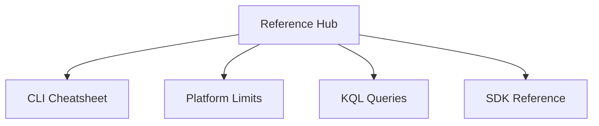

---
content_sources:
  - https://learn.microsoft.com/azure/communication-services/overview
---

# Reference Hub

The Reference section provides detailed information on Azure Communication Services (ACS) CLI commands, platform limits, diagnostic queries, and SDK details.

<!-- diagram-id: reference-hub -->

## Reference Documentation

| Document | Description |
| --- | --- |
| [CLI Cheatsheet](cli-cheatsheet.md) | ACS-specific Azure CLI commands and examples. |
| [Platform Limits](platform-limits.md) | Quotas and limits for SMS, Email, Chat, and Calling. |
| [KQL Queries](kql-queries.md) | Reusable Kusto queries for ACS diagnostics. |
| [SDK Reference](sdk-reference.md) | Package names, versions, and key classes for all SDKs. |

## Quick Links

- [Azure Communication Services CLI Reference](https://learn.microsoft.com/cli/azure/communication)
- [REST API Reference](https://learn.microsoft.com/rest/api/communication/)
- [Service limits and quotas](https://learn.microsoft.com/azure/communication-services/concepts/service-limits)

## Common Variables Table

| Variable | Description |
| --- | --- |
| `ACS_RESOURCE_NAME` | The name of your ACS resource. |
| `ACS_CONNECTION_STRING` | The primary or secondary connection string. |
| `ACS_ENDPOINT` | The endpoint URL for your resource. |
| `RESOURCE_GROUP` | The Azure Resource Group containing your ACS resource. |

## See Also
- [Azure Communication Services Overview](https://learn.microsoft.com/azure/communication-services/overview)

## Sources
- [ACS Documentation](https://learn.microsoft.com/azure/communication-services/)
