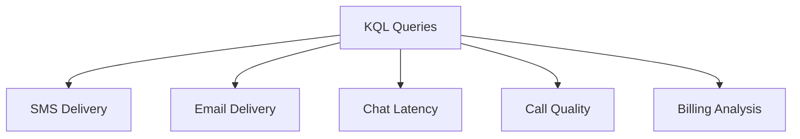

---
content_sources:
  - https://learn.microsoft.com/azure/communication-services/concepts/analytics/enable-logging
  - https://learn.microsoft.com/en-us/azure/azure-monitor/reference/acssmsincomingoperations
  - https://learn.microsoft.com/en-us/azure/azure-monitor/reference/acsemailstatusupdateoperational
  - https://learn.microsoft.com/en-us/azure/azure-monitor/reference/acschatincomingoperations
  - https://learn.microsoft.com/en-us/azure/azure-monitor/reference/acscalldiagnostics
content_validation:
  status: pending_review
  last_reviewed: null
  reviewer: agent
  core_claims: []
---

# KQL Queries for ACS Diagnostics

Reusable Kusto (KQL) queries for monitoring and troubleshooting Azure Communication Services (ACS).

<!-- diagram-id: kql-queries-diagram -->


## SMS Delivery Analysis

Use this query to track SMS delivery status and identify failures.

```kusto
// Get recent SMS operation outcomes
ACSSMSIncomingOperations
| where TimeGenerated > ago(24h)
| project TimeGenerated, MessageId, PhoneNumber, NumberType, ResultType, ResultSignature, ResultDescription
| order by TimeGenerated desc
```

| Column | Description |
| --- | --- |
| `TimeGenerated` | Timestamp of the log entry. |
| `MessageId` | Unique ID of the SMS message. |
| `PhoneNumber` | Sending or receiving phone number associated with the operation. |
| `ResultType` | Operation result. |
| `ResultSignature` | Substatus, including HTTP status code for REST API calls. |

## Email Delivery Tracking

Use this query to monitor email delivery status and identify bounces.

```kusto
// Get email delivery status for the last 7 days
ACSEmailStatusUpdateOperational
| where TimeGenerated > ago(7d)
| summarize Count=count() by DeliveryStatus, FailureReason, SmtpStatusCode, IsHardBounce
| order by Count desc
```

| Column | Description |
| --- | --- |
| `DeliveryStatus` | Delivery state such as delivered, bounced, or failed. |
| `FailureReason` | Failure category when ACS receives one. |
| `SmtpStatusCode` | SMTP status returned by the recipient email server when available. |
| `IsHardBounce` | Indicates whether the delivery failure is permanent. |
| `Count` | Total number of emails in this state. |

## Chat Message Latency

Analyze chat operation latency to identify performance issues.

```kusto
// Get average chat operation duration per minute
ACSChatIncomingOperations
| where TimeGenerated > ago(1h)
| summarize AvgDurationMs = avg(DurationMs) by OperationName, bin(TimeGenerated, 1m)
| render timechart
```

| Column | Description |
| --- | --- |
| `AvgDurationMs` | Average server-side operation duration for chat API calls. |
| `OperationName` | Chat operation, such as send message or list messages. |
| `TimeGenerated` | Time interval for the average calculation. |

## Call Quality Metrics

Monitor VoIP and PSTN media quality using documented call diagnostic fields.

```kusto
// Get average media diagnostics for calls in the last 24 hours
ACSCallDiagnostics
| where TimeGenerated > ago(24h)
| summarize
    AvgRoundTripTimeMs = avg(RoundTripTimeAvg),
    AvgJitterMs = avg(JitterAvg),
    AvgPacketLoss = avg(PacketLossRateAvg)
    by MediaType, StreamDirection, bin(TimeGenerated, 1h)
| render timechart
```

| Column | Description |
| --- | --- |
| `AvgRoundTripTimeMs` | Average round-trip time reported for the media stream. |
| `AvgJitterMs` | Average jitter reported for the media stream. |
| `AvgPacketLoss` | Average packet-loss rate reported for the media stream. |
| `TimeGenerated` | Time interval for the average calculation. |

## Billing Analysis

Summarize communication costs based on usage patterns.

```kusto
// Get total billing units per operation
ACSBillingUsage
| where TimeGenerated > ago(30d)
| summarize Records=count() by OperationName, bin(TimeGenerated, 1d)
| order by Records desc
```

| Column | Description |
| --- | --- |
| `OperationName` | The ACS operation being billed. |
| `Records` | Count of billing usage records for the operation and day. |

## See Also
- [Log Analytics and Kusto queries](https://learn.microsoft.com/en-us/azure/azure-monitor/logs/log-analytics-overviewlog-analytics-tutorial)
- [Enable logging with Azure Monitor](https://learn.microsoft.com/azure/communication-services/concepts/analytics/enable-logging)

## Sources
- [ACS Metrics Reference](https://learn.microsoft.com/azure/communication-services/concepts/metrics)
