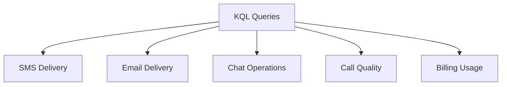

---
content_sources:
  diagrams:
    - id: kql-queries-diagram
      type: flowchart
      source: self-generated
      justification: Original navigation diagram categorizing ACS KQL query packs by service (SMS, Email, Chat, Calling, Billing).
      based_on:
        - https://learn.microsoft.com/en-us/azure/communication-services/concepts/logging-and-diagnostics
        - https://learn.microsoft.com/en-us/azure/communication-services/concepts/analytics/logs/sms-logs
        - https://learn.microsoft.com/en-us/azure/azure-monitor/reference/tables/acssmsincomingoperations
        - https://learn.microsoft.com/en-us/azure/azure-monitor/reference/tables/acsemailsendmailoperational
        - https://learn.microsoft.com/en-us/azure/azure-monitor/reference/tables/acsemailstatusupdateoperational
        - https://learn.microsoft.com/en-us/azure/azure-monitor/reference/tables/acschatincomingoperations
        - https://learn.microsoft.com/en-us/azure/azure-monitor/reference/tables/acscalldiagnostics
        - https://learn.microsoft.com/en-us/azure/azure-monitor/reference/tables/acscallsurvey
        - https://learn.microsoft.com/en-us/azure/azure-monitor/reference/tables/acsbillingusage
content_validation:
  status: verified
  last_reviewed: 2026-07-01
  reviewer: agent
  core_claims:
    - claim: "SMS diagnostic logs land in ACSSMSIncomingOperations with OperationName discriminating between SMSMessagesSent, SMSDeliveryReportsReceived, and SMSMessagesReceived events"
      source: https://learn.microsoft.com/en-us/azure/communication-services/concepts/analytics/logs/sms-logs
      verified: true
    - claim: "ACSEmailSendMailOperational holds one row per send request with counters including Size, UniqueRecipientsCount, and AttachmentsCount"
      source: https://learn.microsoft.com/en-us/azure/azure-monitor/reference/tables/acsemailsendmailoperational
      verified: true
    - claim: "ACSEmailStatusUpdateOperational holds message-level and per-recipient delivery status rows with DeliveryStatus, SmtpStatusCode, and IsHardBounce"
      source: https://learn.microsoft.com/en-us/azure/azure-monitor/reference/tables/acsemailstatusupdateoperational
      verified: true
    - claim: "Chat diagnostic logs land in ACSChatIncomingOperations, exposing UserId, ChatThreadId, ChatMessageId, DurationMs, and ResultType per incoming API operation"
      source: https://learn.microsoft.com/en-us/azure/azure-monitor/reference/tables/acschatincomingoperations
      verified: true
    - claim: "ACSCallDiagnostics carries per-media-stream network metrics including RoundTripTimeAvg, JitterAvg, and PacketLossRateAvg"
      source: https://learn.microsoft.com/en-us/azure/azure-monitor/reference/tables/acscalldiagnostics
      verified: true
    - claim: "ACSCallSurvey carries participant-reported ratings including OverallRatingScore, AudioRatingScore, and VideoRatingScore"
      source: https://learn.microsoft.com/en-us/azure/azure-monitor/reference/tables/acscallsurvey
      verified: true
    - claim: "Billing usage across all ACS modes is recorded in ACSBillingUsage with UsageType, UnitType, Quantity, StartTime, and EndTime"
      source: https://learn.microsoft.com/en-us/azure/azure-monitor/reference/tables/acsbillingusage
      verified: true
---

# KQL Queries for ACS Diagnostics

Reusable Kusto (KQL) queries for monitoring and troubleshooting Azure Communication Services (ACS). Every query targets the Azure Monitor diagnostic tables that ACS actually emits, and every column name is taken from the Azure Monitor Logs table reference.

!!! note "Prerequisites"
    Route the relevant log categories to a Log Analytics workspace via [Diagnostic Settings](https://learn.microsoft.com/en-us/azure/communication-services/concepts/logging-and-diagnostics). Table availability depends on which categories are enabled — for example, SMS queries require the SMS category, and call quality metrics require the voice and video calling categories.

<!-- diagram-id: kql-queries-diagram -->


## SMS Delivery Analysis

ACS emits a single SMS diagnostic table, `ACSSMSIncomingOperations`. The `OperationName` column discriminates the three SMS event kinds:

- `SMSMessagesSent` — outbound send request accepted by ACS.
- `SMSDeliveryReportsReceived` — per-recipient carrier delivery report for a previously sent message.
- `SMSMessagesReceived` — inbound SMS received on an ACS-owned number.

```kusto
// Delivery outcomes per country over the last 24 hours
ACSSMSIncomingOperations
| where TimeGenerated > ago(24h)
| where OperationName == "SMSDeliveryReportsReceived"
| summarize DeliveryReports = count() by Country, ResultType, ResultDescription
| order by DeliveryReports desc
```

| Column | Type | Description |
| --- | --- | --- |
| `TimeGenerated` | datetime | Timestamp (UTC) of the log entry. |
| `OperationName` | string | One of `SMSMessagesSent`, `SMSDeliveryReportsReceived`, `SMSMessagesReceived`. |
| `MessageId` | string | Correlates a send event to its subsequent delivery report. |
| `Country` | string | Recipient country. |
| `ResultType` | string | Status of the operation, for example `Succeeded` or `Failed`. |
| `ResultDescription` | string | Status text returned by ACS or the downstream carrier. |
| `DeliveryAttempts` | int | Number of attempts made to deliver the message. |

## Email Delivery Tracking

ACS Email emits two operational tables that must be read together:

- `ACSEmailSendMailOperational` — one row per `SendMail` request, with counters like `Size`, `AttachmentsCount`, and `UniqueRecipientsCount`.
- `ACSEmailStatusUpdateOperational` — message-level and recipient-level status updates, with per-recipient rows identified by nonempty `RecipientId`. Columns include `DeliveryStatus`, `SmtpStatusCode`, `EnhancedSmtpStatusCode`, `FailureReason`, `FailureMessage`, and `IsHardBounce`.

Correlate the two tables on `CorrelationId`, which the [Azure Monitor reference](https://learn.microsoft.com/en-us/azure/azure-monitor/reference/tables/acsemailstatusupdateoperational) documents as being populated with the `MessageID` returned by the send request.

```kusto
// Delivery outcomes per recipient over the last 7 days
ACSEmailStatusUpdateOperational
| where TimeGenerated > ago(7d)
| where isnotempty(RecipientId)
| summarize Count = count() by DeliveryStatus
| order by Count desc
```

| Column | Type | Description |
| --- | --- | --- |
| `TimeGenerated` | datetime | Timestamp (UTC) of the log entry. |
| `DeliveryStatus` | string | Terminal per-recipient status, for example `Delivered`, `Bounced`, or `Failed`. |
| `RecipientId` | string | The email address of the recipient. Empty when the row is a message-level status without a per-recipient breakdown. |
| `SmtpStatusCode` | string | SMTP status code returned by the recipient mail server. |
| `EnhancedSmtpStatusCode` | string | Enhanced SMTP status code returned by the recipient mail server, if available. |
| `IsHardBounce` | string | Per Microsoft Learn, signifies whether a delivery failure was due to a permanent or temporary issue. |
| `FailureReason` | string | Failure reason for the given SMTP or Enhanced SMTP status code. |

## Chat Operations

ACS Chat emits a single diagnostic table, `ACSChatIncomingOperations`. Each row represents one incoming REST API operation — send message, create thread, list messages, and so on — with the server-side operation duration in `DurationMs`.

```kusto
// Average operation duration per operation name over the last hour
ACSChatIncomingOperations
| where TimeGenerated > ago(1h)
| summarize AvgDurationMs = avg(DurationMs), Count = count() by OperationName
| order by AvgDurationMs desc
```

| Column | Type | Description |
| --- | --- | --- |
| `TimeGenerated` | datetime | Timestamp (UTC) of the log entry. |
| `OperationName` | string | Name of the incoming Chat API operation. |
| `DurationMs` | int | Server-side duration of the operation in milliseconds. |
| `ResultType` | string | Status of the operation. |
| `ChatThreadId` | string | Thread that the operation targeted. |
| `ChatMessageId` | int | Message that the operation targeted, when applicable. |
| `UserId` | string | The request sender's user ID. |

!!! note "DurationMs is server processing time, not end-to-end delivery latency"
    `DurationMs` measures how long ACS spent handling a single API call server side. End-to-end latency from sender publish to receiver render requires client-side telemetry outside these diagnostic tables.

## Call Quality Metrics

Two tables cover call quality, each with a different perspective:

- `ACSCallDiagnostics` — one row per media stream, with network-level metrics such as `RoundTripTimeAvg`, `JitterAvg`, `PacketLossRateAvg`, and video metrics such as `VideoBitRateAvg` and `VideoFrameRateAvg`.
- `ACSCallSurvey` — one row per submitted post-call survey, with participant-reported ratings such as `OverallRatingScore`, `AudioRatingScore`, and `VideoRatingScore`.

Network-level quality per media stream:

```kusto
// Average round-trip time, jitter, and packet loss per media type over the last 24 hours
ACSCallDiagnostics
| where TimeGenerated > ago(24h)
| summarize
    AvgRTT_ms = avg(RoundTripTimeAvg),
    AvgJitter_ms = avg(JitterAvg),
    AvgPacketLoss = avg(PacketLossRateAvg)
    by MediaType, StreamDirection
| order by MediaType, StreamDirection
```

Participant-reported ratings:

```kusto
// Distribution of overall call rating scores over the last 7 days
ACSCallSurvey
| where TimeGenerated > ago(7d)
| summarize SurveyCount = count() by OverallRatingScore
| order by OverallRatingScore
```

| Column | Type | Table | Description |
| --- | --- | --- | --- |
| `RoundTripTimeAvg` | int | `ACSCallDiagnostics` | Average round-trip time in milliseconds. |
| `JitterAvg` | int | `ACSCallDiagnostics` | Average delay of sending packets in milliseconds. |
| `PacketLossRateAvg` | real | `ACSCallDiagnostics` | Average lost packets ratio. |
| `MediaType` | string | `ACSCallDiagnostics` | Media stream type, for example audio or video. |
| `StreamDirection` | string | `ACSCallDiagnostics` | `inbound` or `outbound`. |
| `OverallRatingScore` | int | `ACSCallSurvey` | Overall call experience rated by the participant. |
| `AudioRatingScore` | int | `ACSCallSurvey` | Audio experience rated by the participant. |
| `VideoRatingScore` | int | `ACSCallSurvey` | Video experience rated by the participant. |

!!! note "ACS diagnostic tables do not emit a Mean Opinion Score column"
    The Azure Monitor reference for `ACSCallDiagnostics` and `ACSCallSurvey` does not define a `MOS` or `CallQualityScore` column. To approximate perceptual call quality, combine the network metrics from `ACSCallDiagnostics` (RTT, jitter, loss) with the participant-reported ratings from `ACSCallSurvey`.

## Billing Usage

`ACSBillingUsage` records consumption across all ACS modes (SMS, email, chat, calling, PSTN). Each row carries an `OperationName`, a `UsageType`, a `UnitType`, and a `Quantity`, along with `StartTime` / `EndTime` consumption windows.

```kusto
// Total billed quantity per operation over the last 30 days
ACSBillingUsage
| where TimeGenerated > ago(30d)
| summarize TotalQuantity = sum(Quantity) by OperationName, UsageType, UnitType
| order by TotalQuantity desc
```

| Column | Type | Description |
| --- | --- | --- |
| `TimeGenerated` | datetime | Timestamp (UTC) of the log entry. |
| `OperationName` | string | The ACS operation being billed. |
| `UsageType` | string | The type of resource being consumed. |
| `UnitType` | string | The unit in which usage is measured. |
| `Quantity` | real | Amount of usage in terms of the specified `UnitType`. |
| `StartTime` | datetime | Time when the resource consumption started. |
| `EndTime` | datetime | Time when the resource consumption ended (optional for instant events). |

## See Also

- [Operations — Monitoring](../operations/monitoring.md)
- [Troubleshooting — KQL Query Packs](../troubleshooting/kql/index.md)
- [Reference — CLI Cheatsheet](cli-cheatsheet.md)
- [Reference — Platform Limits](platform-limits.md)

## Sources

- [ACS logging and diagnostics overview](https://learn.microsoft.com/en-us/azure/communication-services/concepts/logging-and-diagnostics)
- [ACSSMSIncomingOperations table reference](https://learn.microsoft.com/en-us/azure/azure-monitor/reference/tables/acssmsincomingoperations)
- [ACSEmailSendMailOperational table reference](https://learn.microsoft.com/en-us/azure/azure-monitor/reference/tables/acsemailsendmailoperational)
- [ACSEmailStatusUpdateOperational table reference](https://learn.microsoft.com/en-us/azure/azure-monitor/reference/tables/acsemailstatusupdateoperational)
- [ACSChatIncomingOperations table reference](https://learn.microsoft.com/en-us/azure/azure-monitor/reference/tables/acschatincomingoperations)
- [ACSCallDiagnostics table reference](https://learn.microsoft.com/en-us/azure/azure-monitor/reference/tables/acscalldiagnostics)
- [ACSCallSurvey table reference](https://learn.microsoft.com/en-us/azure/azure-monitor/reference/tables/acscallsurvey)
- [ACSBillingUsage table reference](https://learn.microsoft.com/en-us/azure/azure-monitor/reference/tables/acsbillingusage)
