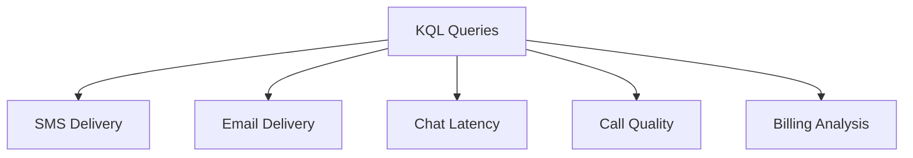

---
content_sources:
  - https://learn.microsoft.com/azure/communication-services/concepts/logging-and-diagnostics
---

# KQL Queries for ACS Diagnostics

Reusable Kusto (KQL) queries for monitoring and troubleshooting Azure Communication Services (ACS).

<!-- diagram-id: kql-queries-diagram -->


## SMS Delivery Analysis

Use this query to track SMS delivery status and identify failures.

```kusto
// Get SMS delivery status by recipient number
ACSSmsLogs
| where TimeGenerated > ago(24h)
| project TimeGenerated, MessageId, RecipientNumber, DeliveryStatus, DeliveryStatusDetail
| order by TimeGenerated desc
```

| Column | Description |
| --- | --- |
| `TimeGenerated` | Timestamp of the log entry. |
| `MessageId` | Unique ID of the SMS message. |
| `RecipientNumber` | Phone number of the recipient. |
| `DeliveryStatus` | Final delivery state (e.g., Delivered, Failed). |

## Email Delivery Tracking

Use this query to monitor email delivery status and identify bounces.

```kusto
// Get email delivery status for the last 7 days
ACSEmailLogs
| where TimeGenerated > ago(7d)
| summarize Count=count() by DeliveryStatus, DeliveryStatusDetail
| order by Count desc
```

| Column | Description |
| --- | --- |
| `DeliveryStatus` | Final delivery state (e.g., Delivered, Bounced, Failed). |
| `Count` | Total number of emails in this state. |

## Chat Message Latency

Analyze chat message delivery latency to identify performance issues.

```kusto
// Get average chat message latency per minute
ACSChatLogs
| where TimeGenerated > ago(1h)
| summarize AvgLatencyMs = avg(MessageLatencyMs) by bin(TimeGenerated, 1m)
| render timechart
```

| Column | Description |
| --- | --- |
| `AvgLatencyMs` | Average end-to-end latency for chat messages. |
| `TimeGenerated` | Time interval for the average calculation. |

## Call Quality Metrics

Monitor VoIP and PSTN call quality (Mean Opinion Score - MOS).

```kusto
// Get average MOS for all calls in the last 24 hours
ACSCallingLogs
| where TimeGenerated > ago(24h)
| summarize AvgMOS = avg(CallQualityScore) by bin(TimeGenerated, 1h)
| render timechart
```

| Column | Description |
| --- | --- |
| `AvgMOS` | Average Mean Opinion Score (1-5). |
| `TimeGenerated` | Time interval for the average calculation. |

## Billing Analysis

Summarize communication costs based on usage patterns.

```kusto
// Get total billing units per operation
ACSBillingLogs
| where TimeGenerated > ago(30d)
| summarize TotalUnits = sum(BillingUnits) by OperationName
| order by TotalUnits desc
```

| Column | Description |
| --- | --- |
| `OperationName` | The ACS operation being billed. |
| `TotalUnits` | Total billing units consumed. |

## See Also
- [Log Analytics and Kusto queries](https://learn.microsoft.com/azure/azure-monitor/logs/log-analytics-tutorial)
- [How to: Use KQL for ACS troubleshooting](https://learn.microsoft.com/azure/communication-services/concepts/logging-and-diagnostics)

## Sources
- [ACS Metrics Reference](https://learn.microsoft.com/azure/communication-services/concepts/metrics)
